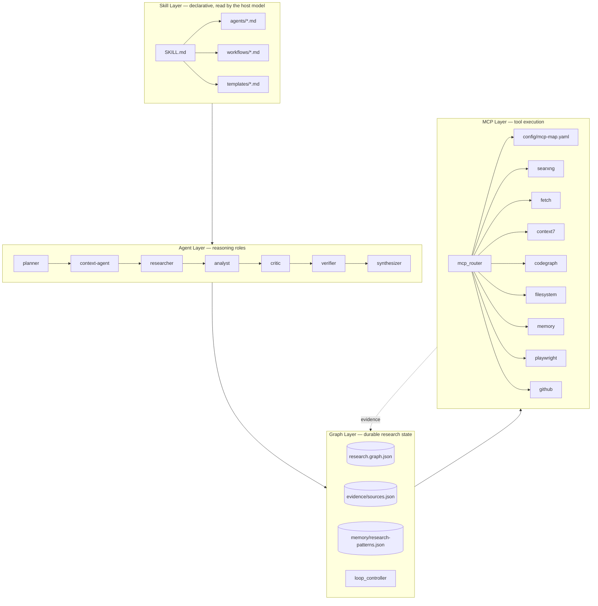
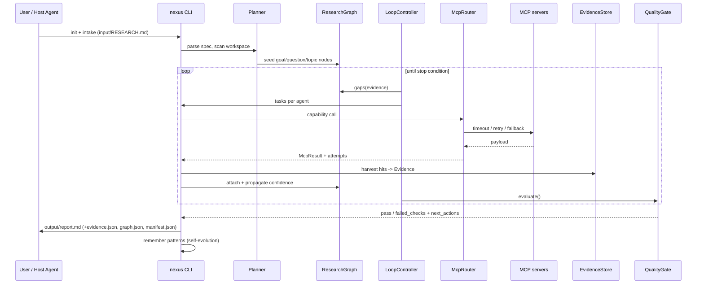

# NexusSearch Architecture

How the pieces in `PRP.md` and `Deep Research Skill 设计方案.md` map onto this
repository, and why each boundary exists.

## 1. Four layers

| Layer | Lives in | Owns | Must never |
| --- | --- | --- | --- |
| Skill | `SKILL.md`, `agents/`, `workflows/`, `templates/` | intent, contracts, prompts | hold credentials, execute tools |
| Agent | `runtime/agent_router.py` + role files | task generation, reasoning | write the graph directly |
| Graph | `runtime/graph_engine.py`, `evidence_store.py`, `loop_controller.py`, `memory_store.py` | state, coverage, gaps, confidence | call MCP itself |
| MCP | `runtime/mcp_router.py`, `config/mcp-map.yaml` | transport, retries, fallback, audit | invent research structure |

The single-writer rule is what keeps a 5-iteration run debuggable: only the
runtime mutates `graph/research.graph.json`, and every mutation is the result of a
typed record (`ResearchTask`, `Evidence`, `GraphUpdate`, `AgentMessage`).

## 2. Run-time data flow

## 3. Graph model

Nodes (`schemas/graph.schema.json`): `goal`, `question`, `topic`, `entity`,
`evidence`, `claim`, `risk`, `decision`, `constraint`, `gap`.
Edges: `decomposes_into`, `depends_on`, `supports`, `contradicts`, `derived_from`,
`implements`, `relates_to`, `answers`, `references`, `blocks`, `mitigates`, `refines`.

Why a graph and not a list: coverage becomes measurable. `gaps()` walks the tree and
reports per-question evidence coverage, missing source tiers, and domain diversity,
then suggests queries — so iteration *n+1* attacks the weakest node instead of
re-searching the first hunch. `propagate()` rolls evidence confidence up into claims
and questions with a decaying weight, which is what the loop and the gate both read.

Renderings: `nexus graph tree` for humans, `nexus graph mermaid` for docs,
`nexus graph export` for other tools.

## 4. Loop control

`runtime/loop_controller.py` — one iteration = `gaps → tasks → execute → merge → verify`.
Stops on the first true condition (`config/settings.yaml`):

`confidence_threshold_reached` (0.85) · `quality_gate_passed` ·
`max_iterations_reached` (5) · `diminishing_returns` (gain < 0.03) ·
`budget_exhausted` (120 calls total / 40 per iteration / 45 min) · `user_abort`.

Budgets matter because a research loop is the easiest place for an agent to spend
hours re-reading the same blog post.

## 5. MCP routing

`config/mcp-map.yaml` is a capability map, not a tool list. A capability
(`web.discovery`, `docs.library`, `code.local_structure`, …) resolves to an ordered
provider chain; the router walks it until one returns *usable* output, where usable
means transport-ok **and** passing the capability's quality rule (`min_results`,
`min_chars`, `require_url`). Error classes (`timeout`, `rate_limited`,
`permission`, `auth_missing`, `low_quality`, …) each have a policy: retry, backoff,
repair arguments, reformulate the query, or mark the server unavailable for the run.

Every call is cached, timed, and appended to `agents/logs/tool-calls.jsonl`, so a
failed research run can be replayed. Servers with `requires_env` are probed, never
guessed; missing credentials surface as `auth_missing` with the variable name rather
than a stack trace.

An audit line is a claim about *what was asked and what came back*, not just whether
the transport survived: `{capability, server, tool, ok, duration_ms, retries,
error_class, arguments{query|url|engines…}, result_count, attempts[]}`, with
`arguments` passed through `redact()` and truncated. That is what makes a negative
result auditable — `nexus -w <run> audit` and the `no_results` error class can show
"5 providers tried, 5 returned no usable candidates" instead of an unexplained gap.

### 5.1 Retrieval quality (what a local-only stack forces on you)

A self-hosted metasearch server is not a search API: it merges whatever its
enabled engines answer before the client gives up. Three properties of that
behaviour shape the design, each measured on a live run:

1. **Engine choice is deployment-specific.** Enablement, not preference, decides
   what comes back; `nexus doctor` plus a per-engine `nexus mcp call` probe is how
   you find the reachable set. Pin it in `servers.searxng.search.engines`.
2. **Wide calls collapse diversity.** One call across 11 engines returned 8 hits,
   all from the single fastest one. `engine_groups` gives each query angle a
   narrow group instead (1-5s each), which is what the source-diversity check
   needs to see more than one domain. Passing `categories` alongside `engines` is
   counter-productive: SearXNG then answers for the whole category.
3. **Relevance must be judged, not assumed.** A hit is scored on query-term
   overlap with its title/snippet/URL (`harvest.relevance`); zero-overlap hits are
   kept only as capped, `unrelated`-flagged weak leads. A *fetched page* is
   scored on its body (`MIN_PAGE_RELEVANCE`) after `strip_boilerplate` removes
   `<script>` noise, so a title match can no longer become high-confidence
   evidence. Chinese questions are reduced to ASCII technical terms
   (`util.ascii_terms`) before they reach English-only engines, and a query that
   returns nothing on-topic gets exactly one relaxed retry with fewer terms.
4. **Locale is a query argument, not an instance default.** A container that
   publishes `default_lang: zh-CN` sends that locale as a region signal, and a niche
   English query answered under it comes back as geo-junk (measured: Korean camping
   portals and South African speed-test sites). `harvest.search_language()` therefore
   sets `language` per query from the query's own script, and the `web.discovery`
   providers pass `language` explicitly rather than inheriting the instance.
   The same applies to egress: if the instance cannot physically reach an engine,
   no amount of `engines:` enablement helps — see the SearXNG deployment guide.
5. **Long queries are answered by popularity.** Past ~4 technical terms,
   bing/google stop ranking the query and rank the region instead, so both query
   builders (`intake._search_strategy`, `graph_engine._suggest_queries`) keep terse
   term lists and let the *engine group* supply variety instead of appending
   "official documentation" / "2026 comparison". `runs/ltx-dataset-annotation` is the
   measurement: padded queries kept 0 on-topic hits, the capped forms kept 2.

The consequence for reports: `source_diversity` counts only unflagged records, so
junk inflates nothing. This is also why the runtime-driven loop and an agent-driven
pass are complementary — the loop buys coverage cheaply, the analyst buys quality.

## 6. Evidence and the gate

`Evidence` = claim + source (`type`, `uri`, `domain`) + tier + confidence + modality +
verification + retrieval provenance. `evidence_check`-style validation happens at
`add()`, so an unfetchable or unsourced record cannot enter the store at all.
Dedup merges identical claim+uri pairs; `contradicts` links let the verifier record
disagreement instead of deleting it.

`runtime/quality_gate.py` turns `config/quality.yaml` into 8 weighted buckets
(coverage, reliability, corroboration, contradiction control, uncertainty
transparency). `nexus gate --strict` exits non-zero, which is how CI or a long agent
run refuses to publish an unverified report.

## 7. Self-evolution

Three loops, not one:

1. **Within a run** — the gate's `failed_checks` become the next iteration's tasks.
2. **Across runs** — `runtime/memory_store.py` keeps `memory/research-patterns.json`
   (kinds: `query`, `source`, `decomposition`, `failure`, `decision`, `tool`).
   Successful queries and dead ends are recorded with a `source_run`; recall is
   token-overlap scored, `use` adjusts confidence, `promote` hardens a pattern above
   0.75 confidence and 3 uses. `nexus remember sync --push` mirrors it into the
   `memory` MCP server for cross-project recall.
3. **Into the skill itself** — recurring failures are expected to be edited back into
   `workflows/*.md` and `config/*.yaml`. The markdown is the source of truth, so
   improvement is a diff, not a retraining run.

## 8. Modality

Evidence records carry `modality` (`text`, `code`, `image`, `tabular`, `structured`,
`audio`, `video`). SearXNG categories give images/news/science/repos/packages;
playwright/chrome-devtools give rendered screenshots and post-JS DOM; postgresql and
redis give tabular/structured data; context7 and github give canonical docs and code.
Providers that reach *user* data (postgresql) are declared `opt_in: true` and stay off
until a run sets `NEXUS_ENABLE_POSTGRES=1`: a business database is not a research corpus.
`workflows/multimodal-retrieval.md` decides which modality can actually answer a
question — a "does it render on mobile?" question needs a screenshot, not a blog post.

## 9. Local-first boundary

Nothing leaves the machine except query strings and public URLs. No telemetry, no
hosted vector DB, no paid API. Embedding recall is optional and off by default;
`requests`, `numpy`, and `networkx` are not required — the graph engine is stdlib.
`nexus audit` greps the workspace for credential-shaped strings before you share a run.

## 10. Extension points

| Want to | Touch |
| --- | --- |
| add a data source | `config/mcp-map.yaml` server + capability provider |
| add a role | `agents/<name>.md` + `config/agents.yaml` grant |
| add a quality rule | `config/quality.yaml` + `QualityGate._checks` |
| change decomposition | `workflows/graph-planning.md` + `runtime/intake.py` |
| plug a vector store | `runtime/memory_store.py` (`recall`/`remember`) |
| new output shape | `templates/report.md` + `runtime/report_builder.py` |
