# 评估把 `examples/demo-project` 中手写的阻塞式 LLM 调用改造为 Agent 编排的可行性；并在 LangGraph、AutoGen (AG2)、OpenAI Agents SDK、MCP 自建循环四个方案中做出选型

> Generated 2026-09-11T21:41:18+00:00 by NexusSearch 1.0.0 · graph `graph_6aa458ee_8d879f` · 113 evidence items · 159 nodes

## Executive Summary

- **Overall confidence:** 92% (high)
- **Key findings:** 9 claims, 5 verified, 0 contested
- **Sources:** 113 across 12 independent domains

Top findings:
1. AutoGen 不再适合作为新建项目的长期独立选型：微软官方称 Agent Framework 是 AutoGen 与 Semantic Kernel 的直接后继 — confidence 1.00 [89], [94], [105], [108]
1. LangGraph 的定位是低层编排运行时，核心价值是 durable execution、持久化 checkpointer、streaming 与 human-in-the-loop — confidence 1.00 [92], [104], [100]
1. 官方最佳实践：开放/对话式任务用 agent，步骤确定的流程用 workflow，能用普通函数完成的任务不应引入 agent — confidence 1.00 [91], [97]
1. MCP 只定义工具/资源访问与信任模型，不提供编排循环；自建循环必须自行承担用户同意、权限控制与审计 — confidence 1.00 [96], [95], [110]
1. 代码事实：demo-project 的 LLM 路径是阻塞式单发调用，ADR-001 已自述代价为无重试、无流式、无工具、无可观测性 — confidence 1.00 [92], [90], [100], [101], [102]

## Research Objective

- **Objective:** 评估把 `examples/demo-project` 中手写的阻塞式 LLM 调用改造为 Agent 编排的可行性；并在 LangGraph、AutoGen (AG2)、OpenAI Agents SDK、MCP 自建循环四个方案中做出选型
- **Constraints:** 只能使用本地 MCP 服务获取外部资料，禁止上传任何源码或数据。, 结论必须有可追溯来源与置信度，单个来源不得支撑关键结论。, 需给出 6 周内的迁移路线与回滚方案。
- **Research questions:** 4

| Question | Coverage | Evidence | Status |
| --- | ---: | ---: | --- |
| 各框架在"少量确定性步骤 + 工具调用"这类工作流上的抽象差异是什么？ | 76% | 81 | supported |
| 流式输出与失败重试在四个方案中的成熟度如何？ | 83% | 19 | supported |
| 迁移到编排框架后，延迟与运维成本会增加多少？ | 93% | 11 | supported |
| 有哪些公开的生产事故或反例说明不应引入编排框架？ | 78% | 24 | supported |

Topics decomposed: 16; entities tracked: 0.

## Current Landscape

Claims so far: 9 (1 proposed, 3 supported, 5 verified).

Evidence comes from 12 independent domains: docs.langchain.com, gentoo.org, haskell.org, learn.microsoft.com, microsoft.com, microsoft.github.io, modelcontextprotocol.io, mozilla.org, openai.github.io, pypi.org, raw.githubusercontent.com, workspace.

## Architecture Analysis

评估把 `examples/demo-project` 中手写的阻塞式 LLM 调用改造为 Agent 编排的可行性；并
├── 各框架在"少量确定性步骤 + 工具调用"这类工作流上的抽象差异是什么？
│   ├── 现状与主流方案是什么
│   │   └── AutoGen 不再适合作为新建项目的长期独立选型：微软官方称 Agent Framework 是 AutoGen 与  [claim] (1.00)
│   ├── 架构与关键机制如何运作
│   │   └── LangGraph 的定位是低层编排运行时，核心价值是 durable execution、持久化 checkpoint [claim] (1.00)
│   ├── 有哪些可落地的最佳实践
│   │   └── 官方最佳实践：开放/对话式任务用 agent，步骤确定的流程用 workflow，能用普通函数完成的任务不应引入 age [claim] (1.00)
│   ├── 各方案的成本与权衡是什么
│   │   └── OpenAI Agents SDK 以少量原语（handoffs / guardrails / sessions）覆盖多 [claim] (0.99)
│   ├── 选型：以 LangGraph 图编排为控制面 + 本地 MCP servers 为工具面，AutoGen / Agent [decision]
│   ├── 编排框架 API 收敛期风险：AutoGen→Agent Framework 的合并即先例，选型可能在 12 个月内需要 [risk]
│   │   └── AutoGen 不再适合作为新建项目的长期独立选型：微软官方称 Agent Framework 是 AutoGen 与  [claim] (1.00)
│   └── 已否决：不引入编排框架、完全自研 MCP while 循环 [gap]
│       └── 选型：以 LangGraph 图编排为控制面 + 本地 MCP servers 为工具面，AutoGen / Agent [decision]
├── 流式输出与失败重试在四个方案中的成熟度如何？
│   ├── 现状与主流方案是什么
│   ├── 架构与关键机制如何运作
│   │   ├── MCP 只定义工具/资源访问与信任模型，不提供编排循环；自建循环必须自行承担用户同意、权限控制与审计 [claim] (1.00)
│   │   └── 流式与失败重试在四个方案中的承担者不同：LangGraph 用 durable execution + streamin [claim] (1.00)
│   │       └── MCP 只定义工具/资源访问与信任模型，不提供编排循环；自建循环必须自行承担用户同意、权限控制与审计 [claim] (1.00)
│   ├── 有哪些可落地的最佳实践
│   ├── 各方案的成本与权衡是什么
│   └── 本地 MCP 工具即任意代码/数据执行路径：越权读取用户文件或外发数据的风险集中在工具层 [risk]
├── 迁移到编排框架后，延迟与运维成本会增加多少？
│   ├── 现状与主流方案是什么
│   ├── 架构与关键机制如何运作
│   ├── 有哪些可落地的最佳实践
│   ├── 各方案的成本与权衡是什么
│   │   ├── 代码事实：demo-project 的 LLM 路径是阻塞式单发调用，ADR-001 已自述代价为无重试、无流式、无工具 [claim] (1.00)
│   │   │   └── 官方最佳实践：开放/对话式任务用 agent，步骤确定的流程用 workflow，能用普通函数完成的任务不应引入 age [claim] (1.00)
│   │   └── 迁移的运维成本增量主要在持久化后端与观测：LangGraph 把调试/观测指向 LangSmith 平台，AutoGen [claim] (0.88)
│   ├── 改造引入持久化后端与新运维面：checkpointer 需要 Redis/Postgres，demo-project 目 [risk]
│   │   └── 代码事实：demo-project 的 LLM 路径是阻塞式单发调用，ADR-001 已自述代价为无重试、无流式、无工具 [claim] (1.00)
│   │       └── 官方最佳实践：开放/对话式任务用 agent，步骤确定的流程用 workflow，能用普通函数完成的任务不应引入 age [claim] (1.00)
│   └── 缺口：缺少基准，无法量化编排改造相对一次普通 async 重构的净收益（p95 延迟、运维面、代码增量） [gap]
├── 有哪些公开的生产事故或反例说明不应引入编排框架？
│   ├── 现状与主流方案是什么
│   │   └── 负结果：本地可达引擎组内未检索到可信的一手『引入编排框架导致生产事故』复盘 [gap]
│   │       └── AutoGen 不再适合作为新建项目的长期独立选型：微软官方称 Agent Framework 是 AutoGen 与  [claim] (1.00)
│   ├── 架构与关键机制如何运作
│   ├── 有哪些可落地的最佳实践
│   │   └── 推断：厂商正在把 planner/harness 能力内置（Agent Framework 的 Harness Agen [claim] (0.37)
│   │       └── 编排框架 API 收敛期风险：AutoGen→Agent Framework 的合并即先例，选型可能在 12 个月内需要 [risk]
│   │           └── AutoGen 不再适合作为新建项目的长期独立选型：微软官方称 Agent Framework 是 AutoGen 与  [claim] (1.00)
│   └── 各方案的成本与权衡是什么
├── 只能使用本地 MCP 服务获取外部资料，禁止上传任何源码或数据。 [constraint]
├── 结论必须有可追溯来源与置信度，单个来源不得支撑关键结论。 [constraint]
└── 需给出 6 周内的迁移路线与回滚方案。 [constraint]

```mermaid
flowchart TD
  goal("评估把 `examples/demo-project` 中手写的阻塞式 LLM 调用改造")
  q1[["各框架在'少量确定性步骤 + 工具调用'这类工作流上的抽象差异是什么？"]]
  q2[["流式输出与失败重试在四个方案中的成熟度如何？"]]
  q3[["迁移到编排框架后，延迟与运维成本会增加多少？"]]
  q4[["有哪些公开的生产事故或反例说明不应引入编排框架？"]]
  q1-architecture["架构与关键机制如何运作"]
  q1-landscape["现状与主流方案是什么"]
  q1-practice["有哪些可落地的最佳实践"]
  q1-tradeoff["各方案的成本与权衡是什么"]
  q2-architecture["架构与关键机制如何运作"]
  q2-landscape["现状与主流方案是什么"]
  q2-practice["有哪些可落地的最佳实践"]
  q2-tradeoff["各方案的成本与权衡是什么"]
  q3-architecture["架构与关键机制如何运作"]
  q3-landscape["现状与主流方案是什么"]
  q3-practice["有哪些可落地的最佳实践"]
  q3-tradeoff["各方案的成本与权衡是什么"]
  q4-architecture["架构与关键机制如何运作"]
  q4-landscape["现状与主流方案是什么"]
  q4-practice["有哪些可落地的最佳实践"]
  q4-tradeoff["各方案的成本与权衡是什么"]
  c1[/"AutoGen 不再适合作为新建项目的长期独立选型：微软官方称 Agent Framew"/]
  c2[/"LangGraph 的定位是低层编排运行时，核心价值是 durable executio"/]
  c3[/"OpenAI Agents SDK 以少量原语（handoffs / guardrail"/]
  c4[/"官方最佳实践：开放/对话式任务用 agent，步骤确定的流程用 workflow，能用普"/]
  c5[/"MCP 只定义工具/资源访问与信任模型，不提供编排循环；自建循环必须自行承担用户同意、权"/]
  c6[/"代码事实：demo-project 的 LLM 路径是阻塞式单发调用，ADR-001 已"/]
  c7[/"推断：厂商正在把 planner/harness 能力内置（Agent Framewor"/]
  c8[/"流式与失败重试在四个方案中的承担者不同：LangGraph 用 durable exec"/]
  c9[/"迁移的运维成本增量主要在持久化后端与观测：LangGraph 把调试/观测指向 Lang"/]
  d1(("选型：以 LangGraph 图编排为控制面 + 本地 MCP servers 为工具面"))
  r1>"编排框架 API 收敛期风险：AutoGen→Agent Framework 的合并即先"]
  r2>"本地 MCP 工具即任意代码/数据执行路径：越权读取用户文件或外发数据的风险集中在工具层"]
  r3>"改造引入持久化后端与新运维面：checkpointer 需要 Redis/Postgre"]
  con-只能使用本地-mcp-服务获取外部资料-禁止上传[/"只能使用本地 MCP 服务获取外部资料，禁止上传任何源码或数据。"\]
  con-结论必须有可追溯来源与置信度-单个来源不得支撑关[/"结论必须有可追溯来源与置信度，单个来源不得支撑关键结论。"\]
  con-需给出-6-周内的迁移路线与回滚方案[/"需给出 6 周内的迁移路线与回滚方案。"\]
  g-benchmark-missing(("缺口：缺少基准，无法量化编排改造相对一次普通 async 重构的净收益（p95 延迟、运"))
  g-no-postmortems(("负结果：本地可达引擎组内未检索到可信的一手『引入编排框架导致生产事故』复盘"))
  g-rejected-standalone-loop(("已否决：不引入编排框架、完全自研 MCP while 循环"))
  gap-task_6aa458fa_0aa5ed(("Close evidence gaps for q1-landscape: no evi"))
  gap-task_6aa458fa_2d9d35(("Close evidence gaps for q4: no evidence yet,"))
  gap-task_6aa458fa_4acf2a(("Close evidence gaps for q1-tradeoff: no evid"))
  gap-task_6aa458fa_8c0eea(("Close evidence gaps for q2-architecture: no "))
  gap-task_6aa458fa_b529c0(("Close evidence gaps for q1-practice: no evid"))
  gap-task_6aa458fa_e1794b(("Close evidence gaps for q1-architecture: no "))
  ev_6aa4586f_1f15a2(["本地工作区 demo-project 共 7 个文件, 79 行代码, 语言分布 7 f"])
  ev_6aa4586f_e6d999(["依赖与构建清单为 requirements.txt, 决定了可用的本地技术栈"])
  ev_6aa4590d_702015(["(弱相关，标题/摘要未命中查询词) 检索「现状与主流方案是什么 各框架在'少量确定性步骤"])
  ev_6aa4590d_ebffad(["(弱相关，标题/摘要未命中查询词) 检索「现状与主流方案是什么 各框架在'少量确定性步骤"])
  ev_6aa45910_e7fc66(["microsoft.com 就「现状与主流方案是什么 各框架在'少量确定性步骤 工具调用"])
  ev_6aa45911_98de04(["mozilla.org 就「现状与主流方案是什么 各框架在'少量确定性步骤 工具调用'这"])
  ev_6aa45924_7e6ae3(["microsoft.com 就「现状与主流方案是什么 各框架在'少量确定性步骤 工具调用"])
  ev_6aa45924_bf41a2(["(弱相关，标题/摘要未命中查询词) 检索「现状与主流方案是什么 各框架在'少量确定性步骤"])
  ev_6aa45924_e803ab(["(弱相关，标题/摘要未命中查询词) 检索「现状与主流方案是什么 各框架在'少量确定性步骤"])
  ev_6aa45925_546b53(["mozilla.org 就「现状与主流方案是什么 各框架在'少量确定性步骤 工具调用'这"])
  ev_6aa45937_0d9121(["检索「现状与主流方案是什么 各框架在'少量确定性步骤 工具调用'这类工作流上的抽象差异是"])
  ev_6aa45937_6c0465(["(弱相关，标题/摘要未命中查询词) 检索「现状与主流方案是什么 各框架在'少量确定性步骤"])
  ev_6aa45937_885387(["检索「现状与主流方案是什么 各框架在'少量确定性步骤 工具调用'这类工作流上的抽象差异是"])
  ev_6aa45937_b34b65(["检索「现状与主流方案是什么 各框架在'少量确定性步骤 工具调用'这类工作流上的抽象差异是"])
  goal -->|decomposes_into| q1
  q1 -->|decomposes_into| q1-landscape
  q1 -->|decomposes_into| q1-architecture
  q1 -->|decomposes_into| q1-practice
  q1 -->|decomposes_into| q1-tradeoff
  goal -->|decomposes_into| q2
  q2 -->|decomposes_into| q2-landscape
  q2 -->|decomposes_into| q2-architecture
  q2 -->|decomposes_into| q2-practice
  q2 -->|decomposes_into| q2-tradeoff
  goal -->|decomposes_into| q3
  q3 -->|decomposes_into| q3-landscape
  q3 -->|decomposes_into| q3-architecture
  q3 -->|decomposes_into| q3-practice
  q3 -->|decomposes_into| q3-tradeoff
  goal -->|decomposes_into| q4
  q4 -->|decomposes_into| q4-landscape
  q4 -->|decomposes_into| q4-architecture
  q4 -->|decomposes_into| q4-practice
  q4 -->|decomposes_into| q4-tradeoff
  goal -->|relates_to| con-只能使用本地-mcp-服务获取外部资料-禁止上传
  goal -->|relates_to| con-结论必须有可追溯来源与置信度-单个来源不得支撑关
  goal -->|relates_to| con-需给出-6-周内的迁移路线与回滚方案
  ev_6aa4586f_1f15a2 -->|supports| q1
  ev_6aa4586f_e6d999 -->|supports| q1
  q1-landscape -->|blocks| gap-task_6aa458fa_0aa5ed
  q1-tradeoff -->|blocks| gap-task_6aa458fa_4acf2a
  q2-architecture -->|blocks| gap-task_6aa458fa_8c0eea
  q1-practice -->|blocks| gap-task_6aa458fa_b529c0
  q1-architecture -->|blocks| gap-task_6aa458fa_e1794b
  q4 -->|blocks| gap-task_6aa458fa_2d9d35
  ev_6aa4590d_ebffad -->|supports| q1-landscape
  ev_6aa4590d_702015 -->|supports| q1-landscape
  ev_6aa45910_e7fc66 -->|supports| q1-landscape
  ev_6aa45911_98de04 -->|supports| q1-landscape
  ev_6aa45924_bf41a2 -->|supports| q1-landscape
  ev_6aa45924_e803ab -->|supports| q1-landscape
  ev_6aa45924_7e6ae3 -->|supports| q1-landscape
  ev_6aa45925_546b53 -->|supports| q1-landscape
  ev_6aa45937_0d9121 -->|supports| q1-landscape
  ev_6aa45937_b34b65 -->|supports| q1-landscape
  ev_6aa45937_885387 -->|supports| q1-landscape
  ev_6aa45937_6c0465 -->|supports| q1-landscape
  q1-landscape -->|derived_from| c1
  q1-architecture -->|derived_from| c2
  q1-tradeoff -->|derived_from| c3
  q1-practice -->|derived_from| c4
  q2-architecture -->|derived_from| c5
  q3-tradeoff -->|derived_from| c6
  q1 -->|derived_from| d1
  q1 -->|derived_from| r1
  q2 -->|derived_from| r2
  q3 -->|derived_from| r3
  c6 -->|relates_to| c4
  d1 -->|answers| goal
  r1 -->|relates_to| c1
  r3 -->|relates_to| c6
  q1 -->|derived_from| g-rejected-standalone-loop
  g-rejected-standalone-loop -->|relates_to| d1
  q4-practice -->|derived_from| c7
  c7 -->|relates_to| r1
  q3 -->|derived_from| g-benchmark-missing
  g-benchmark-missing -->|blocks| d1
  q2-architecture -->|derived_from| c8
  q3-tradeoff -->|derived_from| c9
  q4-landscape -->|derived_from| g-no-postmortems
  g-no-postmortems -->|relates_to| c1
  c8 -->|refines| c5
```



### Decision candidates

- **选型：以 LangGraph 图编排为控制面 + 本地 MCP servers 为工具面，AutoGen / Agents SDK / MCP 自建循环均不采用** → `undecided`
  - rationale: 长任务状态图与可恢复执行是硬需求：LangGraph 的 durable execution/checkpointer/interrupt 与 loop_controller 语义一一对应；工具层已由本地 MCP 覆盖，无需换取整套 SDK。
  - alternatives: AutoGen / AG2; OpenAI Agents SDK; MCP 自建 while 循环

## Evidence

### AutoGen 不再适合作为新建项目的长期独立选型：微软官方称 Agent Framework 是 AutoGen 与 Semantic Kernel 的直接后继

- confidence **1.00** · status `verified` · 4 sources · domains: learn.microsoft.com, microsoft.github.io, pypi.org
  - [89] AutoGen — A framework for building AI agents and applications — `primary` `https://microsoft.github.io/autogen/stable/index.html` ✓ verified
  - [94] Microsoft Agent Framework Overview — `primary` `https://learn.microsoft.com/en-us/agent-framework/overview/` ✓ verified
  - [105] PyPI: autogen-agentchat 0.7.5 vs agent-framework 1.18.0 — `primary` `https://pypi.org/project/autogen-agentchat/`
  - [108] Microsoft Agent Framework Overview — Why Agent Framework? — `primary` `https://learn.microsoft.com/en-us/agent-framework/overview/#why-agent-framework`

> AutoGen stable 文档仍以独立框架发布（Studio/AgentChat/Core/Extensions），但微软 Agent Framework 概览页写明其为 AutoGen 与 Semantic Kernel 的直接后继并由同一团队创建。两条一手来源并存，说明编排层 API 正在收敛期，独立押注 AutoGen 存在二次迁移风险。

### LangGraph 的定位是低层编排运行时，核心价值是 durable execution、持久化 checkpointer、streaming 与 human-in-the-loop

- confidence **1.00** · status `verified` · 3 sources · domains: docs.langchain.com, pypi.org, raw.githubusercontent.com
  - [92] LangGraph Overview — `primary` `https://docs.langchain.com/oss/python/langgraph/overview` ✓ verified
  - [104] PyPI: langgraph 1.2.11 — `primary` `https://pypi.org/project/langgraph/`
  - [100] langgraph/README.md — Why use LangGraph? — `primary` `https://raw.githubusercontent.com/langchain-ai/langgraph/main/README.md`

> 官方概览：LangGraph is a low-level orchestration framework and runtime for building, managing, and deploying long-running, stateful agents；并自述 very low-level, focused entirely on agent orchestration。与本项目需求（可恢复的多步研究循环）高度匹配，代价是需要自行组合 prompt 与 agent 抽象。

### 官方最佳实践：开放/对话式任务用 agent，步骤确定的流程用 workflow，能用普通函数完成的任务不应引入 agent

- confidence **1.00** · status `verified` · 2 sources · domains: learn.microsoft.com, workspace
  - [91] Microsoft Agent Framework Overview — Agent or workflow? — `primary` `https://learn.microsoft.com/en-us/agent-framework/overview/` ✓ verified
  - [97] SKILL.md — Agent Loop / Quality Gate — `primary` `$HOME/WorkSpace/Project/NexusSearch-Agent-Skill/SKILL.md` ✓ verified

> 微软 Agent Framework 概览给出 agent/workflow 选择判据（task is open-ended or conversational vs process has well-defined steps），并明确 If you can write a function to handle the task, do that instead of using an AI agent。对本项目的直接含义：确定性检索/解析管线不应被 agent 化，agent 只保留在规划与判断节点。

### MCP 只定义工具/资源访问与信任模型，不提供编排循环；自建循环必须自行承担用户同意、权限控制与审计

- confidence **1.00** · status `verified` · 3 sources · domains: modelcontextprotocol.io, workspace
  - [96] Model Context Protocol — Specification 2025-06-18 — `primary` `https://modelcontextprotocol.io/specification/2025-06-18` ✓ verified
  - [95] runtime/loop_controller.py — `primary` `$HOME/WorkSpace/Project/NexusSearch-Agent-Skill/runtime/loop_controller.py` ✓ verified
  - [110] runtime/mcp_router.py — retry policy — `primary` `$HOME/WorkSpace/Project/NexusSearch-Agent-Skill/runtime/mcp_router.py`

> MCP 2025-06-18 规范 Trust & Safety：协议通过任意数据访问与代码执行路径带来能力，也随之带来必须由实现者处理的安全与信任问题；关键原则要求用户明确同意并保留对数据共享与操作的控制。因此 MCP-only 方案的隐性工程量是循环控制器、检查点与审计日志。

### 代码事实：demo-project 的 LLM 路径是阻塞式单发调用，ADR-001 已自述代价为无重试、无流式、无工具、无可观测性

- confidence **1.00** · status `verified` · 5 sources · domains: docs.langchain.com, raw.githubusercontent.com, workspace
  - [92] LangGraph Overview — `primary` `https://docs.langchain.com/oss/python/langgraph/overview` ✓ verified
  - [90] examples/demo-project/src/summariser.py — `primary` `$HOME/WorkSpace/Project/NexusSearch-Agent-Skill/examples/demo-project/src/summariser.py` ✓ verified
  - [100] langgraph/README.md — Why use LangGraph? — `primary` `https://raw.githubusercontent.com/langchain-ai/langgraph/main/README.md`
  - [101] examples/demo-project/docs/DECISIONS.md — ADR-001 — `primary` `$HOME/WorkSpace/Project/NexusSearch-Agent-Skill/examples/demo-project/docs/DECISIONS.md`
  - [102] examples/demo-project/tests/test_smoke.py — `primary` `$HOME/WorkSpace/Project/NexusSearch-Agent-Skill/examples/demo-project/tests/test_smoke.py`

> src/summariser.py 用 urllib 直连 chat/completions，TIMEOUT_SECONDS=30，无异常处理；docs/DECISIONS.md 的 ADR-001（accepted, under review）明确列出上述代价并把『LangGraph 还是 AutoGen，还是继续手写』记为 open question。本 claim 只陈述工作区事实，收益量级见 g-benchmark-missing 与 c7。

### 流式与失败重试在四个方案中的承担者不同：LangGraph 用 durable execution + streaming，Agent Framework 用 graph-based workflow 提供显式执行路径，Agents SDK 用 guardrails 快速失败 + human-in-the-loop，MCP 只定义传输与信任模型、重试属实现者责任

- confidence **1.00** · status `supported` · 4 sources · domains: docs.langchain.com, learn.microsoft.com, openai.github.io, workspace
  - [111] LangGraph Overview — capabilities — `primary` `https://docs.langchain.com/oss/python/langgraph/overview#capabilities`
  - [108] Microsoft Agent Framework Overview — Why Agent Framework? — `primary` `https://learn.microsoft.com/en-us/agent-framework/overview/#why-agent-framework`
  - [112] OpenAI Agents SDK — feature list — `primary` `https://openai.github.io/openai-agents-python/#why-use-the-agents-sdk`
  - [110] runtime/mcp_router.py — retry policy — `primary` `$HOME/WorkSpace/Project/NexusSearch-Agent-Skill/runtime/mcp_router.py`

> 三个框架各自有一手文本说明其承担方式；MCP 侧的判据来自反向证据：本项目 runtime/mcp_router.py 自行实现 timeout/retry/fallback/audit，说明协议层不提供这些语义，选型比较的是『谁替你实现』而不是『有没有』。

### OpenAI Agents SDK 以少量原语（handoffs / guardrails / sessions）覆盖多 Agent 委派与输入校验，学习成本最低，但缺少图级可恢复执行

- confidence **0.99** · status `supported` · 3 sources · domains: openai.github.io, pypi.org
  - [93] OpenAI Agents SDK — `primary` `https://openai.github.io/openai-agents-python/`
  - [98] PyPI: openai-agents 0.22.2 — `primary` `https://pypi.org/project/openai-agents/`
  - [112] OpenAI Agents SDK — feature list — `primary` `https://openai.github.io/openai-agents-python/#why-use-the-agents-sdk`

> 官方文档：Sessions 是维持 agent 循环上下文的持久记忆层，Handoffs 用于跨 agent 委派，Guardrails 并行执行输入与安全校验并快速失败。Sessions 提供的是会话记忆而非可回溯的图执行状态，因此在本项目的多阶段验证循环中控制粒度弱于 LangGraph。

### 迁移的运维成本增量主要在持久化后端与观测：LangGraph 把调试/观测指向 LangSmith 平台，AutoGen 用 Studio 降低原型成本，而本项目已具备本地 tool-calls 审计与 loop.jsonl，可不自建云端观测

- confidence **0.88** · status `supported` · 2 sources · domains: microsoft.github.io, raw.githubusercontent.com
  - [113] AutoGen stable docs — Studio — `primary` `https://microsoft.github.io/autogen/stable/index.html#studio`
  - [106] langgraph/README.md — ecosystem — `secondary` `https://raw.githubusercontent.com/langchain-ai/langgraph/main/README.md#langgraph-ecosystem`

> 观测与部署是厂商生态位而非框架内建：LangGraph README 将 Debugging 指向 LangSmith、并引入独立 deployment platform；AutoGen 的 Studio 是无代码原型入口（pip install -U autogenstudio）。本仓库已把 MCP 调用与循环迭代写为 JSONL 审计，因此 q3 的『运维成本』主要落在 checkpointer 后端选型，而不是从零建观测。

### 推断：厂商正在把 planner/harness 能力内置（Agent Framework 的 Harness Agent、LangGraph 的部署平台），本 Skill 自研 planner 层存在被官方实现吸收的风险，选型必须保留替换空间

- confidence **0.37** · status `proposed` · 2 sources · domains: learn.microsoft.com, raw.githubusercontent.com *(uncertain — needs corroboration)*
  - [99] Microsoft Agent Framework Overview — Harness Agent — `secondary` `https://learn.microsoft.com/en-us/agent-framework/overview/#harness-agent`
  - [103] langgraph/README.md — LangGraph ecosystem — `secondary` `https://raw.githubusercontent.com/langchain-ai/langgraph/main/README.md#langgraph-ecosystem`

> 依据是两处厂商自述的能力清单扩张，属于趋势推断而非既有事实：Agent Framework 概览把 Harness Agent 描述为自带 planning 与 todo 跟踪、上下文压缩、文件访问与记忆、don't-ask-again 工具审批与可观测性的 opinionated agent；LangGraph 概览把 deployment 平台与跨团队 agent 复用列为生态能力。若这些抽象成熟，NexusSearch 的 planner 可能只需保留策略配置而非实现。置信度不足 0.7，标记 uncertain，需要在下一轮研究中找一手反例或采用证据。


## Analysis

### 架构与关键机制如何运作

各框架在"少量确定性步骤 + 工具调用"这类工作流上的抽象差异是什么？ → 架构与关键机制如何运作

### 现状与主流方案是什么

各框架在"少量确定性步骤 + 工具调用"这类工作流上的抽象差异是什么？ → 现状与主流方案是什么

### 有哪些可落地的最佳实践

各框架在"少量确定性步骤 + 工具调用"这类工作流上的抽象差异是什么？ → 有哪些可落地的最佳实践

### 各方案的成本与权衡是什么

各框架在"少量确定性步骤 + 工具调用"这类工作流上的抽象差异是什么？ → 各方案的成本与权衡是什么

### 架构与关键机制如何运作

流式输出与失败重试在四个方案中的成熟度如何？ → 架构与关键机制如何运作

### 现状与主流方案是什么

流式输出与失败重试在四个方案中的成熟度如何？ → 现状与主流方案是什么

### Contradictions found

- [89] AutoGen 官方 stable 文档仍以独立框架发布，分层为 Studio / AgentChat / Core / Extensions，AgentChat 面向对话式单/多 **vs** [94] 微软官方文档称 Agent Framework 是 Semantic Kernel 与 AutoGen 的直接后继，由同一团队创建，并新增图式工作流

### Open questions (what this report does not establish)

- 现状与主流方案是什么 — no evidence yet, need 3 independent domains, have 0, no primary source
- 有哪些可落地的最佳实践 — no evidence yet, need 3 independent domains, have 0, no primary source
- 各方案的成本与权衡是什么 — no evidence yet, need 3 independent domains, have 0, no primary source
- 架构与关键机制如何运作 — no evidence yet, need 3 independent domains, have 0, no primary source
- 现状与主流方案是什么 — no evidence yet, need 3 independent domains, have 0, no primary source
- 有哪些可落地的最佳实践 — no evidence yet, need 3 independent domains, have 0, no primary source
- 架构与关键机制如何运作 — no evidence yet, need 3 independent domains, have 0, no primary source
- 各方案的成本与权衡是什么 — no evidence yet, need 3 independent domains, have 0, no primary source


## Implementation Plan

- [ ] Mitigate 编排框架 API 收敛期风险：AutoGen→Agent Framework 的合并即先例，选型可能在 12 个月内需要二次迁移: 框架接口隔离在 agent_router 之后；锁定 LangGraph 版本并在 CI 跑 loop 契约测试；每季度复查谱系公告
- [ ] Mitigate 本地 MCP 工具即任意代码/数据执行路径：越权读取用户文件或外发数据的风险集中在工具层: 只读默认 + 工作区路径白名单 + 每次调用写入 tool-calls.jsonl 审计 + 显式确认后才启用写能力 server
- [ ] Mitigate 改造引入持久化后端与新运维面：checkpointer 需要 Redis/Postgres，demo-project 目前是每请求新建同步 : 先以内存/SQLite checkpointer 试点单个工作流，量测 p95 延迟后再决定是否引入独立后端

## Recommendation

- **选型：以 LangGraph 图编排为控制面 + 本地 MCP servers 为工具面，AutoGen / Agents SDK / MCP 自建循环均不采用:** adopt `undecided`
  - why: 长任务状态图与可恢复执行是硬需求：LangGraph 的 durable execution/checkpointer/interrupt 与 loop_controller 语义一一对应；工具层已由本地 MCP 覆盖，无需换取整套 SDK。
  - alternatives considered: AutoGen / AG2, OpenAI Agents SDK, MCP 自建 while 循环
  - evidence: [92], [96], [95], [104], [100], [101]

## Risk Analysis

| Risk | Level | Evidence | Mitigation |
| --- | --- | --- | --- |
| 编排框架 API 收敛期风险：AutoGen→Agent Framework 的合并即先例，选型可能在 12 个月内需要二次迁移 | high | [89], [94], [95], [98], [105] | 框架接口隔离在 agent_router 之后；锁定 LangGraph 版本并在 CI 跑 loop 契约测试；每季度复查谱系公告 |
| 本地 MCP 工具即任意代码/数据执行路径：越权读取用户文件或外发数据的风险集中在工具层 | high | [96], [97], [100], [110], [107] | 只读默认 + 工作区路径白名单 + 每次调用写入 tool-calls.jsonl 审计 + 显式确认后才启用写能力 server |
| 改造引入持久化后端与新运维面：checkpointer 需要 Redis/Postgres，demo-project 目前是每请求新建同步 psycopg 连接 | medium | [90], [101], [106] | 先以内存/SQLite checkpointer 试点单个工作流，量测 p95 延迟后再决定是否引入独立后端 |

## References

1. 本地工作区 demo-project 共 7 个文件, 79 行代码, 语言分布 7 files | python:4, markdown: — <$HOME/WorkSpace/Project/NexusSearch-Agent-Skill/examples/demo-project/README.md> (primary; 2026-09-11)
2. 依赖与构建清单为 requirements.txt, 决定了可用的本地技术栈 — <$HOME/WorkSpace/Project/NexusSearch-Agent-Skill/examples/demo-project/requirements.txt> (primary; 2026-09-11)
3. Internationalization — <https://developer.mozilla.org/en-US/docs/Web/JavaScript/Guide/Internationalization> (mozilla.org; primary; 2026-09-11)
4. Microsoft Power Platform 官方文档 - Power Platform — <https://learn.microsoft.com/zh-cn/power-platform> (microsoft.com; secondary; 2026-09-11)
5. Microsoft Power Platform 官方文档 - Power Platform | Microsoft Learn (function () { try { var stored = localStorage.getItem('theme'); var theme = /^(light|dark|high-contrast)$/.test(st — <https://learn.microsoft.com/zh-cn/power-platform> (microsoft.com; secondary; 2026-09-11)
6. Internationalization - JavaScript | MDN try { document.documentElement.dataset.theme = localStorage.getItem("theme") || "light dark"; } catch (error) { console.warn("Unable to set  — <https://developer.mozilla.org/en-US/docs/Web/JavaScript/Guide/Internationalization> (mozilla.org; primary; 2026-09-11)
7. Dynamics 365和 Power Platform 的发布计划 - Dynamics 365 | Microsoft Learn (function () { try { var stored = localStorage.getItem('theme'); var theme = /^(light|dark|high-contrast)$/.test — <https://learn.microsoft.com/zh-cn/dynamics365/release-plans> (microsoft.com; secondary; 2026-09-11)
8. Dynamics 365和 Power Platform 的发布计划 - Dynamics 365 — <https://learn.microsoft.com/zh-cn/dynamics365/release-plans> (microsoft.com; secondary; 2026-09-11)
9. Comparison of CSS Selectors and XPath — <https://developer.mozilla.org/en-US/docs/Web/XML/XPath/Guides/Comparison_with_CSS_selectors> (mozilla.org; primary; 2026-09-11)
10. Comparison of CSS Selectors and XPath - XPath | MDN try { document.documentElement.dataset.theme = localStorage.getItem("theme") || "light dark"; } catch (error) { console.warn("Un — <https://developer.mozilla.org/en-US/docs/Web/XML/XPath/Guides/Comparison_with_CSS_selectors> (mozilla.org; primary; 2026-09-11)
11. GitHub Copilot Harness 支持的代理概述 - Microsoft Copilot Studio (GitHub Copilot) — <https://learn.microsoft.com/zh-cn/microsoft-copilot-studio/agents-experience/overview> (microsoft.com; secondary; 2026-09-11)
12. .NET 文档 - .NET — <https://learn.microsoft.com/zh-cn/dotnet> (microsoft.com; secondary; 2026-09-11)
13. MDN GitHub repositories — <https://developer.mozilla.org/en-US/docs/MDN/Community/Our_repositories> (mozilla.org; primary; 2026-09-11)
14. GitHub Discussions — <https://developer.mozilla.org/en-US/docs/MDN/Community/Discussions> (mozilla.org; primary; 2026-09-11)
15. Specification — <https://developer.mozilla.org/en-US/docs/Glossary/Specification> (mozilla.org; primary; 2026-09-11)
16. MDN GitHub repositories - MDN Web Docs | MDN try { document.documentElement.dataset.theme = localStorage.getItem("theme") || "light dark"; } catch (error) { console.warn("Unable to — <https://developer.mozilla.org/en-US/docs/MDN/Community/Our_repositories> (mozilla.org; primary; 2026-09-11)
17. GitHub Copilot Harness 支持的代理概述 - Microsoft Copilot Studio (GitHub Copilot) | Microsoft Learn (function () { try { var stored = localStorage.getItem('theme'); var theme = /^(light|d — <https://learn.microsoft.com/zh-cn/microsoft-copilot-studio/agents-experience/overview> (microsoft.com; secondary; 2026-09-11)
18. GitHub Discussions - MDN Web Docs | MDN try { document.documentElement.dataset.theme = localStorage.getItem("theme") || "light dark"; } catch (error) { console.warn("Unable to set  — <https://developer.mozilla.org/en-US/docs/MDN/Community/Discussions> (mozilla.org; primary; 2026-09-11)
19. Microsoft Foundry 文档 — <https://learn.microsoft.com/zh-cn/azure/foundry> (microsoft.com; secondary; 2026-09-11)
20. Internationalization — <https://developer.mozilla.org/en-US/docs/Web/JavaScript/Guide/Internationalization> (mozilla.org; primary; 2026-09-11)
21. Internationalization - JavaScript | MDN try { document.documentElement.dataset.theme = localStorage.getItem("theme") || "light dark"; } catch (error) { console.warn("Unable to set  — <https://developer.mozilla.org/en-US/docs/Web/JavaScript/Guide/Internationalization> (mozilla.org; primary; 2026-09-11)
22. Microsoft Foundry 文档 | Microsoft Learn (function () { try { var stored = localStorage.getItem('theme'); var theme = /^(light|dark|high-contrast)$/.test(stored) ? stored : matchMedi — <https://learn.microsoft.com/zh-cn/azure/foundry> (microsoft.com; secondary; 2026-09-11)
23. 2026 年 7 月公告 - Partner Center announcements — <https://learn.microsoft.com/zh-cn/partner-center/announcements/2026-july> (microsoft.com; secondary; 2026-09-11)
24. Comparison of CSS Selectors and XPath — <https://developer.mozilla.org/en-US/docs/Web/XML/XPath/Guides/Comparison_with_CSS_selectors> (mozilla.org; primary; 2026-09-11)
25. Comparison of CSS Selectors and XPath - XPath | MDN try { document.documentElement.dataset.theme = localStorage.getItem("theme") || "light dark"; } catch (error) { console.warn("Un — <https://developer.mozilla.org/en-US/docs/Web/XML/XPath/Guides/Comparison_with_CSS_selectors> (mozilla.org; primary; 2026-09-11)
26. 2026 年 7 月公告 - Partner Center announcements | Microsoft Learn (function () { try { var stored = localStorage.getItem('theme'); var theme = /^(light|dark|high-contrast)$/.test(store — <https://learn.microsoft.com/zh-cn/partner-center/announcements/2026-july> (microsoft.com; secondary; 2026-09-11)
27. GitHub Discussions — <https://developer.mozilla.org/en-US/docs/MDN/Community/Discussions> (mozilla.org; primary; 2026-09-11)
28. GitHub Copilot Harness 支持的代理概述 - Microsoft Copilot Studio (GitHub Copilot) | Microsoft Learn (function () { try { var stored = localStorage.getItem('theme'); var theme = /^(light|d — <https://learn.microsoft.com/zh-cn/microsoft-copilot-studio/agents-experience/overview> (microsoft.com; secondary; 2026-09-11)
29. MDN GitHub repositories — <https://developer.mozilla.org/en-US/docs/MDN/Community/Our_repositories> (mozilla.org; primary; 2026-09-11)
30. Specification — <https://developer.mozilla.org/en-US/docs/Glossary/Specification> (mozilla.org; primary; 2026-09-11)
31. GitHub Copilot Harness 支持的代理概述 - Microsoft Copilot Studio (GitHub Copilot) — <https://learn.microsoft.com/zh-cn/microsoft-copilot-studio/agents-experience/overview> (microsoft.com; secondary; 2026-09-11)
32. MDN GitHub repositories - MDN Web Docs | MDN try { document.documentElement.dataset.theme = localStorage.getItem("theme") || "light dark"; } catch (error) { console.warn("Unable to — <https://developer.mozilla.org/en-US/docs/MDN/Community/Our_repositories> (mozilla.org; primary; 2026-09-11)
33. GitHub Discussions - MDN Web Docs | MDN try { document.documentElement.dataset.theme = localStorage.getItem("theme") || "light dark"; } catch (error) { console.warn("Unable to set  — <https://developer.mozilla.org/en-US/docs/MDN/Community/Discussions> (mozilla.org; primary; 2026-09-11)
34. .NET 文档 - .NET — <https://learn.microsoft.com/zh-cn/dotnet> (microsoft.com; secondary; 2026-09-11)
35. Microsoft Power Platform 官方文档 - Power Platform | Microsoft Learn (function () { try { var stored = localStorage.getItem('theme'); var theme = /^(light|dark|high-contrast)$/.test(st — <https://learn.microsoft.com/zh-cn/power-platform> (microsoft.com; secondary; 2026-09-11)
36. Microsoft Power Platform 官方文档 - Power Platform — <https://learn.microsoft.com/zh-cn/power-platform> (microsoft.com; secondary; 2026-09-11)
37. Research and learning — <https://developer.mozilla.org/en-US/docs/Learn_web_development/Getting_started/Soft_skills/Research_and_learning> (mozilla.org; primary; 2026-09-11)
38. Research and learning - Learn web development | MDN try { document.documentElement.dataset.theme = localStorage.getItem("theme") || "light dark"; } catch (error) { console.warn("Un — <https://developer.mozilla.org/en-US/docs/Learn_web_development/Getting_started/Soft_skills/Research_and_learning> (mozilla.org; primary; 2026-09-11)
39. Visual Studio 产品系列文档 — <https://learn.microsoft.com/zh-cn/visualstudio> (microsoft.com; secondary; 2026-09-11)
40. Comparison of CSS Selectors and XPath — <https://developer.mozilla.org/en-US/docs/Web/XML/XPath/Guides/Comparison_with_CSS_selectors> (mozilla.org; primary; 2026-09-11)
41. Comparison of CSS Selectors and XPath - XPath | MDN try { document.documentElement.dataset.theme = localStorage.getItem("theme") || "light dark"; } catch (error) { console.warn("Un — <https://developer.mozilla.org/en-US/docs/Web/XML/XPath/Guides/Comparison_with_CSS_selectors> (mozilla.org; primary; 2026-09-11)
42. Visual Studio 产品系列文档 | Microsoft Learn (function () { try { var stored = localStorage.getItem('theme'); var theme = /^(light|dark|high-contrast)$/.test(stored) ? stored : matchMedi — <https://learn.microsoft.com/zh-cn/visualstudio> (microsoft.com; secondary; 2026-09-11)
43. Microsoft Power Platform 官方文档 - Power Platform | Microsoft Learn (function () { try { var stored = localStorage.getItem('theme'); var theme = /^(light|dark|high-contrast)$/.test(st — <https://learn.microsoft.com/zh-cn/power-platform> (microsoft.com; secondary; 2026-09-11)
44. Internationalization - JavaScript | MDN try { document.documentElement.dataset.theme = localStorage.getItem("theme") || "light dark"; } catch (error) { console.warn("Unable to set  — <https://developer.mozilla.org/en-US/docs/Web/JavaScript/Guide/Internationalization> (mozilla.org; primary; 2026-09-11)
45. Visual Studio 产品系列文档 — <https://learn.microsoft.com/zh-cn/visualstudio> (microsoft.com; secondary; 2026-09-11)
46. Internationalization — <https://developer.mozilla.org/en-US/docs/Web/JavaScript/Guide/Internationalization> (mozilla.org; primary; 2026-09-11)
47. Comparison of CSS Selectors and XPath - XPath | MDN try { document.documentElement.dataset.theme = localStorage.getItem("theme") || "light dark"; } catch (error) { console.warn("Un — <https://developer.mozilla.org/en-US/docs/Web/XML/XPath/Guides/Comparison_with_CSS_selectors> (mozilla.org; primary; 2026-09-11)
48. Visual Studio 产品系列文档 | Microsoft Learn (function () { try { var stored = localStorage.getItem('theme'); var theme = /^(light|dark|high-contrast)$/.test(stored) ? stored : matchMedi — <https://learn.microsoft.com/zh-cn/visualstudio> (microsoft.com; secondary; 2026-09-11)
49. Microsoft Power Platform 官方文档 - Power Platform — <https://learn.microsoft.com/zh-cn/power-platform> (microsoft.com; secondary; 2026-09-11)
50. Comparison of CSS Selectors and XPath — <https://developer.mozilla.org/en-US/docs/Web/XML/XPath/Guides/Comparison_with_CSS_selectors> (mozilla.org; primary; 2026-09-11)
51. MDN GitHub repositories — <https://developer.mozilla.org/en-US/docs/MDN/Community/Our_repositories> (mozilla.org; primary; 2026-09-11)
52. .NET 文档 - .NET — <https://learn.microsoft.com/zh-cn/dotnet> (microsoft.com; secondary; 2026-09-11)
53. GitHub Discussions - MDN Web Docs | MDN try { document.documentElement.dataset.theme = localStorage.getItem("theme") || "light dark"; } catch (error) { console.warn("Unable to set  — <https://developer.mozilla.org/en-US/docs/MDN/Community/Discussions> (mozilla.org; primary; 2026-09-11)
54. GitHub Copilot Harness 支持的代理概述 - Microsoft Copilot Studio (GitHub Copilot) | Microsoft Learn (function () { try { var stored = localStorage.getItem('theme'); var theme = /^(light|d — <https://learn.microsoft.com/zh-cn/microsoft-copilot-studio/agents-experience/overview> (microsoft.com; secondary; 2026-09-11)
55. Specification — <https://developer.mozilla.org/en-US/docs/Glossary/Specification> (mozilla.org; primary; 2026-09-11)
56. GitHub Copilot Harness 支持的代理概述 - Microsoft Copilot Studio (GitHub Copilot) — <https://learn.microsoft.com/zh-cn/microsoft-copilot-studio/agents-experience/overview> (microsoft.com; secondary; 2026-09-11)
57. MDN GitHub repositories - MDN Web Docs | MDN try { document.documentElement.dataset.theme = localStorage.getItem("theme") || "light dark"; } catch (error) { console.warn("Unable to — <https://developer.mozilla.org/en-US/docs/MDN/Community/Our_repositories> (mozilla.org; primary; 2026-09-11)
58. GitHub Discussions — <https://developer.mozilla.org/en-US/docs/MDN/Community/Discussions> (mozilla.org; primary; 2026-09-11)
59. Microsoft Power Platform 官方文档 - Power Platform | Microsoft Learn (function () { try { var stored = localStorage.getItem('theme'); var theme = /^(light|dark|high-contrast)$/.test(st — <https://learn.microsoft.com/zh-cn/power-platform> (microsoft.com; secondary; 2026-09-11)
60. Internationalization - JavaScript | MDN try { document.documentElement.dataset.theme = localStorage.getItem("theme") || "light dark"; } catch (error) { console.warn("Unable to set  — <https://developer.mozilla.org/en-US/docs/Web/JavaScript/Guide/Internationalization> (mozilla.org; primary; 2026-09-11)
61. Internationalization — <https://developer.mozilla.org/en-US/docs/Web/JavaScript/Guide/Internationalization> (mozilla.org; primary; 2026-09-11)
62. Microsoft Power Platform 官方文档 - Power Platform — <https://learn.microsoft.com/zh-cn/power-platform> (microsoft.com; secondary; 2026-09-11)
63. Visual Studio 产品系列文档 | Microsoft Learn (function () { try { var stored = localStorage.getItem('theme'); var theme = /^(light|dark|high-contrast)$/.test(stored) ? stored : matchMedi — <https://learn.microsoft.com/zh-cn/visualstudio> (microsoft.com; secondary; 2026-09-11)
64. Comparison of CSS Selectors and XPath - XPath | MDN try { document.documentElement.dataset.theme = localStorage.getItem("theme") || "light dark"; } catch (error) { console.warn("Un — <https://developer.mozilla.org/en-US/docs/Web/XML/XPath/Guides/Comparison_with_CSS_selectors> (mozilla.org; primary; 2026-09-11)
65. Visual Studio 产品系列文档 — <https://learn.microsoft.com/zh-cn/visualstudio> (microsoft.com; secondary; 2026-09-11)
66. Comparison of CSS Selectors and XPath — <https://developer.mozilla.org/en-US/docs/Web/XML/XPath/Guides/Comparison_with_CSS_selectors> (mozilla.org; primary; 2026-09-11)
67. GitHub Copilot Harness 支持的代理概述 - Microsoft Copilot Studio (GitHub Copilot) — <https://learn.microsoft.com/zh-cn/microsoft-copilot-studio/agents-experience/overview> (microsoft.com; secondary; 2026-09-11)
68. GitHub Copilot Harness 支持的代理概述 - Microsoft Copilot Studio (GitHub Copilot) | Microsoft Learn (function () { try { var stored = localStorage.getItem('theme'); var theme = /^(light|d — <https://learn.microsoft.com/zh-cn/microsoft-copilot-studio/agents-experience/overview> (microsoft.com; secondary; 2026-09-11)
69. GitHub Discussions - MDN Web Docs | MDN try { document.documentElement.dataset.theme = localStorage.getItem("theme") || "light dark"; } catch (error) { console.warn("Unable to set  — <https://developer.mozilla.org/en-US/docs/MDN/Community/Discussions> (mozilla.org; primary; 2026-09-11)
70. MDN GitHub repositories — <https://developer.mozilla.org/en-US/docs/MDN/Community/Our_repositories> (mozilla.org; primary; 2026-09-11)
71. Specification — <https://developer.mozilla.org/en-US/docs/Glossary/Specification> (mozilla.org; primary; 2026-09-11)
72. .NET 文档 - .NET — <https://learn.microsoft.com/zh-cn/dotnet> (microsoft.com; secondary; 2026-09-11)
73. GitHub Discussions — <https://developer.mozilla.org/en-US/docs/MDN/Community/Discussions> (mozilla.org; primary; 2026-09-11)
74. MDN GitHub repositories - MDN Web Docs | MDN try { document.documentElement.dataset.theme = localStorage.getItem("theme") || "light dark"; } catch (error) { console.warn("Unable to — <https://developer.mozilla.org/en-US/docs/MDN/Community/Our_repositories> (mozilla.org; primary; 2026-09-11)
75. Research and learning — <https://developer.mozilla.org/en-US/docs/Learn_web_development/Getting_started/Soft_skills/Research_and_learning> (mozilla.org; primary; 2026-09-11)
76. Research and learning - Learn web development | MDN try { document.documentElement.dataset.theme = localStorage.getItem("theme") || "light dark"; } catch (error) { console.warn("Un — <https://developer.mozilla.org/en-US/docs/Learn_web_development/Getting_started/Soft_skills/Research_and_learning> (mozilla.org; primary; 2026-09-11)
77. introduce :: Unital cat i1 i0 f => cat i0 (f i1) — <https://hackage.haskell.org/package/monoidal-functors/docs/Data-Functor-Monoidal.html#v:introduce> (haskell.org; primary; 2026-09-11)
78. #synopsis details:not(\[open\]) > ul { visibility: hidden; }Data.Functor.MonoidalMathJax.Hub.Config({ tex2jax: { processClass: "mathjax", ignoreClass: ".\*" } }); monoidal-functors — <https://hackage.haskell.org/package/monoidal-functors/docs/Data-Functor-Monoidal.html#v:introduce> (haskell.org; primary; 2026-09-11)
79. Comparison of CSS Selectors and XPath — <https://developer.mozilla.org/en-US/docs/Web/XML/XPath/Guides/Comparison_with_CSS_selectors> (mozilla.org; primary; 2026-09-11)
80. Visual Studio 文档 — <https://learn.microsoft.com/zh-cn/visualstudio/windows> (microsoft.com; secondary; 2026-09-11)
81. Comparison of CSS Selectors and XPath - XPath | MDN try { document.documentElement.dataset.theme = localStorage.getItem("theme") || "light dark"; } catch (error) { console.warn("Un — <https://developer.mozilla.org/en-US/docs/Web/XML/XPath/Guides/Comparison_with_CSS_selectors> (mozilla.org; primary; 2026-09-11)
82. Visual Studio 文档 | Microsoft Learn (function () { try { var stored = localStorage.getItem('theme'); var theme = /^(light|dark|high-contrast)$/.test(stored) ? stored : matchMedia('( — <https://learn.microsoft.com/zh-cn/visualstudio/windows> (microsoft.com; secondary; 2026-09-11)
83. Specification — <https://developer.mozilla.org/en-US/docs/Glossary/Specification> (mozilla.org; primary; 2026-09-11)
84. Systemd/systemd-boot — <https://wiki.gentoo.org/wiki/Systemd/systemd-boot> (gentoo.org; secondary; 2026-09-11)
85. GitHub Discussions — <https://developer.mozilla.org/en-US/docs/MDN/Community/Discussions> (mozilla.org; primary; 2026-09-11)
86. GitHub Discussions - MDN Web Docs | MDN try { document.documentElement.dataset.theme = localStorage.getItem("theme") || "light dark"; } catch (error) { console.warn("Unable to set  — <https://developer.mozilla.org/en-US/docs/MDN/Community/Discussions> (mozilla.org; primary; 2026-09-11)
87. Specification - Glossary | MDN try { document.documentElement.dataset.theme = localStorage.getItem("theme") || "light dark"; } catch (error) { console.warn("Unable to set theme", e — <https://developer.mozilla.org/en-US/docs/Glossary/Specification> (mozilla.org; primary; 2026-09-11)
88. Jump to: [content](#top) [ **Get Gentoo!**](https://get.gentoo.org/) [ gentoo.org sites ](#) * [ gentoo.org](https://www.gentoo.org/ "Gentoo's main website") * [ Wiki](https://wiki — <https://wiki.gentoo.org/wiki/Systemd/systemd-boot> (gentoo.org; secondary; 2026-09-11)
89. AutoGen — A framework for building AI agents and applications — <https://microsoft.github.io/autogen/stable/index.html> (microsoft.github.io; primary; 2026-09-11)
90. examples/demo-project/src/summariser.py — <$HOME/WorkSpace/Project/NexusSearch-Agent-Skill/examples/demo-project/src/summariser.py> (primary; 2026-09-11)
91. Microsoft Agent Framework Overview — Agent or workflow? — <https://learn.microsoft.com/en-us/agent-framework/overview/> (learn.microsoft.com; primary; 2026-09-11)
92. LangGraph Overview — <https://docs.langchain.com/oss/python/langgraph/overview> (docs.langchain.com; primary; 2026-09-11)
93. OpenAI Agents SDK — <https://openai.github.io/openai-agents-python/> (openai.github.io; primary; 2026-09-11)
94. Microsoft Agent Framework Overview — <https://learn.microsoft.com/en-us/agent-framework/overview/> (learn.microsoft.com; primary; 2026-09-11)
95. runtime/loop_controller.py — <$HOME/WorkSpace/Project/NexusSearch-Agent-Skill/runtime/loop_controller.py> (primary; 2026-09-11)
96. Model Context Protocol — Specification 2025-06-18 — <https://modelcontextprotocol.io/specification/2025-06-18> (modelcontextprotocol.io; primary; 2026-09-11)
97. SKILL.md — Agent Loop / Quality Gate — <$HOME/WorkSpace/Project/NexusSearch-Agent-Skill/SKILL.md> (primary; 2026-09-11)
98. PyPI: openai-agents 0.22.2 — <https://pypi.org/project/openai-agents/> (pypi.org; primary; 2026-09-11)
99. Microsoft Agent Framework Overview — Harness Agent — <https://learn.microsoft.com/en-us/agent-framework/overview/#harness-agent> (learn.microsoft.com; secondary; 2026-09-11)
100. langgraph/README.md — Why use LangGraph? — <https://raw.githubusercontent.com/langchain-ai/langgraph/main/README.md> (raw.githubusercontent.com; primary; 2026-09-11)
101. examples/demo-project/docs/DECISIONS.md — ADR-001 — <$HOME/WorkSpace/Project/NexusSearch-Agent-Skill/examples/demo-project/docs/DECISIONS.md> (primary; 2026-09-11)
102. examples/demo-project/tests/test_smoke.py — <$HOME/WorkSpace/Project/NexusSearch-Agent-Skill/examples/demo-project/tests/test_smoke.py> (primary; 2026-09-11)
103. langgraph/README.md — LangGraph ecosystem — <https://raw.githubusercontent.com/langchain-ai/langgraph/main/README.md#langgraph-ecosystem> (raw.githubusercontent.com; secondary; 2026-09-11)
104. PyPI: langgraph 1.2.11 — <https://pypi.org/project/langgraph/> (pypi.org; primary; 2026-09-11)
105. PyPI: autogen-agentchat 0.7.5 vs agent-framework 1.18.0 — <https://pypi.org/project/autogen-agentchat/> (pypi.org; primary; 2026-09-11)
106. langgraph/README.md — ecosystem — <https://raw.githubusercontent.com/langchain-ai/langgraph/main/README.md#langgraph-ecosystem> (raw.githubusercontent.com; secondary; 2026-09-11)
107. agents/logs/tool-calls.jsonl — web.discovery audit line — <$HOME/WorkSpace/Project/NexusSearch-Agent-Skill/examples/sessions/ai-agent-framework/agents/logs/tool-calls.jsonl> (primary; 2026-09-11)
108. Microsoft Agent Framework Overview — Why Agent Framework? — <https://learn.microsoft.com/en-us/agent-framework/overview/#why-agent-framework> (learn.microsoft.com; primary; 2026-09-11)
109. evidence/sources.json — quality_flags=unrelated — <$HOME/WorkSpace/Project/NexusSearch-Agent-Skill/examples/sessions/ai-agent-framework/evidence/sources.json> (primary; 2026-09-11)
110. runtime/mcp_router.py — retry policy — <$HOME/WorkSpace/Project/NexusSearch-Agent-Skill/runtime/mcp_router.py> (primary; 2026-09-11)
111. LangGraph Overview — capabilities — <https://docs.langchain.com/oss/python/langgraph/overview#capabilities> (docs.langchain.com; primary; 2026-09-11)
112. OpenAI Agents SDK — feature list — <https://openai.github.io/openai-agents-python/#why-use-the-agents-sdk> (openai.github.io; primary; 2026-09-11)
113. AutoGen stable docs — Studio — <https://microsoft.github.io/autogen/stable/index.html#studio> (microsoft.github.io; primary; 2026-09-11)

## Research Loop Trace

| # | Conf. Δ | Coverage | New evidence | New nodes | Stop |
| --- | --- | --- | ---: | ---: | --- |
| 1 | 0% → 0% | 95% | 86 | 0 | budget_exhausted |

## Appendix: Evidence Records

```json
[
 {
  "id": "ev_6aa4586f_1f15a2",
  "claim": "本地工作区 demo-project 共 7 个文件, 79 行代码, 语言分布 7 files | python:4, markdown:2 | manifests: requirements.txt | entrypoints: app.py",
  "source": {
   "type": "file",
   "uri": "$HOME/WorkSpace/Project/NexusSearch-Agent-Skill/examples/demo-project/README.md"
  },
  "retrieved_at": "2026-09-11T19:37:19+00:00",
  "confidence": 0.75,
  "modality": "structured",
  "source_tier": "primary",
  "summary": "# Ticketd (demo project)\n\nA deliberately small FastAPI service used as input for the NexusSearch demo run.\nIt manages tickets with a Postgres backend and a hand-rolled LLM summariser.\n\n## Layout\n- `src/app.py` — HTTP layer, `/tickets` CRUD plus `/tickets/{id}/summary`\n- `src/summariser.py` — direct OpenAI-shaped HTTP call, no retry, no caching\n- `src/db.py` — sync `psycopg` connection per request\n- `docs/DECISIONS.md` — why the current design was chosen\n\n## Run\n```bash\nuvicorn src.app:app --reload\n```\n\n## Known pain points\n- the summariser blocks a request thread for up to 30 s\n- no streaming, so long tickets time out behind the gateway\n- no tests for the LLM path\n",
  "confidence_basis": "direct filesystem read of the workspace under study",
  "supports": [
   "q1",
   "q2",
   "q3"
  ],
  "tags": [
   "context",
   "workspace"
  ],
  "retrieved_via": {
   "server": "filesystem",
   "tool": "read",
   "capability": "code.local_structure"
  }
 },
 {
  "id": "ev_6aa4586f_e6d999",
  "claim": "依赖与构建清单为 requirements.txt, 决定了可用的本地技术栈",
  "source": {
   "type": "file",
   "uri": "$HOME/WorkSpace/Project/NexusSearch-Agent-Skill/examples/demo-project/requirements.txt"
  },
  "retrieved_at": "2026-09-11T19:37:19+00:00",
  "confidence": 0.75,
  "modality": "text",
  "source_tier": "primary",
  "summary": "entrypoints: src/app.py",
  "confidence_basis": "direct filesystem read of the workspace under study",
  "supports": [
   "q1",
   "q2",
   "q3"
  ],
  "tags": [
   "context",
   "workspace"
  ],
  "retrieved_via": {
   "server": "filesystem",
   "tool": "read",
   "capability": "code.local_structure"
  }
 },
 {
  "id": "ev_6aa4590d_702015",
  "claim": "[弱相关，标题/摘要未命中查询词] 检索「现状与主流方案是什么 各框架在\"少量确定性步骤 工具调用\"这类工作流上的抽象差异是什么？ official documentation」命中来源 mozilla.org: Internationalization",
  "source": {
   "type": "url",
   "uri": "https://developer.mozilla.org/en-US/docs/Web/JavaScript/Guide/Internationalization",
   "domain": "mozilla.org",
   "title": "Internationalization"
  },
  "retrieved_at": "2026-09-11T19:39:57+00:00",
  "confidence": 0.25,
  "modality": "text",
  "source_tier": "primary",
  "summary": "search hit for 现状与主流方案是什么 各框架在\"少量确定性步骤 工具调用\"这类工作流上的抽象差异是什么？ official documentation",
  "confidence_basis": "ranked by the search engine but shares no query term with the title or snippet; treat as an unverified lead",
  "supports": [
   "q1-landscape"
  ],
  "quality_flags": [
   "unrelated"
  ],
  "tags": [
   "query:现状与主流方案是什么-各框架在-少量确定性步骤-",
   "weak-lead"
  ],
  "retrieved_via": {
   "server": "searxng",
   "tool": "searxng_web_search",
   "capability": "web.discovery",
   "duration_ms": 19300,
   "retries": 0
  }
 },
 {
  "id": "ev_6aa4590d_ebffad",
  "claim": "[弱相关，标题/摘要未命中查询词] 检索「现状与主流方案是什么 各框架在\"少量确定性步骤 工具调用\"这类工作流上的抽象差异是什么？ official documentation」命中来源 microsoft.com: Microsoft Power Platform 官方文档 - Power Platform",
  "source": {
   "type": "url",
   "uri": "https://learn.microsoft.com/zh-cn/power-platform",
   "domain": "microsoft.com",
   "title": "Microsoft Power Platform 官方文档 - Power Platform"
  },
  "retrieved_at": "2026-09-11T19:39:57+00:00",
  "confidence": 0.25,
  "modality": "text",
  "source_tier": "secondary",
  "summary": "search hit for 现状与主流方案是什么 各框架在\"少量确定性步骤 工具调用\"这类工作流上的抽象差异是什么？ official documentation",
  "confidence_basis": "ranked by the search engine but shares no query term with the title or snippet; treat as an unverified lead",
  "supports": [
   "q1-landscape"
  ],
  "quality_flags": [
   "unrelated"
  ],
  "tags": [
   "query:现状与主流方案是什么-各框架在-少量确定性步骤-",
   "weak-lead"
  ],
  "retrieved_via": {
   "server": "searxng",
   "tool": "searxng_web_search",
   "capability": "web.discovery",
   "duration_ms": 19300,
   "retries": 0
  }
 },
 {
  "id": "ev_6aa45910_e7fc66",
  "claim": "microsoft.com 就「现状与主流方案是什么 各框架在\"少量确定性步骤 工具调用\"这类工作流上的抽象差异是什么？ official docume」指出: Microsoft Power Platform 官方文档 - Power Platform | Microsoft Learn (function () { try { var stored = localStorage.getItem('theme'); var theme = /^(light|dark|high-contrast)$/.test(stored) ? stored : matchMedia('(prefers-co",
  "source": {
   "type": "url",
   "uri": "https://learn.microsoft.com/zh-cn/power-platform",
   "domain": "microsoft.com",
   "title": "Microsoft Power Platform 官方文档 - Power Platform | Microsoft Learn (function () { try { var stored = localStorage.getItem('theme'); var theme = /^(light|dark|high-contrast)$/.test(st"
  },
  "retrieved_at": "2026-09-11T19:40:00+00:00",
  "confidence": 0.62,
  "modality": "text",
  "source_tier": "secondary",
  "summary": "Microsoft Power Platform 官方文档 - Power Platform | Microsoft Learn (function () { try { var stored = localStorage.getItem('theme'); var theme = /^(light|dark|high-contrast)$/.test(stored) ? stored : matchMedia('(prefers-color-scheme: dark)').matches ? 'dark' : 'light'; document.documentElement.classList.add('theme-' + theme); } catch (e) {} })();; (function () { try { var state = JSON.parse(localStorage.getItem('atlas-layout-preferences') || '{}'); var view = state\\[\"Hub\"\\] || {}; var excludesKey = \"\"; var blocked = {}; if (excludesKey) { var exclusions = JSON.parse(localStorage.getItem('atlas-layout-exclusions') || '{}'); if (Object.prototype.hasOwnProperty.call(exclusions, excludesKey)) { var scoped = exclusions\\[excludesKey\\]; if (scoped) { if (typeof scoped === 'object') blocked = scoped; } } } var html = document.documentElement; for (var c in view) { if (Object.prototype.hasOwnProper",
  "quote": "Microsoft Power Platform 官方文档 - Power Platform | Microsoft Learn (function () { try { var stored = localStorage.getItem('theme'); var theme = /^(light|dark|high-contrast)$/.test(stored) ? stored : matchMedia('(prefers-color-scheme: dark)').matches ? 'dark' : 'light'; document.documentElement.classList.add('theme-' + theme); } catch (e) {} })();; (function () { try { var state = JSON.parse(localStorage.getItem('atlas-layout-preferences') || '{}'); var view = state\\[\"Hub\"\\] || {}; var excludesKey = \"\"; var blocked = {}; if (excludesKey) { var exclusions = JSON.parse(localStorage.getItem('atlas-layout-exclusions') || '{}'); if (Object.prototype.hasOwnProperty.call(exclusions, excludesKey)) { var scoped = exclusions\\[excludesKey\\]; if (scoped) { if (typeof scoped === 'object') blocked = scoped; } } } var html = document.documentElement; for (var c in view) { if (Object.prototype.hasOwnProperty.call(blocked, c)) continue; if (view\\[c\\]) html.classList.add(c); else html.classList.remove(c); } } catch (e) {} })();; var msDocs = { \"environment\": { \"accessLevel\": \"online\", \"azurePortalHostname\": \"portal.azure.com\", \"reviewFeatures\": false, \"",
  "confidence_basis": "full text retrieved via fetch/fetch_markdown",
  "supports": [
   "q1-landscape"
  ],
  "quality_flags": [
   "truncated"
  ],
  "tags": [
   "query:现状与主流方案是什么-各框架在-少量确定性步骤-",
   "read"
  ],
  "retrieved_via": {
   "server": "fetch",
   "tool": "fetch_markdown",
   "capability": "web.read",
   "duration_ms": 2670,
   "retries": 0
  }
 },
 {
  "id": "ev_6aa45911_98de04",
  "claim": "mozilla.org 就「现状与主流方案是什么 各框架在\"少量确定性步骤 工具调用\"这类工作流上的抽象差异是什么？ official docume」指出: Internationalization - JavaScript | MDN try { document.documentElement.dataset.theme = localStorage.getItem(\"theme\") || \"light dark\"; } catch (error) { console.warn(\"Unable to set theme\", error); } try { if (localStorage",
  "source": {
   "type": "url",
   "uri": "https://developer.mozilla.org/en-US/docs/Web/JavaScript/Guide/Internationalization",
   "domain": "mozilla.org",
   "title": "Internationalization - JavaScript | MDN try { document.documentElement.dataset.theme = localStorage.getItem(\"theme\") || \"light dark\"; } catch (error) { console.warn(\"Unable to set "
  },
  "retrieved_at": "2026-09-11T19:40:01+00:00",
  "confidence": 0.62,
  "modality": "text",
  "source_tier": "primary",
  "summary": "Internationalization - JavaScript | MDN try { document.documentElement.dataset.theme = localStorage.getItem(\"theme\") || \"light dark\"; } catch (error) { console.warn(\"Unable to set theme\", error); } try { if (localStorage.getItem(\"nop\") === \"yes\") { document.documentElement.dataset\\[\"nop\"\\] = \"yes\"; } } catch (error) { console.warn(\"Unable to set nop\", error); } * [Skip to main content](#content) * [Skip to search](#search) [MDN](/en-US/) HTML [HTML: Markup language](/en-US/docs/Web/HTML) HTML reference * [Elements](/en-US/docs/Web/HTML/Reference/Elements) * [Global attributes](/en-US/docs/Web/HTML/Reference/Global_attributes) * [Attributes](/en-US/docs/Web/HTML/Reference/Attributes) * [See all…](/en-US/docs/Web/HTML/Reference \"See all HTML references\") HTML guides * [Responsive images](/en-US/docs/Web/HTML/Guides/Responsive_images) * [HTML cheatsheet](/en-US/docs/Web/HTML/Guides/Cheatshe",
  "quote": "Internationalization - JavaScript | MDN try { document.documentElement.dataset.theme = localStorage.getItem(\"theme\") || \"light dark\"; } catch (error) { console.warn(\"Unable to set theme\", error); } try { if (localStorage.getItem(\"nop\") === \"yes\") { document.documentElement.dataset\\[\"nop\"\\] = \"yes\"; } } catch (error) { console.warn(\"Unable to set nop\", error); } * [Skip to main content](#content) * [Skip to search](#search) [MDN](/en-US/) HTML [HTML: Markup language](/en-US/docs/Web/HTML) HTML reference * [Elements](/en-US/docs/Web/HTML/Reference/Elements) * [Global attributes](/en-US/docs/Web/HTML/Reference/Global_attributes) * [Attributes](/en-US/docs/Web/HTML/Reference/Attributes) * [See all…](/en-US/docs/Web/HTML/Reference \"See all HTML references\") HTML guides * [Responsive images](/en-US/docs/Web/HTML/Guides/Responsive_images) * [HTML cheatsheet](/en-US/docs/Web/HTML/Guides/Cheatsheet) * [Date & time formats](/en-US/docs/Web/HTML/Guides/Date_and_time_formats) * [See all…](/en-US/docs/Web/HTML/Guides \"See all HTML guides\") Markup languages * [SVG](/en-US/docs/Web/SVG) * [MathML](/en-US/docs/Web/MathML) * [XML](/en-US/docs/Web/XM",
  "confidence_basis": "full text retrieved via fetch/fetch_markdown",
  "supports": [
   "q1-landscape"
  ],
  "quality_flags": [
   "truncated"
  ],
  "tags": [
   "query:现状与主流方案是什么-各框架在-少量确定性步骤-",
   "read"
  ],
  "retrieved_via": {
   "server": "fetch",
   "tool": "fetch_markdown",
   "capability": "web.read",
   "duration_ms": 1222,
   "retries": 0
  }
 },
 {
  "id": "ev_6aa45924_7e6ae3",
  "claim": "microsoft.com 就「现状与主流方案是什么 各框架在\"少量确定性步骤 工具调用\"这类工作流上的抽象差异是什么？ 2026 comparison」指出: Dynamics 365和 Power Platform 的发布计划 - Dynamics 365 | Microsoft Learn (function () { try { var stored = localStorage.getItem('theme'); var theme = /^(light|dark|high-contrast)$/.test(stored) ? stored : matchMedia('(prefers",
  "source": {
   "type": "url",
   "uri": "https://learn.microsoft.com/zh-cn/dynamics365/release-plans",
   "domain": "microsoft.com",
   "title": "Dynamics 365和 Power Platform 的发布计划 - Dynamics 365 | Microsoft Learn (function () { try { var stored = localStorage.getItem('theme'); var theme = /^(light|dark|high-contrast)$/.test"
  },
  "retrieved_at": "2026-09-11T19:40:20+00:00",
  "confidence": 0.62,
  "modality": "text",
  "source_tier": "secondary",
  "summary": "Dynamics 365和 Power Platform 的发布计划 - Dynamics 365 | Microsoft Learn (function () { try { var stored = localStorage.getItem('theme'); var theme = /^(light|dark|high-contrast)$/.test(stored) ? stored : matchMedia('(prefers-color-scheme: dark)').matches ? 'dark' : 'light'; document.documentElement.classList.add('theme-' + theme); } catch (e) {} })();; (function () { try { var state = JSON.parse(localStorage.getItem('atlas-layout-preferences') || '{}'); var view = state\\[\"Hub\"\\] || {}; var excludesKey = \"\"; var blocked = {}; if (excludesKey) { var exclusions = JSON.parse(localStorage.getItem('atlas-layout-exclusions') || '{}'); if (Object.prototype.hasOwnProperty.call(exclusions, excludesKey)) { var scoped = exclusions\\[excludesKey\\]; if (scoped) { if (typeof scoped === 'object') blocked = scoped; } } } var html = document.documentElement; for (var c in view) { if (Object.prototype.hasOwnPro",
  "quote": "Dynamics 365和 Power Platform 的发布计划 - Dynamics 365 | Microsoft Learn (function () { try { var stored = localStorage.getItem('theme'); var theme = /^(light|dark|high-contrast)$/.test(stored) ? stored : matchMedia('(prefers-color-scheme: dark)').matches ? 'dark' : 'light'; document.documentElement.classList.add('theme-' + theme); } catch (e) {} })();; (function () { try { var state = JSON.parse(localStorage.getItem('atlas-layout-preferences') || '{}'); var view = state\\[\"Hub\"\\] || {}; var excludesKey = \"\"; var blocked = {}; if (excludesKey) { var exclusions = JSON.parse(localStorage.getItem('atlas-layout-exclusions') || '{}'); if (Object.prototype.hasOwnProperty.call(exclusions, excludesKey)) { var scoped = exclusions\\[excludesKey\\]; if (scoped) { if (typeof scoped === 'object') blocked = scoped; } } } var html = document.documentElement; for (var c in view) { if (Object.prototype.hasOwnProperty.call(blocked, c)) continue; if (view\\[c\\]) html.classList.add(c); else html.classList.remove(c); } } catch (e) {} })();; var msDocs = { \"environment\": { \"accessLevel\": \"online\", \"azurePortalHostname\": \"portal.azure.com\", \"reviewFeatures\": false",
  "confidence_basis": "full text retrieved via fetch/fetch_markdown",
  "supports": [
   "q1-landscape"
  ],
  "quality_flags": [
   "truncated"
  ],
  "tags": [
   "query:现状与主流方案是什么-各框架在-少量确定性步骤-",
   "read"
  ],
  "retrieved_via": {
   "server": "fetch",
   "tool": "fetch_markdown",
   "capability": "web.read",
   "duration_ms": 722,
   "retries": 0
  }
 },
 {
  "id": "ev_6aa45924_bf41a2",
  "claim": "[弱相关，标题/摘要未命中查询词] 检索「现状与主流方案是什么 各框架在\"少量确定性步骤 工具调用\"这类工作流上的抽象差异是什么？ 2026 comparison」命中来源 microsoft.com: Dynamics 365和 Power Platform 的发布计划 - Dynamics 365",
  "source": {
   "type": "url",
   "uri": "https://learn.microsoft.com/zh-cn/dynamics365/release-plans",
   "domain": "microsoft.com",
   "title": "Dynamics 365和 Power Platform 的发布计划 - Dynamics 365"
  },
  "retrieved_at": "2026-09-11T19:40:20+00:00",
  "confidence": 0.25,
  "modality": "text",
  "source_tier": "secondary",
  "summary": "search hit for 现状与主流方案是什么 各框架在\"少量确定性步骤 工具调用\"这类工作流上的抽象差异是什么？ 2026 comparison",
  "confidence_basis": "ranked by the search engine but shares no query term with the title or snippet; treat as an unverified lead",
  "supports": [
   "q1-landscape"
  ],
  "quality_flags": [
   "unrelated"
  ],
  "tags": [
   "query:现状与主流方案是什么-各框架在-少量确定性步骤-",
   "weak-lead"
  ],
  "retrieved_via": {
   "server": "searxng",
   "tool": "searxng_web_search",
   "capability": "web.discovery",
   "duration_ms": 19010,
   "retries": 0
  }
 },
 {
  "id": "ev_6aa45924_e803ab",
  "claim": "[弱相关，标题/摘要未命中查询词] 检索「现状与主流方案是什么 各框架在\"少量确定性步骤 工具调用\"这类工作流上的抽象差异是什么？ 2026 comparison」命中来源 mozilla.org: Comparison of CSS Selectors and XPath",
  "source": {
   "type": "url",
   "uri": "https://developer.mozilla.org/en-US/docs/Web/XML/XPath/Guides/Comparison_with_CSS_selectors",
   "domain": "mozilla.org",
   "title": "Comparison of CSS Selectors and XPath"
  },
  "retrieved_at": "2026-09-11T19:40:20+00:00",
  "confidence": 0.25,
  "modality": "text",
  "source_tier": "primary",
  "summary": "search hit for 现状与主流方案是什么 各框架在\"少量确定性步骤 工具调用\"这类工作流上的抽象差异是什么？ 2026 comparison",
  "confidence_basis": "ranked by the search engine but shares no query term with the title or snippet; treat as an unverified lead",
  "supports": [
   "q1-landscape"
  ],
  "quality_flags": [
   "unrelated"
  ],
  "tags": [
   "query:现状与主流方案是什么-各框架在-少量确定性步骤-",
   "weak-lead"
  ],
  "retrieved_via": {
   "server": "searxng",
   "tool": "searxng_web_search",
   "capability": "web.discovery",
   "duration_ms": 19010,
   "retries": 0
  }
 },
 {
  "id": "ev_6aa45925_546b53",
  "claim": "mozilla.org 就「现状与主流方案是什么 各框架在\"少量确定性步骤 工具调用\"这类工作流上的抽象差异是什么？ 2026 comparison」指出: Comparison of CSS Selectors and XPath - XPath | MDN try { document.documentElement.dataset.theme = localStorage.getItem(\"theme\") || \"light dark\"; } catch (error) { console.warn(\"Unable to set theme\", error); } try { if (",
  "source": {
   "type": "url",
   "uri": "https://developer.mozilla.org/en-US/docs/Web/XML/XPath/Guides/Comparison_with_CSS_selectors",
   "domain": "mozilla.org",
   "title": "Comparison of CSS Selectors and XPath - XPath | MDN try { document.documentElement.dataset.theme = localStorage.getItem(\"theme\") || \"light dark\"; } catch (error) { console.warn(\"Un"
  },
  "retrieved_at": "2026-09-11T19:40:21+00:00",
  "confidence": 0.62,
  "modality": "text",
  "source_tier": "primary",
  "summary": "Comparison of CSS Selectors and XPath - XPath | MDN try { document.documentElement.dataset.theme = localStorage.getItem(\"theme\") || \"light dark\"; } catch (error) { console.warn(\"Unable to set theme\", error); } try { if (localStorage.getItem(\"nop\") === \"yes\") { document.documentElement.dataset\\[\"nop\"\\] = \"yes\"; } } catch (error) { console.warn(\"Unable to set nop\", error); } * [Skip to main content](#content) * [Skip to search](#search) [MDN](/en-US/) HTML [HTML: Markup language](/en-US/docs/Web/HTML) HTML reference * [Elements](/en-US/docs/Web/HTML/Reference/Elements) * [Global attributes](/en-US/docs/Web/HTML/Reference/Global_attributes) * [Attributes](/en-US/docs/Web/HTML/Reference/Attributes) * [See all…](/en-US/docs/Web/HTML/Reference \"See all HTML references\") HTML guides * [Responsive images](/en-US/docs/Web/HTML/Guides/Responsive_images) * [HTML cheatsheet](/en-US/docs/Web/HTML/Gui",
  "quote": "Comparison of CSS Selectors and XPath - XPath | MDN try { document.documentElement.dataset.theme = localStorage.getItem(\"theme\") || \"light dark\"; } catch (error) { console.warn(\"Unable to set theme\", error); } try { if (localStorage.getItem(\"nop\") === \"yes\") { document.documentElement.dataset\\[\"nop\"\\] = \"yes\"; } } catch (error) { console.warn(\"Unable to set nop\", error); } * [Skip to main content](#content) * [Skip to search](#search) [MDN](/en-US/) HTML [HTML: Markup language](/en-US/docs/Web/HTML) HTML reference * [Elements](/en-US/docs/Web/HTML/Reference/Elements) * [Global attributes](/en-US/docs/Web/HTML/Reference/Global_attributes) * [Attributes](/en-US/docs/Web/HTML/Reference/Attributes) * [See all…](/en-US/docs/Web/HTML/Reference \"See all HTML references\") HTML guides * [Responsive images](/en-US/docs/Web/HTML/Guides/Responsive_images) * [HTML cheatsheet](/en-US/docs/Web/HTML/Guides/Cheatsheet) * [Date & time formats](/en-US/docs/Web/HTML/Guides/Date_and_time_formats) * [See all…](/en-US/docs/Web/HTML/Guides \"See all HTML guides\") Markup languages * [SVG](/en-US/docs/Web/SVG) * [MathML](/en-US/docs/Web/MathML) * [XML](/en-US",
  "confidence_basis": "full text retrieved via fetch/fetch_markdown",
  "supports": [
   "q1-landscape"
  ],
  "quality_flags": [
   "truncated"
  ],
  "tags": [
   "query:现状与主流方案是什么-各框架在-少量确定性步骤-",
   "read"
  ],
  "retrieved_via": {
   "server": "fetch",
   "tool": "fetch_markdown",
   "capability": "web.read",
   "duration_ms": 595,
   "retries": 0
  }
 },
 {
  "id": "ev_6aa45937_0d9121",
  "claim": "检索「现状与主流方案是什么 各框架在\"少量确定性步骤 工具调用\"这类工作流上的抽象差异是什么？ specification github」命中来源 microsoft.com: GitHub Copilot Harness 支持的代理概述 - Microsoft Copilot Studio (GitHub Copilot)",
  "source": {
   "type": "url",
   "uri": "https://learn.microsoft.com/zh-cn/microsoft-copilot-studio/agents-experience/overview",
   "domain": "microsoft.com",
   "title": "GitHub Copilot Harness 支持的代理概述 - Microsoft Copilot Studio (GitHub Copilot)"
  },
  "retrieved_at": "2026-09-11T19:40:39+00:00",
  "confidence": 0.4,
  "modality": "text",
  "source_tier": "secondary",
  "summary": "search hit for 现状与主流方案是什么 各框架在\"少量确定性步骤 工具调用\"这类工作流上的抽象差异是什么？ specification github",
  "confidence_basis": "search result surfaced by local MCP, page body not yet read",
  "supports": [
   "q1-landscape"
  ],
  "tags": [
   "query:现状与主流方案是什么-各框架在-少量确定性步骤-",
   "lead"
  ],
  "retrieved_via": {
   "server": "searxng",
   "tool": "searxng_web_search",
   "capability": "web.discovery",
   "duration_ms": 18024,
   "retries": 0
  }
 },
 {
  "id": "ev_6aa45937_6c0465",
  "claim": "[弱相关，标题/摘要未命中查询词] 检索「现状与主流方案是什么 各框架在\"少量确定性步骤 工具调用\"这类工作流上的抽象差异是什么？ specification github」命中来源 microsoft.com: .NET 文档 - .NET",
  "source": {
   "type": "url",
   "uri": "https://learn.microsoft.com/zh-cn/dotnet",
   "domain": "microsoft.com",
   "title": ".NET 文档 - .NET"
  },
  "retrieved_at": "2026-09-11T19:40:39+00:00",
  "confidence": 0.25,
  "modality": "text",
  "source_tier": "secondary",
  "summary": "search hit for 现状与主流方案是什么 各框架在\"少量确定性步骤 工具调用\"这类工作流上的抽象差异是什么？ specification github",
  "confidence_basis": "ranked by the search engine but shares no query term with the title or snippet; treat as an unverified lead",
  "supports": [
   "q1-landscape"
  ],
  "quality_flags": [
   "unrelated"
  ],
  "tags": [
   "query:现状与主流方案是什么-各框架在-少量确定性步骤-",
   "weak-lead"
  ],
  "retrieved_via": {
   "server": "searxng",
   "tool": "searxng_web_search",
   "capability": "web.discovery",
   "duration_ms": 18024,
   "retries": 0
  }
 },
 {
  "id": "ev_6aa45937_885387",
  "claim": "检索「现状与主流方案是什么 各框架在\"少量确定性步骤 工具调用\"这类工作流上的抽象差异是什么？ specification github」命中来源 mozilla.org: MDN GitHub repositories",
  "source": {
   "type": "url",
   "uri": "https://developer.mozilla.org/en-US/docs/MDN/Community/Our_repositories",
   "domain": "mozilla.org",
   "title": "MDN GitHub repositories"
  },
  "retrieved_at": "2026-09-11T19:40:39+00:00",
  "confidence": 0.4,
  "modality": "text",
  "source_tier": "primary",
  "summary": "search hit for 现状与主流方案是什么 各框架在\"少量确定性步骤 工具调用\"这类工作流上的抽象差异是什么？ specification github",
  "confidence_basis": "search result surfaced by local MCP, page body not yet read",
  "supports": [
   "q1-landscape"
  ],
  "tags": [
   "query:现状与主流方案是什么-各框架在-少量确定性步骤-",
   "lead"
  ],
  "retrieved_via": {
   "server": "searxng",
   "tool": "searxng_web_search",
   "capability": "web.discovery",
   "duration_ms": 18024,
   "retries": 0
  }
 },
 {
  "id": "ev_6aa45937_b34b65",
  "claim": "检索「现状与主流方案是什么 各框架在\"少量确定性步骤 工具调用\"这类工作流上的抽象差异是什么？ specification github」命中来源 mozilla.org: GitHub Discussions",
  "source": {
   "type": "url",
   "uri": "https://developer.mozilla.org/en-US/docs/MDN/Community/Discussions",
   "domain": "mozilla.org",
   "title": "GitHub Discussions"
  },
  "retrieved_at": "2026-09-11T19:40:39+00:00",
  "confidence": 0.4,
  "modality": "text",
  "source_tier": "primary",
  "summary": "search hit for 现状与主流方案是什么 各框架在\"少量确定性步骤 工具调用\"这类工作流上的抽象差异是什么？ specification github",
  "confidence_basis": "search result surfaced by local MCP, page body not yet read",
  "supports": [
   "q1-landscape"
  ],
  "tags": [
   "query:现状与主流方案是什么-各框架在-少量确定性步骤-",
   "lead"
  ],
  "retrieved_via": {
   "server": "searxng",
   "tool": "searxng_web_search",
   "capability": "web.discovery",
   "duration_ms": 18024,
   "retries": 0
  }
 },
 {
  "id": "ev_6aa45937_c37469",
  "claim": "[弱相关，标题/摘要未命中查询词] 检索「现状与主流方案是什么 各框架在\"少量确定性步骤 工具调用\"这类工作流上的抽象差异是什么？ specification github」命中来源 mozilla.org: Specification",
  "source": {
   "type": "url",
   "uri": "https://developer.mozilla.org/en-US/docs/Glossary/Specification",
   "domain": "mozilla.org",
   "title": "Specification"
  },
  "retrieved_at": "2026-09-11T19:40:39+00:00",
  "confidence": 0.25,
  "modality": "text",
  "source_tier": "primary",
  "summary": "search hit for 现状与主流方案是什么 各框架在\"少量确定性步骤 工具调用\"这类工作流上的抽象差异是什么？ specification github",
  "confidence_basis": "ranked by the search engine but shares no query term with the title or snippet; treat as an unverified lead",
  "supports": [
   "q1-landscape"
  ],
  "quality_flags": [
   "unrelated"
  ],
  "tags": [
   "query:现状与主流方案是什么-各框架在-少量确定性步骤-",
   "weak-lead"
  ],
  "retrieved_via": {
   "server": "searxng",
   "tool": "searxng_web_search",
   "capability": "web.discovery",
   "duration_ms": 18024,
   "retries": 0
  }
 },
 {
  "id": "ev_6aa45938_228924",
  "claim": "mozilla.org 就「现状与主流方案是什么 各框架在\"少量确定性步骤 工具调用\"这类工作流上的抽象差异是什么？ specification g」指出: MDN GitHub repositories - MDN Web Docs | MDN try { document.documentElement.dataset.theme = localStorage.getItem(\"theme\") || \"light dark\"; } catch (error) { console.warn(\"Unable to set theme\", error); } try { if (localSt",
  "source": {
   "type": "url",
   "uri": "https://developer.mozilla.org/en-US/docs/MDN/Community/Our_repositories",
   "domain": "mozilla.org",
   "title": "MDN GitHub repositories - MDN Web Docs | MDN try { document.documentElement.dataset.theme = localStorage.getItem(\"theme\") || \"light dark\"; } catch (error) { console.warn(\"Unable to"
  },
  "retrieved_at": "2026-09-11T19:40:40+00:00",
  "confidence": 0.62,
  "modality": "text",
  "source_tier": "primary",
  "summary": "MDN GitHub repositories - MDN Web Docs | MDN try { document.documentElement.dataset.theme = localStorage.getItem(\"theme\") || \"light dark\"; } catch (error) { console.warn(\"Unable to set theme\", error); } try { if (localStorage.getItem(\"nop\") === \"yes\") { document.documentElement.dataset\\[\"nop\"\\] = \"yes\"; } } catch (error) { console.warn(\"Unable to set nop\", error); } * [Skip to main content](#content) * [Skip to search](#search) [MDN](/en-US/) HTML [HTML: Markup language](/en-US/docs/Web/HTML) HTML reference * [Elements](/en-US/docs/Web/HTML/Reference/Elements) * [Global attributes](/en-US/docs/Web/HTML/Reference/Global_attributes) * [Attributes](/en-US/docs/Web/HTML/Reference/Attributes) * [See all…](/en-US/docs/Web/HTML/Reference \"See all HTML references\") HTML guides * [Responsive images](/en-US/docs/Web/HTML/Guides/Responsive_images) * [HTML cheatsheet](/en-US/docs/Web/HTML/Guides/Che",
  "quote": "MDN GitHub repositories - MDN Web Docs | MDN try { document.documentElement.dataset.theme = localStorage.getItem(\"theme\") || \"light dark\"; } catch (error) { console.warn(\"Unable to set theme\", error); } try { if (localStorage.getItem(\"nop\") === \"yes\") { document.documentElement.dataset\\[\"nop\"\\] = \"yes\"; } } catch (error) { console.warn(\"Unable to set nop\", error); } * [Skip to main content](#content) * [Skip to search](#search) [MDN](/en-US/) HTML [HTML: Markup language](/en-US/docs/Web/HTML) HTML reference * [Elements](/en-US/docs/Web/HTML/Reference/Elements) * [Global attributes](/en-US/docs/Web/HTML/Reference/Global_attributes) * [Attributes](/en-US/docs/Web/HTML/Reference/Attributes) * [See all…](/en-US/docs/Web/HTML/Reference \"See all HTML references\") HTML guides * [Responsive images](/en-US/docs/Web/HTML/Guides/Responsive_images) * [HTML cheatsheet](/en-US/docs/Web/HTML/Guides/Cheatsheet) * [Date & time formats](/en-US/docs/Web/HTML/Guides/Date_and_time_formats) * [See all…](/en-US/docs/Web/HTML/Guides \"See all HTML guides\") Markup languages * [SVG](/en-US/docs/Web/SVG) * [MathML](/en-US/docs/Web/MathML) * [XML](/en-US/docs/W",
  "confidence_basis": "full text retrieved via fetch/fetch_markdown",
  "supports": [
   "q1-landscape"
  ],
  "quality_flags": [
   "truncated"
  ],
  "tags": [
   "query:现状与主流方案是什么-各框架在-少量确定性步骤-",
   "read"
  ],
  "retrieved_via": {
   "server": "fetch",
   "tool": "fetch_markdown",
   "capability": "web.read",
   "duration_ms": 169,
   "retries": 0
  }
 },
 {
  "id": "ev_6aa45938_626548",
  "claim": "microsoft.com 就「现状与主流方案是什么 各框架在\"少量确定性步骤 工具调用\"这类工作流上的抽象差异是什么？ specification g」指出: GitHub Copilot Harness 支持的代理概述 - Microsoft Copilot Studio (GitHub Copilot) | Microsoft Learn (function () { try { var stored = localStorage.getItem('theme'); var theme = /^(light|dark|high-contrast)$/.test(stored) ? stor",
  "source": {
   "type": "url",
   "uri": "https://learn.microsoft.com/zh-cn/microsoft-copilot-studio/agents-experience/overview",
   "domain": "microsoft.com",
   "title": "GitHub Copilot Harness 支持的代理概述 - Microsoft Copilot Studio (GitHub Copilot) | Microsoft Learn (function () { try { var stored = localStorage.getItem('theme'); var theme = /^(light|d"
  },
  "retrieved_at": "2026-09-11T19:40:40+00:00",
  "confidence": 0.62,
  "modality": "text",
  "source_tier": "secondary",
  "summary": "GitHub Copilot Harness 支持的代理概述 - Microsoft Copilot Studio (GitHub Copilot) | Microsoft Learn (function () { try { var stored = localStorage.getItem('theme'); var theme = /^(light|dark|high-contrast)$/.test(stored) ? stored : matchMedia('(prefers-color-scheme: dark)').matches ? 'dark' : 'light'; document.documentElement.classList.add('theme-' + theme); } catch (e) {} })();; (function () { try { var state = JSON.parse(localStorage.getItem('atlas-layout-preferences') || '{}'); var view = state\\[\"docs-layout-persistence\"\\] || {}; var excludesKey = \"\"; var blocked = {}; if (excludesKey) { var exclusions = JSON.parse(localStorage.getItem('atlas-layout-exclusions') || '{}'); if (Object.prototype.hasOwnProperty.call(exclusions, excludesKey)) { var scoped = exclusions\\[excludesKey\\]; if (scoped) { if (typeof scoped === 'object') blocked = scoped; } } } var html = document.documentElement; for (va",
  "quote": "GitHub Copilot Harness 支持的代理概述 - Microsoft Copilot Studio (GitHub Copilot) | Microsoft Learn (function () { try { var stored = localStorage.getItem('theme'); var theme = /^(light|dark|high-contrast)$/.test(stored) ? stored : matchMedia('(prefers-color-scheme: dark)').matches ? 'dark' : 'light'; document.documentElement.classList.add('theme-' + theme); } catch (e) {} })();; (function () { try { var state = JSON.parse(localStorage.getItem('atlas-layout-preferences') || '{}'); var view = state\\[\"docs-layout-persistence\"\\] || {}; var excludesKey = \"\"; var blocked = {}; if (excludesKey) { var exclusions = JSON.parse(localStorage.getItem('atlas-layout-exclusions') || '{}'); if (Object.prototype.hasOwnProperty.call(exclusions, excludesKey)) { var scoped = exclusions\\[excludesKey\\]; if (scoped) { if (typeof scoped === 'object') blocked = scoped; } } } var html = document.documentElement; for (var c in view) { if (Object.prototype.hasOwnProperty.call(blocked, c)) continue; if (view\\[c\\]) html.classList.add(c); else html.classList.remove(c); } } catch (e) {} })();; var msDocs = { \"environment\": { \"accessLevel\": \"online\", \"azurePortalHostname\"",
  "confidence_basis": "full text retrieved via fetch/fetch_markdown",
  "supports": [
   "q1-landscape"
  ],
  "quality_flags": [
   "truncated"
  ],
  "tags": [
   "query:现状与主流方案是什么-各框架在-少量确定性步骤-",
   "read"
  ],
  "retrieved_via": {
   "server": "fetch",
   "tool": "fetch_markdown",
   "capability": "web.read",
   "duration_ms": 389,
   "retries": 0
  }
 },
 {
  "id": "ev_6aa45938_9fb4d6",
  "claim": "mozilla.org 就「现状与主流方案是什么 各框架在\"少量确定性步骤 工具调用\"这类工作流上的抽象差异是什么？ specification g」指出: GitHub Discussions - MDN Web Docs | MDN try { document.documentElement.dataset.theme = localStorage.getItem(\"theme\") || \"light dark\"; } catch (error) { console.warn(\"Unable to set theme\", error); } try { if (localStorage",
  "source": {
   "type": "url",
   "uri": "https://developer.mozilla.org/en-US/docs/MDN/Community/Discussions",
   "domain": "mozilla.org",
   "title": "GitHub Discussions - MDN Web Docs | MDN try { document.documentElement.dataset.theme = localStorage.getItem(\"theme\") || \"light dark\"; } catch (error) { console.warn(\"Unable to set "
  },
  "retrieved_at": "2026-09-11T19:40:40+00:00",
  "confidence": 0.62,
  "modality": "text",
  "source_tier": "primary",
  "summary": "GitHub Discussions - MDN Web Docs | MDN try { document.documentElement.dataset.theme = localStorage.getItem(\"theme\") || \"light dark\"; } catch (error) { console.warn(\"Unable to set theme\", error); } try { if (localStorage.getItem(\"nop\") === \"yes\") { document.documentElement.dataset\\[\"nop\"\\] = \"yes\"; } } catch (error) { console.warn(\"Unable to set nop\", error); } * [Skip to main content](#content) * [Skip to search](#search) [MDN](/en-US/) HTML [HTML: Markup language](/en-US/docs/Web/HTML) HTML reference * [Elements](/en-US/docs/Web/HTML/Reference/Elements) * [Global attributes](/en-US/docs/Web/HTML/Reference/Global_attributes) * [Attributes](/en-US/docs/Web/HTML/Reference/Attributes) * [See all…](/en-US/docs/Web/HTML/Reference \"See all HTML references\") HTML guides * [Responsive images](/en-US/docs/Web/HTML/Guides/Responsive_images) * [HTML cheatsheet](/en-US/docs/Web/HTML/Guides/Cheatshe",
  "quote": "GitHub Discussions - MDN Web Docs | MDN try { document.documentElement.dataset.theme = localStorage.getItem(\"theme\") || \"light dark\"; } catch (error) { console.warn(\"Unable to set theme\", error); } try { if (localStorage.getItem(\"nop\") === \"yes\") { document.documentElement.dataset\\[\"nop\"\\] = \"yes\"; } } catch (error) { console.warn(\"Unable to set nop\", error); } * [Skip to main content](#content) * [Skip to search](#search) [MDN](/en-US/) HTML [HTML: Markup language](/en-US/docs/Web/HTML) HTML reference * [Elements](/en-US/docs/Web/HTML/Reference/Elements) * [Global attributes](/en-US/docs/Web/HTML/Reference/Global_attributes) * [Attributes](/en-US/docs/Web/HTML/Reference/Attributes) * [See all…](/en-US/docs/Web/HTML/Reference \"See all HTML references\") HTML guides * [Responsive images](/en-US/docs/Web/HTML/Guides/Responsive_images) * [HTML cheatsheet](/en-US/docs/Web/HTML/Guides/Cheatsheet) * [Date & time formats](/en-US/docs/Web/HTML/Guides/Date_and_time_formats) * [See all…](/en-US/docs/Web/HTML/Guides \"See all HTML guides\") Markup languages * [SVG](/en-US/docs/Web/SVG) * [MathML](/en-US/docs/Web/MathML) * [XML](/en-US/docs/Web/XM",
  "confidence_basis": "full text retrieved via fetch/fetch_markdown",
  "supports": [
   "q1-landscape"
  ],
  "quality_flags": [
   "truncated"
  ],
  "tags": [
   "query:现状与主流方案是什么-各框架在-少量确定性步骤-",
   "read"
  ],
  "retrieved_via": {
   "server": "fetch",
   "tool": "fetch_markdown",
   "capability": "web.read",
   "duration_ms": 412,
   "retries": 0
  }
 },
 {
  "id": "ev_6aa4594b_55eddd",
  "claim": "[弱相关，标题/摘要未命中查询词] 检索「各方案的成本与权衡是什么 各框架在\"少量确定性步骤 工具调用\"这类工作流上的抽象差异是什么？ official documentation」命中来源 microsoft.com: Microsoft Foundry 文档",
  "source": {
   "type": "url",
   "uri": "https://learn.microsoft.com/zh-cn/azure/foundry",
   "domain": "microsoft.com",
   "title": "Microsoft Foundry 文档"
  },
  "retrieved_at": "2026-09-11T19:40:59+00:00",
  "confidence": 0.25,
  "modality": "text",
  "source_tier": "secondary",
  "summary": "search hit for 各方案的成本与权衡是什么 各框架在\"少量确定性步骤 工具调用\"这类工作流上的抽象差异是什么？ official documentation",
  "confidence_basis": "ranked by the search engine but shares no query term with the title or snippet; treat as an unverified lead",
  "supports": [
   "q1-tradeoff"
  ],
  "quality_flags": [
   "unrelated"
  ],
  "tags": [
   "query:各方案的成本与权衡是什么-各框架在-少量确定性步",
   "weak-lead"
  ],
  "retrieved_via": {
   "server": "searxng",
   "tool": "searxng_web_search",
   "capability": "web.discovery",
   "duration_ms": 18883,
   "retries": 0
  }
 },
 {
  "id": "ev_6aa4594b_e4cf94",
  "claim": "[弱相关，标题/摘要未命中查询词] 检索「各方案的成本与权衡是什么 各框架在\"少量确定性步骤 工具调用\"这类工作流上的抽象差异是什么？ official documentation」命中来源 mozilla.org: Internationalization",
  "source": {
   "type": "url",
   "uri": "https://developer.mozilla.org/en-US/docs/Web/JavaScript/Guide/Internationalization",
   "domain": "mozilla.org",
   "title": "Internationalization"
  },
  "retrieved_at": "2026-09-11T19:40:59+00:00",
  "confidence": 0.25,
  "modality": "text",
  "source_tier": "primary",
  "summary": "search hit for 各方案的成本与权衡是什么 各框架在\"少量确定性步骤 工具调用\"这类工作流上的抽象差异是什么？ official documentation",
  "confidence_basis": "ranked by the search engine but shares no query term with the title or snippet; treat as an unverified lead",
  "supports": [
   "q1-tradeoff"
  ],
  "quality_flags": [
   "unrelated"
  ],
  "tags": [
   "query:各方案的成本与权衡是什么-各框架在-少量确定性步",
   "weak-lead"
  ],
  "retrieved_via": {
   "server": "searxng",
   "tool": "searxng_web_search",
   "capability": "web.discovery",
   "duration_ms": 18883,
   "retries": 0
  }
 },
 {
  "id": "ev_6aa4594c_5c9adc",
  "claim": "mozilla.org 就「各方案的成本与权衡是什么 各框架在\"少量确定性步骤 工具调用\"这类工作流上的抽象差异是什么？ official docu」指出: Internationalization - JavaScript | MDN try { document.documentElement.dataset.theme = localStorage.getItem(\"theme\") || \"light dark\"; } catch (error) { console.warn(\"Unable to set theme\", error); } try { if (localStorage",
  "source": {
   "type": "url",
   "uri": "https://developer.mozilla.org/en-US/docs/Web/JavaScript/Guide/Internationalization",
   "domain": "mozilla.org",
   "title": "Internationalization - JavaScript | MDN try { document.documentElement.dataset.theme = localStorage.getItem(\"theme\") || \"light dark\"; } catch (error) { console.warn(\"Unable to set "
  },
  "retrieved_at": "2026-09-11T19:41:00+00:00",
  "confidence": 0.62,
  "modality": "text",
  "source_tier": "primary",
  "summary": "Internationalization - JavaScript | MDN try { document.documentElement.dataset.theme = localStorage.getItem(\"theme\") || \"light dark\"; } catch (error) { console.warn(\"Unable to set theme\", error); } try { if (localStorage.getItem(\"nop\") === \"yes\") { document.documentElement.dataset\\[\"nop\"\\] = \"yes\"; } } catch (error) { console.warn(\"Unable to set nop\", error); } * [Skip to main content](#content) * [Skip to search](#search) [MDN](/en-US/) HTML [HTML: Markup language](/en-US/docs/Web/HTML) HTML reference * [Elements](/en-US/docs/Web/HTML/Reference/Elements) * [Global attributes](/en-US/docs/Web/HTML/Reference/Global_attributes) * [Attributes](/en-US/docs/Web/HTML/Reference/Attributes) * [See all…](/en-US/docs/Web/HTML/Reference \"See all HTML references\") HTML guides * [Responsive images](/en-US/docs/Web/HTML/Guides/Responsive_images) * [HTML cheatsheet](/en-US/docs/Web/HTML/Guides/Cheatshe",
  "quote": "Internationalization - JavaScript | MDN try { document.documentElement.dataset.theme = localStorage.getItem(\"theme\") || \"light dark\"; } catch (error) { console.warn(\"Unable to set theme\", error); } try { if (localStorage.getItem(\"nop\") === \"yes\") { document.documentElement.dataset\\[\"nop\"\\] = \"yes\"; } } catch (error) { console.warn(\"Unable to set nop\", error); } * [Skip to main content](#content) * [Skip to search](#search) [MDN](/en-US/) HTML [HTML: Markup language](/en-US/docs/Web/HTML) HTML reference * [Elements](/en-US/docs/Web/HTML/Reference/Elements) * [Global attributes](/en-US/docs/Web/HTML/Reference/Global_attributes) * [Attributes](/en-US/docs/Web/HTML/Reference/Attributes) * [See all…](/en-US/docs/Web/HTML/Reference \"See all HTML references\") HTML guides * [Responsive images](/en-US/docs/Web/HTML/Guides/Responsive_images) * [HTML cheatsheet](/en-US/docs/Web/HTML/Guides/Cheatsheet) * [Date & time formats](/en-US/docs/Web/HTML/Guides/Date_and_time_formats) * [See all…](/en-US/docs/Web/HTML/Guides \"See all HTML guides\") Markup languages * [SVG](/en-US/docs/Web/SVG) * [MathML](/en-US/docs/Web/MathML) * [XML](/en-US/docs/Web/XM",
  "confidence_basis": "full text retrieved via fetch/fetch_markdown",
  "supports": [
   "q1-tradeoff"
  ],
  "quality_flags": [
   "truncated"
  ],
  "tags": [
   "query:各方案的成本与权衡是什么-各框架在-少量确定性步",
   "read"
  ],
  "retrieved_via": {
   "server": "fetch",
   "tool": "fetch_markdown",
   "capability": "web.read",
   "duration_ms": 0,
   "retries": 0
  }
 },
 {
  "id": "ev_6aa4594c_fb7f81",
  "claim": "microsoft.com 就「各方案的成本与权衡是什么 各框架在\"少量确定性步骤 工具调用\"这类工作流上的抽象差异是什么？ official docu」指出: Microsoft Foundry 文档 | Microsoft Learn (function () { try { var stored = localStorage.getItem('theme'); var theme = /^(light|dark|high-contrast)$/.test(stored) ? stored : matchMedia('(prefers-color-scheme: dark)').matche",
  "source": {
   "type": "url",
   "uri": "https://learn.microsoft.com/zh-cn/azure/foundry",
   "domain": "microsoft.com",
   "title": "Microsoft Foundry 文档 | Microsoft Learn (function () { try { var stored = localStorage.getItem('theme'); var theme = /^(light|dark|high-contrast)$/.test(stored) ? stored : matchMedi"
  },
  "retrieved_at": "2026-09-11T19:41:00+00:00",
  "confidence": 0.62,
  "modality": "text",
  "source_tier": "secondary",
  "summary": "Microsoft Foundry 文档 | Microsoft Learn (function () { try { var stored = localStorage.getItem('theme'); var theme = /^(light|dark|high-contrast)$/.test(stored) ? stored : matchMedia('(prefers-color-scheme: dark)').matches ? 'dark' : 'light'; document.documentElement.classList.add('theme-' + theme); } catch (e) {} })();; (function () { try { var state = JSON.parse(localStorage.getItem('atlas-layout-preferences') || '{}'); var view = state\\[\"Hub\"\\] || {}; var excludesKey = \"\"; var blocked = {}; if (excludesKey) { var exclusions = JSON.parse(localStorage.getItem('atlas-layout-exclusions') || '{}'); if (Object.prototype.hasOwnProperty.call(exclusions, excludesKey)) { var scoped = exclusions\\[excludesKey\\]; if (scoped) { if (typeof scoped === 'object') blocked = scoped; } } } var html = document.documentElement; for (var c in view) { if (Object.prototype.hasOwnProperty.call(blocked, c)) conti",
  "quote": "Microsoft Foundry 文档 | Microsoft Learn (function () { try { var stored = localStorage.getItem('theme'); var theme = /^(light|dark|high-contrast)$/.test(stored) ? stored : matchMedia('(prefers-color-scheme: dark)').matches ? 'dark' : 'light'; document.documentElement.classList.add('theme-' + theme); } catch (e) {} })();; (function () { try { var state = JSON.parse(localStorage.getItem('atlas-layout-preferences') || '{}'); var view = state\\[\"Hub\"\\] || {}; var excludesKey = \"\"; var blocked = {}; if (excludesKey) { var exclusions = JSON.parse(localStorage.getItem('atlas-layout-exclusions') || '{}'); if (Object.prototype.hasOwnProperty.call(exclusions, excludesKey)) { var scoped = exclusions\\[excludesKey\\]; if (scoped) { if (typeof scoped === 'object') blocked = scoped; } } } var html = document.documentElement; for (var c in view) { if (Object.prototype.hasOwnProperty.call(blocked, c)) continue; if (view\\[c\\]) html.classList.add(c); else html.classList.remove(c); } } catch (e) {} })();; var msDocs = { \"environment\": { \"accessLevel\": \"online\", \"azurePortalHostname\": \"portal.azure.com\", \"reviewFeatures\": false, \"supportLevel\": \"production",
  "confidence_basis": "full text retrieved via fetch/fetch_markdown",
  "supports": [
   "q1-tradeoff"
  ],
  "quality_flags": [
   "truncated"
  ],
  "tags": [
   "query:各方案的成本与权衡是什么-各框架在-少量确定性步",
   "read"
  ],
  "retrieved_via": {
   "server": "fetch",
   "tool": "fetch_markdown",
   "capability": "web.read",
   "duration_ms": 1000,
   "retries": 0
  }
 },
 {
  "id": "ev_6aa4595d_36e916",
  "claim": "[弱相关，标题/摘要未命中查询词] 检索「各方案的成本与权衡是什么 各框架在\"少量确定性步骤 工具调用\"这类工作流上的抽象差异是什么？ 2026 comparison」命中来源 microsoft.com: 2026 年 7 月公告 - Partner Center announcements",
  "source": {
   "type": "url",
   "uri": "https://learn.microsoft.com/zh-cn/partner-center/announcements/2026-july",
   "domain": "microsoft.com",
   "title": "2026 年 7 月公告 - Partner Center announcements"
  },
  "retrieved_at": "2026-09-11T19:41:17+00:00",
  "confidence": 0.25,
  "modality": "text",
  "source_tier": "secondary",
  "summary": "search hit for 各方案的成本与权衡是什么 各框架在\"少量确定性步骤 工具调用\"这类工作流上的抽象差异是什么？ 2026 comparison",
  "confidence_basis": "ranked by the search engine but shares no query term with the title or snippet; treat as an unverified lead",
  "supports": [
   "q1-tradeoff"
  ],
  "quality_flags": [
   "unrelated"
  ],
  "tags": [
   "query:各方案的成本与权衡是什么-各框架在-少量确定性步",
   "weak-lead"
  ],
  "retrieved_via": {
   "server": "searxng",
   "tool": "searxng_web_search",
   "capability": "web.discovery",
   "duration_ms": 17327,
   "retries": 0
  }
 },
 {
  "id": "ev_6aa4595d_9121f5",
  "claim": "[弱相关，标题/摘要未命中查询词] 检索「各方案的成本与权衡是什么 各框架在\"少量确定性步骤 工具调用\"这类工作流上的抽象差异是什么？ 2026 comparison」命中来源 mozilla.org: Comparison of CSS Selectors and XPath",
  "source": {
   "type": "url",
   "uri": "https://developer.mozilla.org/en-US/docs/Web/XML/XPath/Guides/Comparison_with_CSS_selectors",
   "domain": "mozilla.org",
   "title": "Comparison of CSS Selectors and XPath"
  },
  "retrieved_at": "2026-09-11T19:41:17+00:00",
  "confidence": 0.25,
  "modality": "text",
  "source_tier": "primary",
  "summary": "search hit for 各方案的成本与权衡是什么 各框架在\"少量确定性步骤 工具调用\"这类工作流上的抽象差异是什么？ 2026 comparison",
  "confidence_basis": "ranked by the search engine but shares no query term with the title or snippet; treat as an unverified lead",
  "supports": [
   "q1-tradeoff"
  ],
  "quality_flags": [
   "unrelated"
  ],
  "tags": [
   "query:各方案的成本与权衡是什么-各框架在-少量确定性步",
   "weak-lead"
  ],
  "retrieved_via": {
   "server": "searxng",
   "tool": "searxng_web_search",
   "capability": "web.discovery",
   "duration_ms": 17327,
   "retries": 0
  }
 },
 {
  "id": "ev_6aa4595e_3e0b8d",
  "claim": "mozilla.org 就「各方案的成本与权衡是什么 各框架在\"少量确定性步骤 工具调用\"这类工作流上的抽象差异是什么？ 2026 comparis」指出: Comparison of CSS Selectors and XPath - XPath | MDN try { document.documentElement.dataset.theme = localStorage.getItem(\"theme\") || \"light dark\"; } catch (error) { console.warn(\"Unable to set theme\", error); } try { if (",
  "source": {
   "type": "url",
   "uri": "https://developer.mozilla.org/en-US/docs/Web/XML/XPath/Guides/Comparison_with_CSS_selectors",
   "domain": "mozilla.org",
   "title": "Comparison of CSS Selectors and XPath - XPath | MDN try { document.documentElement.dataset.theme = localStorage.getItem(\"theme\") || \"light dark\"; } catch (error) { console.warn(\"Un"
  },
  "retrieved_at": "2026-09-11T19:41:18+00:00",
  "confidence": 0.62,
  "modality": "text",
  "source_tier": "primary",
  "summary": "Comparison of CSS Selectors and XPath - XPath | MDN try { document.documentElement.dataset.theme = localStorage.getItem(\"theme\") || \"light dark\"; } catch (error) { console.warn(\"Unable to set theme\", error); } try { if (localStorage.getItem(\"nop\") === \"yes\") { document.documentElement.dataset\\[\"nop\"\\] = \"yes\"; } } catch (error) { console.warn(\"Unable to set nop\", error); } * [Skip to main content](#content) * [Skip to search](#search) [MDN](/en-US/) HTML [HTML: Markup language](/en-US/docs/Web/HTML) HTML reference * [Elements](/en-US/docs/Web/HTML/Reference/Elements) * [Global attributes](/en-US/docs/Web/HTML/Reference/Global_attributes) * [Attributes](/en-US/docs/Web/HTML/Reference/Attributes) * [See all…](/en-US/docs/Web/HTML/Reference \"See all HTML references\") HTML guides * [Responsive images](/en-US/docs/Web/HTML/Guides/Responsive_images) * [HTML cheatsheet](/en-US/docs/Web/HTML/Gui",
  "quote": "Comparison of CSS Selectors and XPath - XPath | MDN try { document.documentElement.dataset.theme = localStorage.getItem(\"theme\") || \"light dark\"; } catch (error) { console.warn(\"Unable to set theme\", error); } try { if (localStorage.getItem(\"nop\") === \"yes\") { document.documentElement.dataset\\[\"nop\"\\] = \"yes\"; } } catch (error) { console.warn(\"Unable to set nop\", error); } * [Skip to main content](#content) * [Skip to search](#search) [MDN](/en-US/) HTML [HTML: Markup language](/en-US/docs/Web/HTML) HTML reference * [Elements](/en-US/docs/Web/HTML/Reference/Elements) * [Global attributes](/en-US/docs/Web/HTML/Reference/Global_attributes) * [Attributes](/en-US/docs/Web/HTML/Reference/Attributes) * [See all…](/en-US/docs/Web/HTML/Reference \"See all HTML references\") HTML guides * [Responsive images](/en-US/docs/Web/HTML/Guides/Responsive_images) * [HTML cheatsheet](/en-US/docs/Web/HTML/Guides/Cheatsheet) * [Date & time formats](/en-US/docs/Web/HTML/Guides/Date_and_time_formats) * [See all…](/en-US/docs/Web/HTML/Guides \"See all HTML guides\") Markup languages * [SVG](/en-US/docs/Web/SVG) * [MathML](/en-US/docs/Web/MathML) * [XML](/en-US",
  "confidence_basis": "full text retrieved via fetch/fetch_markdown",
  "supports": [
   "q1-tradeoff"
  ],
  "quality_flags": [
   "truncated"
  ],
  "tags": [
   "query:各方案的成本与权衡是什么-各框架在-少量确定性步",
   "read"
  ],
  "retrieved_via": {
   "server": "fetch",
   "tool": "fetch_markdown",
   "capability": "web.read",
   "duration_ms": 0,
   "retries": 0
  }
 },
 {
  "id": "ev_6aa4595e_82318f",
  "claim": "microsoft.com 就「各方案的成本与权衡是什么 各框架在\"少量确定性步骤 工具调用\"这类工作流上的抽象差异是什么？ 2026 comparis」指出: 2026 年 7 月公告 - Partner Center announcements | Microsoft Learn (function () { try { var stored = localStorage.getItem('theme'); var theme = /^(light|dark|high-contrast)$/.test(stored) ? stored : matchMedia('(prefers-color",
  "source": {
   "type": "url",
   "uri": "https://learn.microsoft.com/zh-cn/partner-center/announcements/2026-july",
   "domain": "microsoft.com",
   "title": "2026 年 7 月公告 - Partner Center announcements | Microsoft Learn (function () { try { var stored = localStorage.getItem('theme'); var theme = /^(light|dark|high-contrast)$/.test(store"
  },
  "retrieved_at": "2026-09-11T19:41:18+00:00",
  "confidence": 0.62,
  "modality": "text",
  "source_tier": "secondary",
  "summary": "2026 年 7 月公告 - Partner Center announcements | Microsoft Learn (function () { try { var stored = localStorage.getItem('theme'); var theme = /^(light|dark|high-contrast)$/.test(stored) ? stored : matchMedia('(prefers-color-scheme: dark)').matches ? 'dark' : 'light'; document.documentElement.classList.add('theme-' + theme); } catch (e) {} })();; (function () { try { var state = JSON.parse(localStorage.getItem('atlas-layout-preferences') || '{}'); var view = state\\[\"docs-layout-persistence\"\\] || {}; var excludesKey = \"\"; var blocked = {}; if (excludesKey) { var exclusions = JSON.parse(localStorage.getItem('atlas-layout-exclusions') || '{}'); if (Object.prototype.hasOwnProperty.call(exclusions, excludesKey)) { var scoped = exclusions\\[excludesKey\\]; if (scoped) { if (typeof scoped === 'object') blocked = scoped; } } } var html = document.documentElement; for (var c in view) { if (Object.proto",
  "quote": "2026 年 7 月公告 - Partner Center announcements | Microsoft Learn (function () { try { var stored = localStorage.getItem('theme'); var theme = /^(light|dark|high-contrast)$/.test(stored) ? stored : matchMedia('(prefers-color-scheme: dark)').matches ? 'dark' : 'light'; document.documentElement.classList.add('theme-' + theme); } catch (e) {} })();; (function () { try { var state = JSON.parse(localStorage.getItem('atlas-layout-preferences') || '{}'); var view = state\\[\"docs-layout-persistence\"\\] || {}; var excludesKey = \"\"; var blocked = {}; if (excludesKey) { var exclusions = JSON.parse(localStorage.getItem('atlas-layout-exclusions') || '{}'); if (Object.prototype.hasOwnProperty.call(exclusions, excludesKey)) { var scoped = exclusions\\[excludesKey\\]; if (scoped) { if (typeof scoped === 'object') blocked = scoped; } } } var html = document.documentElement; for (var c in view) { if (Object.prototype.hasOwnProperty.call(blocked, c)) continue; if (view\\[c\\]) html.classList.add(c); else html.classList.remove(c); } } catch (e) {} })();; var msDocs = { \"environment\": { \"accessLevel\": \"online\", \"azurePortalHostname\": \"portal.azure.com\", \"reviewFe",
  "confidence_basis": "full text retrieved via fetch/fetch_markdown",
  "supports": [
   "q1-tradeoff"
  ],
  "quality_flags": [
   "truncated"
  ],
  "tags": [
   "query:各方案的成本与权衡是什么-各框架在-少量确定性步",
   "read"
  ],
  "retrieved_via": {
   "server": "fetch",
   "tool": "fetch_markdown",
   "capability": "web.read",
   "duration_ms": 491,
   "retries": 0
  }
 },
 {
  "id": "ev_6aa4596f_39a842",
  "claim": "检索「各方案的成本与权衡是什么 各框架在\"少量确定性步骤 工具调用\"这类工作流上的抽象差异是什么？ specification github」命中来源 mozilla.org: GitHub Discussions",
  "source": {
   "type": "url",
   "uri": "https://developer.mozilla.org/en-US/docs/MDN/Community/Discussions",
   "domain": "mozilla.org",
   "title": "GitHub Discussions"
  },
  "retrieved_at": "2026-09-11T19:41:35+00:00",
  "confidence": 0.4,
  "modality": "text",
  "source_tier": "primary",
  "summary": "search hit for 各方案的成本与权衡是什么 各框架在\"少量确定性步骤 工具调用\"这类工作流上的抽象差异是什么？ specification github",
  "confidence_basis": "search result surfaced by local MCP, page body not yet read",
  "supports": [
   "q1-tradeoff"
  ],
  "tags": [
   "query:各方案的成本与权衡是什么-各框架在-少量确定性步",
   "lead"
  ],
  "retrieved_via": {
   "server": "searxng",
   "tool": "searxng_web_search",
   "capability": "web.discovery",
   "duration_ms": 17215,
   "retries": 0
  }
 },
 {
  "id": "ev_6aa4596f_736832",
  "claim": "microsoft.com 就「各方案的成本与权衡是什么 各框架在\"少量确定性步骤 工具调用\"这类工作流上的抽象差异是什么？ specification」指出: GitHub Copilot Harness 支持的代理概述 - Microsoft Copilot Studio (GitHub Copilot) | Microsoft Learn (function () { try { var stored = localStorage.getItem('theme'); var theme = /^(light|dark|high-contrast)$/.test(stored) ? stor",
  "source": {
   "type": "url",
   "uri": "https://learn.microsoft.com/zh-cn/microsoft-copilot-studio/agents-experience/overview",
   "domain": "microsoft.com",
   "title": "GitHub Copilot Harness 支持的代理概述 - Microsoft Copilot Studio (GitHub Copilot) | Microsoft Learn (function () { try { var stored = localStorage.getItem('theme'); var theme = /^(light|d"
  },
  "retrieved_at": "2026-09-11T19:41:35+00:00",
  "confidence": 0.62,
  "modality": "text",
  "source_tier": "secondary",
  "summary": "GitHub Copilot Harness 支持的代理概述 - Microsoft Copilot Studio (GitHub Copilot) | Microsoft Learn (function () { try { var stored = localStorage.getItem('theme'); var theme = /^(light|dark|high-contrast)$/.test(stored) ? stored : matchMedia('(prefers-color-scheme: dark)').matches ? 'dark' : 'light'; document.documentElement.classList.add('theme-' + theme); } catch (e) {} })();; (function () { try { var state = JSON.parse(localStorage.getItem('atlas-layout-preferences') || '{}'); var view = state\\[\"docs-layout-persistence\"\\] || {}; var excludesKey = \"\"; var blocked = {}; if (excludesKey) { var exclusions = JSON.parse(localStorage.getItem('atlas-layout-exclusions') || '{}'); if (Object.prototype.hasOwnProperty.call(exclusions, excludesKey)) { var scoped = exclusions\\[excludesKey\\]; if (scoped) { if (typeof scoped === 'object') blocked = scoped; } } } var html = document.documentElement; for (va",
  "quote": "GitHub Copilot Harness 支持的代理概述 - Microsoft Copilot Studio (GitHub Copilot) | Microsoft Learn (function () { try { var stored = localStorage.getItem('theme'); var theme = /^(light|dark|high-contrast)$/.test(stored) ? stored : matchMedia('(prefers-color-scheme: dark)').matches ? 'dark' : 'light'; document.documentElement.classList.add('theme-' + theme); } catch (e) {} })();; (function () { try { var state = JSON.parse(localStorage.getItem('atlas-layout-preferences') || '{}'); var view = state\\[\"docs-layout-persistence\"\\] || {}; var excludesKey = \"\"; var blocked = {}; if (excludesKey) { var exclusions = JSON.parse(localStorage.getItem('atlas-layout-exclusions') || '{}'); if (Object.prototype.hasOwnProperty.call(exclusions, excludesKey)) { var scoped = exclusions\\[excludesKey\\]; if (scoped) { if (typeof scoped === 'object') blocked = scoped; } } } var html = document.documentElement; for (var c in view) { if (Object.prototype.hasOwnProperty.call(blocked, c)) continue; if (view\\[c\\]) html.classList.add(c); else html.classList.remove(c); } } catch (e) {} })();; var msDocs = { \"environment\": { \"accessLevel\": \"online\", \"azurePortalHostname\"",
  "confidence_basis": "full text retrieved via fetch/fetch_markdown",
  "supports": [
   "q1-tradeoff"
  ],
  "quality_flags": [
   "truncated"
  ],
  "tags": [
   "query:各方案的成本与权衡是什么-各框架在-少量确定性步",
   "read"
  ],
  "retrieved_via": {
   "server": "fetch",
   "tool": "fetch_markdown",
   "capability": "web.read",
   "duration_ms": 0,
   "retries": 0
  }
 },
 {
  "id": "ev_6aa4596f_75593b",
  "claim": "检索「各方案的成本与权衡是什么 各框架在\"少量确定性步骤 工具调用\"这类工作流上的抽象差异是什么？ specification github」命中来源 mozilla.org: MDN GitHub repositories",
  "source": {
   "type": "url",
   "uri": "https://developer.mozilla.org/en-US/docs/MDN/Community/Our_repositories",
   "domain": "mozilla.org",
   "title": "MDN GitHub repositories"
  },
  "retrieved_at": "2026-09-11T19:41:35+00:00",
  "confidence": 0.4,
  "modality": "text",
  "source_tier": "primary",
  "summary": "search hit for 各方案的成本与权衡是什么 各框架在\"少量确定性步骤 工具调用\"这类工作流上的抽象差异是什么？ specification github",
  "confidence_basis": "search result surfaced by local MCP, page body not yet read",
  "supports": [
   "q1-tradeoff"
  ],
  "tags": [
   "query:各方案的成本与权衡是什么-各框架在-少量确定性步",
   "lead"
  ],
  "retrieved_via": {
   "server": "searxng",
   "tool": "searxng_web_search",
   "capability": "web.discovery",
   "duration_ms": 17215,
   "retries": 0
  }
 },
 {
  "id": "ev_6aa4596f_75ef78",
  "claim": "[弱相关，标题/摘要未命中查询词] 检索「各方案的成本与权衡是什么 各框架在\"少量确定性步骤 工具调用\"这类工作流上的抽象差异是什么？ specification github」命中来源 mozilla.org: Specification",
  "source": {
   "type": "url",
   "uri": "https://developer.mozilla.org/en-US/docs/Glossary/Specification",
   "domain": "mozilla.org",
   "title": "Specification"
  },
  "retrieved_at": "2026-09-11T19:41:35+00:00",
  "confidence": 0.25,
  "modality": "text",
  "source_tier": "primary",
  "summary": "search hit for 各方案的成本与权衡是什么 各框架在\"少量确定性步骤 工具调用\"这类工作流上的抽象差异是什么？ specification github",
  "confidence_basis": "ranked by the search engine but shares no query term with the title or snippet; treat as an unverified lead",
  "supports": [
   "q1-tradeoff"
  ],
  "quality_flags": [
   "unrelated"
  ],
  "tags": [
   "query:各方案的成本与权衡是什么-各框架在-少量确定性步",
   "weak-lead"
  ],
  "retrieved_via": {
   "server": "searxng",
   "tool": "searxng_web_search",
   "capability": "web.discovery",
   "duration_ms": 17215,
   "retries": 0
  }
 },
 {
  "id": "ev_6aa4596f_88bf9d",
  "claim": "检索「各方案的成本与权衡是什么 各框架在\"少量确定性步骤 工具调用\"这类工作流上的抽象差异是什么？ specification github」命中来源 microsoft.com: GitHub Copilot Harness 支持的代理概述 - Microsoft Copilot Studio (GitHub Copilot)",
  "source": {
   "type": "url",
   "uri": "https://learn.microsoft.com/zh-cn/microsoft-copilot-studio/agents-experience/overview",
   "domain": "microsoft.com",
   "title": "GitHub Copilot Harness 支持的代理概述 - Microsoft Copilot Studio (GitHub Copilot)"
  },
  "retrieved_at": "2026-09-11T19:41:35+00:00",
  "confidence": 0.4,
  "modality": "text",
  "source_tier": "secondary",
  "summary": "search hit for 各方案的成本与权衡是什么 各框架在\"少量确定性步骤 工具调用\"这类工作流上的抽象差异是什么？ specification github",
  "confidence_basis": "search result surfaced by local MCP, page body not yet read",
  "supports": [
   "q1-tradeoff"
  ],
  "tags": [
   "query:各方案的成本与权衡是什么-各框架在-少量确定性步",
   "lead"
  ],
  "retrieved_via": {
   "server": "searxng",
   "tool": "searxng_web_search",
   "capability": "web.discovery",
   "duration_ms": 17215,
   "retries": 0
  }
 },
 {
  "id": "ev_6aa4596f_c7ffda",
  "claim": "mozilla.org 就「各方案的成本与权衡是什么 各框架在\"少量确定性步骤 工具调用\"这类工作流上的抽象差异是什么？ specification」指出: MDN GitHub repositories - MDN Web Docs | MDN try { document.documentElement.dataset.theme = localStorage.getItem(\"theme\") || \"light dark\"; } catch (error) { console.warn(\"Unable to set theme\", error); } try { if (localSt",
  "source": {
   "type": "url",
   "uri": "https://developer.mozilla.org/en-US/docs/MDN/Community/Our_repositories",
   "domain": "mozilla.org",
   "title": "MDN GitHub repositories - MDN Web Docs | MDN try { document.documentElement.dataset.theme = localStorage.getItem(\"theme\") || \"light dark\"; } catch (error) { console.warn(\"Unable to"
  },
  "retrieved_at": "2026-09-11T19:41:35+00:00",
  "confidence": 0.62,
  "modality": "text",
  "source_tier": "primary",
  "summary": "MDN GitHub repositories - MDN Web Docs | MDN try { document.documentElement.dataset.theme = localStorage.getItem(\"theme\") || \"light dark\"; } catch (error) { console.warn(\"Unable to set theme\", error); } try { if (localStorage.getItem(\"nop\") === \"yes\") { document.documentElement.dataset\\[\"nop\"\\] = \"yes\"; } } catch (error) { console.warn(\"Unable to set nop\", error); } * [Skip to main content](#content) * [Skip to search](#search) [MDN](/en-US/) HTML [HTML: Markup language](/en-US/docs/Web/HTML) HTML reference * [Elements](/en-US/docs/Web/HTML/Reference/Elements) * [Global attributes](/en-US/docs/Web/HTML/Reference/Global_attributes) * [Attributes](/en-US/docs/Web/HTML/Reference/Attributes) * [See all…](/en-US/docs/Web/HTML/Reference \"See all HTML references\") HTML guides * [Responsive images](/en-US/docs/Web/HTML/Guides/Responsive_images) * [HTML cheatsheet](/en-US/docs/Web/HTML/Guides/Che",
  "quote": "MDN GitHub repositories - MDN Web Docs | MDN try { document.documentElement.dataset.theme = localStorage.getItem(\"theme\") || \"light dark\"; } catch (error) { console.warn(\"Unable to set theme\", error); } try { if (localStorage.getItem(\"nop\") === \"yes\") { document.documentElement.dataset\\[\"nop\"\\] = \"yes\"; } } catch (error) { console.warn(\"Unable to set nop\", error); } * [Skip to main content](#content) * [Skip to search](#search) [MDN](/en-US/) HTML [HTML: Markup language](/en-US/docs/Web/HTML) HTML reference * [Elements](/en-US/docs/Web/HTML/Reference/Elements) * [Global attributes](/en-US/docs/Web/HTML/Reference/Global_attributes) * [Attributes](/en-US/docs/Web/HTML/Reference/Attributes) * [See all…](/en-US/docs/Web/HTML/Reference \"See all HTML references\") HTML guides * [Responsive images](/en-US/docs/Web/HTML/Guides/Responsive_images) * [HTML cheatsheet](/en-US/docs/Web/HTML/Guides/Cheatsheet) * [Date & time formats](/en-US/docs/Web/HTML/Guides/Date_and_time_formats) * [See all…](/en-US/docs/Web/HTML/Guides \"See all HTML guides\") Markup languages * [SVG](/en-US/docs/Web/SVG) * [MathML](/en-US/docs/Web/MathML) * [XML](/en-US/docs/W",
  "confidence_basis": "full text retrieved via fetch/fetch_markdown",
  "supports": [
   "q1-tradeoff"
  ],
  "quality_flags": [
   "truncated"
  ],
  "tags": [
   "query:各方案的成本与权衡是什么-各框架在-少量确定性步",
   "read"
  ],
  "retrieved_via": {
   "server": "fetch",
   "tool": "fetch_markdown",
   "capability": "web.read",
   "duration_ms": 0,
   "retries": 0
  }
 },
 {
  "id": "ev_6aa4596f_e99564",
  "claim": "mozilla.org 就「各方案的成本与权衡是什么 各框架在\"少量确定性步骤 工具调用\"这类工作流上的抽象差异是什么？ specification」指出: GitHub Discussions - MDN Web Docs | MDN try { document.documentElement.dataset.theme = localStorage.getItem(\"theme\") || \"light dark\"; } catch (error) { console.warn(\"Unable to set theme\", error); } try { if (localStorage",
  "source": {
   "type": "url",
   "uri": "https://developer.mozilla.org/en-US/docs/MDN/Community/Discussions",
   "domain": "mozilla.org",
   "title": "GitHub Discussions - MDN Web Docs | MDN try { document.documentElement.dataset.theme = localStorage.getItem(\"theme\") || \"light dark\"; } catch (error) { console.warn(\"Unable to set "
  },
  "retrieved_at": "2026-09-11T19:41:35+00:00",
  "confidence": 0.62,
  "modality": "text",
  "source_tier": "primary",
  "summary": "GitHub Discussions - MDN Web Docs | MDN try { document.documentElement.dataset.theme = localStorage.getItem(\"theme\") || \"light dark\"; } catch (error) { console.warn(\"Unable to set theme\", error); } try { if (localStorage.getItem(\"nop\") === \"yes\") { document.documentElement.dataset\\[\"nop\"\\] = \"yes\"; } } catch (error) { console.warn(\"Unable to set nop\", error); } * [Skip to main content](#content) * [Skip to search](#search) [MDN](/en-US/) HTML [HTML: Markup language](/en-US/docs/Web/HTML) HTML reference * [Elements](/en-US/docs/Web/HTML/Reference/Elements) * [Global attributes](/en-US/docs/Web/HTML/Reference/Global_attributes) * [Attributes](/en-US/docs/Web/HTML/Reference/Attributes) * [See all…](/en-US/docs/Web/HTML/Reference \"See all HTML references\") HTML guides * [Responsive images](/en-US/docs/Web/HTML/Guides/Responsive_images) * [HTML cheatsheet](/en-US/docs/Web/HTML/Guides/Cheatshe",
  "quote": "GitHub Discussions - MDN Web Docs | MDN try { document.documentElement.dataset.theme = localStorage.getItem(\"theme\") || \"light dark\"; } catch (error) { console.warn(\"Unable to set theme\", error); } try { if (localStorage.getItem(\"nop\") === \"yes\") { document.documentElement.dataset\\[\"nop\"\\] = \"yes\"; } } catch (error) { console.warn(\"Unable to set nop\", error); } * [Skip to main content](#content) * [Skip to search](#search) [MDN](/en-US/) HTML [HTML: Markup language](/en-US/docs/Web/HTML) HTML reference * [Elements](/en-US/docs/Web/HTML/Reference/Elements) * [Global attributes](/en-US/docs/Web/HTML/Reference/Global_attributes) * [Attributes](/en-US/docs/Web/HTML/Reference/Attributes) * [See all…](/en-US/docs/Web/HTML/Reference \"See all HTML references\") HTML guides * [Responsive images](/en-US/docs/Web/HTML/Guides/Responsive_images) * [HTML cheatsheet](/en-US/docs/Web/HTML/Guides/Cheatsheet) * [Date & time formats](/en-US/docs/Web/HTML/Guides/Date_and_time_formats) * [See all…](/en-US/docs/Web/HTML/Guides \"See all HTML guides\") Markup languages * [SVG](/en-US/docs/Web/SVG) * [MathML](/en-US/docs/Web/MathML) * [XML](/en-US/docs/Web/XM",
  "confidence_basis": "full text retrieved via fetch/fetch_markdown",
  "supports": [
   "q1-tradeoff"
  ],
  "quality_flags": [
   "truncated"
  ],
  "tags": [
   "query:各方案的成本与权衡是什么-各框架在-少量确定性步",
   "read"
  ],
  "retrieved_via": {
   "server": "fetch",
   "tool": "fetch_markdown",
   "capability": "web.read",
   "duration_ms": 0,
   "retries": 0
  }
 },
 {
  "id": "ev_6aa4596f_fb99af",
  "claim": "[弱相关，标题/摘要未命中查询词] 检索「各方案的成本与权衡是什么 各框架在\"少量确定性步骤 工具调用\"这类工作流上的抽象差异是什么？ specification github」命中来源 microsoft.com: .NET 文档 - .NET",
  "source": {
   "type": "url",
   "uri": "https://learn.microsoft.com/zh-cn/dotnet",
   "domain": "microsoft.com",
   "title": ".NET 文档 - .NET"
  },
  "retrieved_at": "2026-09-11T19:41:35+00:00",
  "confidence": 0.25,
  "modality": "text",
  "source_tier": "secondary",
  "summary": "search hit for 各方案的成本与权衡是什么 各框架在\"少量确定性步骤 工具调用\"这类工作流上的抽象差异是什么？ specification github",
  "confidence_basis": "ranked by the search engine but shares no query term with the title or snippet; treat as an unverified lead",
  "supports": [
   "q1-tradeoff"
  ],
  "quality_flags": [
   "unrelated"
  ],
  "tags": [
   "query:各方案的成本与权衡是什么-各框架在-少量确定性步",
   "weak-lead"
  ],
  "retrieved_via": {
   "server": "searxng",
   "tool": "searxng_web_search",
   "capability": "web.discovery",
   "duration_ms": 17215,
   "retries": 0
  }
 },
 {
  "id": "ev_6aa45982_4fb1d3",
  "claim": "microsoft.com 就「架构与关键机制如何运作 流式输出与失败重试在四个方案中的成熟度如何？ official documentation」指出: Microsoft Power Platform 官方文档 - Power Platform | Microsoft Learn (function () { try { var stored = localStorage.getItem('theme'); var theme = /^(light|dark|high-contrast)$/.test(stored) ? stored : matchMedia('(prefers-co",
  "source": {
   "type": "url",
   "uri": "https://learn.microsoft.com/zh-cn/power-platform",
   "domain": "microsoft.com",
   "title": "Microsoft Power Platform 官方文档 - Power Platform | Microsoft Learn (function () { try { var stored = localStorage.getItem('theme'); var theme = /^(light|dark|high-contrast)$/.test(st"
  },
  "retrieved_at": "2026-09-11T19:41:54+00:00",
  "confidence": 0.62,
  "modality": "text",
  "source_tier": "secondary",
  "summary": "Microsoft Power Platform 官方文档 - Power Platform | Microsoft Learn (function () { try { var stored = localStorage.getItem('theme'); var theme = /^(light|dark|high-contrast)$/.test(stored) ? stored : matchMedia('(prefers-color-scheme: dark)').matches ? 'dark' : 'light'; document.documentElement.classList.add('theme-' + theme); } catch (e) {} })();; (function () { try { var state = JSON.parse(localStorage.getItem('atlas-layout-preferences') || '{}'); var view = state\\[\"Hub\"\\] || {}; var excludesKey = \"\"; var blocked = {}; if (excludesKey) { var exclusions = JSON.parse(localStorage.getItem('atlas-layout-exclusions') || '{}'); if (Object.prototype.hasOwnProperty.call(exclusions, excludesKey)) { var scoped = exclusions\\[excludesKey\\]; if (scoped) { if (typeof scoped === 'object') blocked = scoped; } } } var html = document.documentElement; for (var c in view) { if (Object.prototype.hasOwnProper",
  "quote": "Microsoft Power Platform 官方文档 - Power Platform | Microsoft Learn (function () { try { var stored = localStorage.getItem('theme'); var theme = /^(light|dark|high-contrast)$/.test(stored) ? stored : matchMedia('(prefers-color-scheme: dark)').matches ? 'dark' : 'light'; document.documentElement.classList.add('theme-' + theme); } catch (e) {} })();; (function () { try { var state = JSON.parse(localStorage.getItem('atlas-layout-preferences') || '{}'); var view = state\\[\"Hub\"\\] || {}; var excludesKey = \"\"; var blocked = {}; if (excludesKey) { var exclusions = JSON.parse(localStorage.getItem('atlas-layout-exclusions') || '{}'); if (Object.prototype.hasOwnProperty.call(exclusions, excludesKey)) { var scoped = exclusions\\[excludesKey\\]; if (scoped) { if (typeof scoped === 'object') blocked = scoped; } } } var html = document.documentElement; for (var c in view) { if (Object.prototype.hasOwnProperty.call(blocked, c)) continue; if (view\\[c\\]) html.classList.add(c); else html.classList.remove(c); } } catch (e) {} })();; var msDocs = { \"environment\": { \"accessLevel\": \"online\", \"azurePortalHostname\": \"portal.azure.com\", \"reviewFeatures\": false, \"",
  "confidence_basis": "full text retrieved via fetch/fetch_markdown",
  "supports": [
   "q2-architecture"
  ],
  "quality_flags": [
   "truncated"
  ],
  "tags": [
   "query:架构与关键机制如何运作-流式输出与失败重试在四个",
   "read"
  ],
  "retrieved_via": {
   "server": "fetch",
   "tool": "fetch_markdown",
   "capability": "web.read",
   "duration_ms": 0,
   "retries": 0
  }
 },
 {
  "id": "ev_6aa45982_69d36f",
  "claim": "[弱相关，标题/摘要未命中查询词] 检索「架构与关键机制如何运作 流式输出与失败重试在四个方案中的成熟度如何？ official documentation」命中来源 microsoft.com: Microsoft Power Platform 官方文档 - Power Platform",
  "source": {
   "type": "url",
   "uri": "https://learn.microsoft.com/zh-cn/power-platform",
   "domain": "microsoft.com",
   "title": "Microsoft Power Platform 官方文档 - Power Platform"
  },
  "retrieved_at": "2026-09-11T19:41:54+00:00",
  "confidence": 0.25,
  "modality": "text",
  "source_tier": "secondary",
  "summary": "search hit for 架构与关键机制如何运作 流式输出与失败重试在四个方案中的成熟度如何？ official documentation",
  "confidence_basis": "ranked by the search engine but shares no query term with the title or snippet; treat as an unverified lead",
  "supports": [
   "q2-architecture"
  ],
  "quality_flags": [
   "unrelated"
  ],
  "tags": [
   "query:架构与关键机制如何运作-流式输出与失败重试在四个",
   "weak-lead"
  ],
  "retrieved_via": {
   "server": "searxng",
   "tool": "searxng_web_search",
   "capability": "web.discovery",
   "duration_ms": 19123,
   "retries": 0
  }
 },
 {
  "id": "ev_6aa45982_8bc1a4",
  "claim": "[弱相关，标题/摘要未命中查询词] 检索「架构与关键机制如何运作 流式输出与失败重试在四个方案中的成熟度如何？ official documentation」命中来源 mozilla.org: Research and learning",
  "source": {
   "type": "url",
   "uri": "https://developer.mozilla.org/en-US/docs/Learn_web_development/Getting_started/Soft_skills/Research_and_learning",
   "domain": "mozilla.org",
   "title": "Research and learning"
  },
  "retrieved_at": "2026-09-11T19:41:54+00:00",
  "confidence": 0.25,
  "modality": "text",
  "source_tier": "primary",
  "summary": "search hit for 架构与关键机制如何运作 流式输出与失败重试在四个方案中的成熟度如何？ official documentation",
  "confidence_basis": "ranked by the search engine but shares no query term with the title or snippet; treat as an unverified lead",
  "supports": [
   "q2-architecture"
  ],
  "quality_flags": [
   "unrelated"
  ],
  "tags": [
   "query:架构与关键机制如何运作-流式输出与失败重试在四个",
   "weak-lead"
  ],
  "retrieved_via": {
   "server": "searxng",
   "tool": "searxng_web_search",
   "capability": "web.discovery",
   "duration_ms": 19123,
   "retries": 0
  }
 },
 {
  "id": "ev_6aa45983_916e59",
  "claim": "mozilla.org 就「架构与关键机制如何运作 流式输出与失败重试在四个方案中的成熟度如何？ official documentation」指出: Research and learning - Learn web development | MDN try { document.documentElement.dataset.theme = localStorage.getItem(\"theme\") || \"light dark\"; } catch (error) { console.warn(\"Unable to set theme\", error); } try { if (",
  "source": {
   "type": "url",
   "uri": "https://developer.mozilla.org/en-US/docs/Learn_web_development/Getting_started/Soft_skills/Research_and_learning",
   "domain": "mozilla.org",
   "title": "Research and learning - Learn web development | MDN try { document.documentElement.dataset.theme = localStorage.getItem(\"theme\") || \"light dark\"; } catch (error) { console.warn(\"Un"
  },
  "retrieved_at": "2026-09-11T19:41:55+00:00",
  "confidence": 0.62,
  "modality": "text",
  "source_tier": "primary",
  "summary": "Research and learning - Learn web development | MDN try { document.documentElement.dataset.theme = localStorage.getItem(\"theme\") || \"light dark\"; } catch (error) { console.warn(\"Unable to set theme\", error); } try { if (localStorage.getItem(\"nop\") === \"yes\") { document.documentElement.dataset\\[\"nop\"\\] = \"yes\"; } } catch (error) { console.warn(\"Unable to set nop\", error); } * [Skip to main content](#content) * [Skip to search](#search) [MDN](/en-US/) HTML [HTML: Markup language](/en-US/docs/Web/HTML) HTML reference * [Elements](/en-US/docs/Web/HTML/Reference/Elements) * [Global attributes](/en-US/docs/Web/HTML/Reference/Global_attributes) * [Attributes](/en-US/docs/Web/HTML/Reference/Attributes) * [See all…](/en-US/docs/Web/HTML/Reference \"See all HTML references\") HTML guides * [Responsive images](/en-US/docs/Web/HTML/Guides/Responsive_images) * [HTML cheatsheet](/en-US/docs/Web/HTML/Gui",
  "quote": "Research and learning - Learn web development | MDN try { document.documentElement.dataset.theme = localStorage.getItem(\"theme\") || \"light dark\"; } catch (error) { console.warn(\"Unable to set theme\", error); } try { if (localStorage.getItem(\"nop\") === \"yes\") { document.documentElement.dataset\\[\"nop\"\\] = \"yes\"; } } catch (error) { console.warn(\"Unable to set nop\", error); } * [Skip to main content](#content) * [Skip to search](#search) [MDN](/en-US/) HTML [HTML: Markup language](/en-US/docs/Web/HTML) HTML reference * [Elements](/en-US/docs/Web/HTML/Reference/Elements) * [Global attributes](/en-US/docs/Web/HTML/Reference/Global_attributes) * [Attributes](/en-US/docs/Web/HTML/Reference/Attributes) * [See all…](/en-US/docs/Web/HTML/Reference \"See all HTML references\") HTML guides * [Responsive images](/en-US/docs/Web/HTML/Guides/Responsive_images) * [HTML cheatsheet](/en-US/docs/Web/HTML/Guides/Cheatsheet) * [Date & time formats](/en-US/docs/Web/HTML/Guides/Date_and_time_formats) * [See all…](/en-US/docs/Web/HTML/Guides \"See all HTML guides\") Markup languages * [SVG](/en-US/docs/Web/SVG) * [MathML](/en-US/docs/Web/MathML) * [XML](/en-US",
  "confidence_basis": "full text retrieved via fetch/fetch_markdown",
  "supports": [
   "q2-architecture"
  ],
  "quality_flags": [
   "truncated"
  ],
  "tags": [
   "query:架构与关键机制如何运作-流式输出与失败重试在四个",
   "read"
  ],
  "retrieved_via": {
   "server": "fetch",
   "tool": "fetch_markdown",
   "capability": "web.read",
   "duration_ms": 862,
   "retries": 0
  }
 },
 {
  "id": "ev_6aa45994_0d6deb",
  "claim": "[弱相关，标题/摘要未命中查询词] 检索「架构与关键机制如何运作 流式输出与失败重试在四个方案中的成熟度如何？ 2026 comparison」命中来源 microsoft.com: Visual Studio 产品系列文档",
  "source": {
   "type": "url",
   "uri": "https://learn.microsoft.com/zh-cn/visualstudio",
   "domain": "microsoft.com",
   "title": "Visual Studio 产品系列文档"
  },
  "retrieved_at": "2026-09-11T19:42:12+00:00",
  "confidence": 0.25,
  "modality": "text",
  "source_tier": "secondary",
  "summary": "search hit for 架构与关键机制如何运作 流式输出与失败重试在四个方案中的成熟度如何？ 2026 comparison",
  "confidence_basis": "ranked by the search engine but shares no query term with the title or snippet; treat as an unverified lead",
  "supports": [
   "q2-architecture"
  ],
  "quality_flags": [
   "unrelated"
  ],
  "tags": [
   "query:架构与关键机制如何运作-流式输出与失败重试在四个",
   "weak-lead"
  ],
  "retrieved_via": {
   "server": "searxng",
   "tool": "searxng_web_search",
   "capability": "web.discovery",
   "duration_ms": 17090,
   "retries": 0
  }
 },
 {
  "id": "ev_6aa45994_1f98e0",
  "claim": "[弱相关，标题/摘要未命中查询词] 检索「架构与关键机制如何运作 流式输出与失败重试在四个方案中的成熟度如何？ 2026 comparison」命中来源 mozilla.org: Comparison of CSS Selectors and XPath",
  "source": {
   "type": "url",
   "uri": "https://developer.mozilla.org/en-US/docs/Web/XML/XPath/Guides/Comparison_with_CSS_selectors",
   "domain": "mozilla.org",
   "title": "Comparison of CSS Selectors and XPath"
  },
  "retrieved_at": "2026-09-11T19:42:12+00:00",
  "confidence": 0.25,
  "modality": "text",
  "source_tier": "primary",
  "summary": "search hit for 架构与关键机制如何运作 流式输出与失败重试在四个方案中的成熟度如何？ 2026 comparison",
  "confidence_basis": "ranked by the search engine but shares no query term with the title or snippet; treat as an unverified lead",
  "supports": [
   "q2-architecture"
  ],
  "quality_flags": [
   "unrelated"
  ],
  "tags": [
   "query:架构与关键机制如何运作-流式输出与失败重试在四个",
   "weak-lead"
  ],
  "retrieved_via": {
   "server": "searxng",
   "tool": "searxng_web_search",
   "capability": "web.discovery",
   "duration_ms": 17090,
   "retries": 0
  }
 },
 {
  "id": "ev_6aa45995_b8bb58",
  "claim": "mozilla.org 就「架构与关键机制如何运作 流式输出与失败重试在四个方案中的成熟度如何？ 2026 comparison」指出: Comparison of CSS Selectors and XPath - XPath | MDN try { document.documentElement.dataset.theme = localStorage.getItem(\"theme\") || \"light dark\"; } catch (error) { console.warn(\"Unable to set theme\", error); } try { if (",
  "source": {
   "type": "url",
   "uri": "https://developer.mozilla.org/en-US/docs/Web/XML/XPath/Guides/Comparison_with_CSS_selectors",
   "domain": "mozilla.org",
   "title": "Comparison of CSS Selectors and XPath - XPath | MDN try { document.documentElement.dataset.theme = localStorage.getItem(\"theme\") || \"light dark\"; } catch (error) { console.warn(\"Un"
  },
  "retrieved_at": "2026-09-11T19:42:13+00:00",
  "confidence": 0.62,
  "modality": "text",
  "source_tier": "primary",
  "summary": "Comparison of CSS Selectors and XPath - XPath | MDN try { document.documentElement.dataset.theme = localStorage.getItem(\"theme\") || \"light dark\"; } catch (error) { console.warn(\"Unable to set theme\", error); } try { if (localStorage.getItem(\"nop\") === \"yes\") { document.documentElement.dataset\\[\"nop\"\\] = \"yes\"; } } catch (error) { console.warn(\"Unable to set nop\", error); } * [Skip to main content](#content) * [Skip to search](#search) [MDN](/en-US/) HTML [HTML: Markup language](/en-US/docs/Web/HTML) HTML reference * [Elements](/en-US/docs/Web/HTML/Reference/Elements) * [Global attributes](/en-US/docs/Web/HTML/Reference/Global_attributes) * [Attributes](/en-US/docs/Web/HTML/Reference/Attributes) * [See all…](/en-US/docs/Web/HTML/Reference \"See all HTML references\") HTML guides * [Responsive images](/en-US/docs/Web/HTML/Guides/Responsive_images) * [HTML cheatsheet](/en-US/docs/Web/HTML/Gui",
  "quote": "Comparison of CSS Selectors and XPath - XPath | MDN try { document.documentElement.dataset.theme = localStorage.getItem(\"theme\") || \"light dark\"; } catch (error) { console.warn(\"Unable to set theme\", error); } try { if (localStorage.getItem(\"nop\") === \"yes\") { document.documentElement.dataset\\[\"nop\"\\] = \"yes\"; } } catch (error) { console.warn(\"Unable to set nop\", error); } * [Skip to main content](#content) * [Skip to search](#search) [MDN](/en-US/) HTML [HTML: Markup language](/en-US/docs/Web/HTML) HTML reference * [Elements](/en-US/docs/Web/HTML/Reference/Elements) * [Global attributes](/en-US/docs/Web/HTML/Reference/Global_attributes) * [Attributes](/en-US/docs/Web/HTML/Reference/Attributes) * [See all…](/en-US/docs/Web/HTML/Reference \"See all HTML references\") HTML guides * [Responsive images](/en-US/docs/Web/HTML/Guides/Responsive_images) * [HTML cheatsheet](/en-US/docs/Web/HTML/Guides/Cheatsheet) * [Date & time formats](/en-US/docs/Web/HTML/Guides/Date_and_time_formats) * [See all…](/en-US/docs/Web/HTML/Guides \"See all HTML guides\") Markup languages * [SVG](/en-US/docs/Web/SVG) * [MathML](/en-US/docs/Web/MathML) * [XML](/en-US",
  "confidence_basis": "full text retrieved via fetch/fetch_markdown",
  "supports": [
   "q2-architecture"
  ],
  "quality_flags": [
   "truncated"
  ],
  "tags": [
   "query:架构与关键机制如何运作-流式输出与失败重试在四个",
   "read"
  ],
  "retrieved_via": {
   "server": "fetch",
   "tool": "fetch_markdown",
   "capability": "web.read",
   "duration_ms": 0,
   "retries": 0
  }
 },
 {
  "id": "ev_6aa45995_bc0c9e",
  "claim": "microsoft.com 就「架构与关键机制如何运作 流式输出与失败重试在四个方案中的成熟度如何？ 2026 comparison」指出: Visual Studio 产品系列文档 | Microsoft Learn (function () { try { var stored = localStorage.getItem('theme'); var theme = /^(light|dark|high-contrast)$/.test(stored) ? stored : matchMedia('(prefers-color-scheme: dark)').matche",
  "source": {
   "type": "url",
   "uri": "https://learn.microsoft.com/zh-cn/visualstudio",
   "domain": "microsoft.com",
   "title": "Visual Studio 产品系列文档 | Microsoft Learn (function () { try { var stored = localStorage.getItem('theme'); var theme = /^(light|dark|high-contrast)$/.test(stored) ? stored : matchMedi"
  },
  "retrieved_at": "2026-09-11T19:42:13+00:00",
  "confidence": 0.62,
  "modality": "text",
  "source_tier": "secondary",
  "summary": "Visual Studio 产品系列文档 | Microsoft Learn (function () { try { var stored = localStorage.getItem('theme'); var theme = /^(light|dark|high-contrast)$/.test(stored) ? stored : matchMedia('(prefers-color-scheme: dark)').matches ? 'dark' : 'light'; document.documentElement.classList.add('theme-' + theme); } catch (e) {} })();; (function () { try { var state = JSON.parse(localStorage.getItem('atlas-layout-preferences') || '{}'); var view = state\\[\"Hub\"\\] || {}; var excludesKey = \"\"; var blocked = {}; if (excludesKey) { var exclusions = JSON.parse(localStorage.getItem('atlas-layout-exclusions') || '{}'); if (Object.prototype.hasOwnProperty.call(exclusions, excludesKey)) { var scoped = exclusions\\[excludesKey\\]; if (scoped) { if (typeof scoped === 'object') blocked = scoped; } } } var html = document.documentElement; for (var c in view) { if (Object.prototype.hasOwnProperty.call(blocked, c)) conti",
  "quote": "Visual Studio 产品系列文档 | Microsoft Learn (function () { try { var stored = localStorage.getItem('theme'); var theme = /^(light|dark|high-contrast)$/.test(stored) ? stored : matchMedia('(prefers-color-scheme: dark)').matches ? 'dark' : 'light'; document.documentElement.classList.add('theme-' + theme); } catch (e) {} })();; (function () { try { var state = JSON.parse(localStorage.getItem('atlas-layout-preferences') || '{}'); var view = state\\[\"Hub\"\\] || {}; var excludesKey = \"\"; var blocked = {}; if (excludesKey) { var exclusions = JSON.parse(localStorage.getItem('atlas-layout-exclusions') || '{}'); if (Object.prototype.hasOwnProperty.call(exclusions, excludesKey)) { var scoped = exclusions\\[excludesKey\\]; if (scoped) { if (typeof scoped === 'object') blocked = scoped; } } } var html = document.documentElement; for (var c in view) { if (Object.prototype.hasOwnProperty.call(blocked, c)) continue; if (view\\[c\\]) html.classList.add(c); else html.classList.remove(c); } } catch (e) {} })();; var msDocs = { \"environment\": { \"accessLevel\": \"online\", \"azurePortalHostname\": \"portal.azure.com\", \"reviewFeatures\": false, \"supportLevel\": \"production",
  "confidence_basis": "full text retrieved via fetch/fetch_markdown",
  "supports": [
   "q2-architecture"
  ],
  "quality_flags": [
   "truncated"
  ],
  "tags": [
   "query:架构与关键机制如何运作-流式输出与失败重试在四个",
   "read"
  ],
  "retrieved_via": {
   "server": "fetch",
   "tool": "fetch_markdown",
   "capability": "web.read",
   "duration_ms": 797,
   "retries": 0
  }
 },
 {
  "id": "ev_6aa45a03_6c70df",
  "claim": "microsoft.com 就「有哪些可落地的最佳实践 各框架在\"少量确定性步骤 工具调用\"这类工作流上的抽象差异是什么？ official docum」指出: Microsoft Power Platform 官方文档 - Power Platform | Microsoft Learn (function () { try { var stored = localStorage.getItem('theme'); var theme = /^(light|dark|high-contrast)$/.test(stored) ? stored : matchMedia('(prefers-co",
  "source": {
   "type": "url",
   "uri": "https://learn.microsoft.com/zh-cn/power-platform",
   "domain": "microsoft.com",
   "title": "Microsoft Power Platform 官方文档 - Power Platform | Microsoft Learn (function () { try { var stored = localStorage.getItem('theme'); var theme = /^(light|dark|high-contrast)$/.test(st"
  },
  "retrieved_at": "2026-09-11T19:44:03+00:00",
  "confidence": 0.62,
  "modality": "text",
  "source_tier": "secondary",
  "summary": "Microsoft Power Platform 官方文档 - Power Platform | Microsoft Learn (function () { try { var stored = localStorage.getItem('theme'); var theme = /^(light|dark|high-contrast)$/.test(stored) ? stored : matchMedia('(prefers-color-scheme: dark)').matches ? 'dark' : 'light'; document.documentElement.classList.add('theme-' + theme); } catch (e) {} })();; (function () { try { var state = JSON.parse(localStorage.getItem('atlas-layout-preferences') || '{}'); var view = state\\[\"Hub\"\\] || {}; var excludesKey = \"\"; var blocked = {}; if (excludesKey) { var exclusions = JSON.parse(localStorage.getItem('atlas-layout-exclusions') || '{}'); if (Object.prototype.hasOwnProperty.call(exclusions, excludesKey)) { var scoped = exclusions\\[excludesKey\\]; if (scoped) { if (typeof scoped === 'object') blocked = scoped; } } } var html = document.documentElement; for (var c in view) { if (Object.prototype.hasOwnProper",
  "quote": "Microsoft Power Platform 官方文档 - Power Platform | Microsoft Learn (function () { try { var stored = localStorage.getItem('theme'); var theme = /^(light|dark|high-contrast)$/.test(stored) ? stored : matchMedia('(prefers-color-scheme: dark)').matches ? 'dark' : 'light'; document.documentElement.classList.add('theme-' + theme); } catch (e) {} })();; (function () { try { var state = JSON.parse(localStorage.getItem('atlas-layout-preferences') || '{}'); var view = state\\[\"Hub\"\\] || {}; var excludesKey = \"\"; var blocked = {}; if (excludesKey) { var exclusions = JSON.parse(localStorage.getItem('atlas-layout-exclusions') || '{}'); if (Object.prototype.hasOwnProperty.call(exclusions, excludesKey)) { var scoped = exclusions\\[excludesKey\\]; if (scoped) { if (typeof scoped === 'object') blocked = scoped; } } } var html = document.documentElement; for (var c in view) { if (Object.prototype.hasOwnProperty.call(blocked, c)) continue; if (view\\[c\\]) html.classList.add(c); else html.classList.remove(c); } } catch (e) {} })();; var msDocs = { \"environment\": { \"accessLevel\": \"online\", \"azurePortalHostname\": \"portal.azure.com\", \"reviewFeatures\": false, \"",
  "confidence_basis": "full text retrieved via fetch/fetch_markdown",
  "supports": [
   "q1-practice"
  ],
  "quality_flags": [
   "truncated"
  ],
  "tags": [
   "query:有哪些可落地的最佳实践-各框架在-少量确定性步骤",
   "read"
  ],
  "retrieved_via": {
   "server": "fetch",
   "tool": "fetch_markdown",
   "capability": "web.read",
   "duration_ms": 0,
   "retries": 0
  }
 },
 {
  "id": "ev_6aa45a03_9b2257",
  "claim": "mozilla.org 就「有哪些可落地的最佳实践 各框架在\"少量确定性步骤 工具调用\"这类工作流上的抽象差异是什么？ official docum」指出: Internationalization - JavaScript | MDN try { document.documentElement.dataset.theme = localStorage.getItem(\"theme\") || \"light dark\"; } catch (error) { console.warn(\"Unable to set theme\", error); } try { if (localStorage",
  "source": {
   "type": "url",
   "uri": "https://developer.mozilla.org/en-US/docs/Web/JavaScript/Guide/Internationalization",
   "domain": "mozilla.org",
   "title": "Internationalization - JavaScript | MDN try { document.documentElement.dataset.theme = localStorage.getItem(\"theme\") || \"light dark\"; } catch (error) { console.warn(\"Unable to set "
  },
  "retrieved_at": "2026-09-11T19:44:03+00:00",
  "confidence": 0.62,
  "modality": "text",
  "source_tier": "primary",
  "summary": "Internationalization - JavaScript | MDN try { document.documentElement.dataset.theme = localStorage.getItem(\"theme\") || \"light dark\"; } catch (error) { console.warn(\"Unable to set theme\", error); } try { if (localStorage.getItem(\"nop\") === \"yes\") { document.documentElement.dataset\\[\"nop\"\\] = \"yes\"; } } catch (error) { console.warn(\"Unable to set nop\", error); } * [Skip to main content](#content) * [Skip to search](#search) [MDN](/en-US/) HTML [HTML: Markup language](/en-US/docs/Web/HTML) HTML reference * [Elements](/en-US/docs/Web/HTML/Reference/Elements) * [Global attributes](/en-US/docs/Web/HTML/Reference/Global_attributes) * [Attributes](/en-US/docs/Web/HTML/Reference/Attributes) * [See all…](/en-US/docs/Web/HTML/Reference \"See all HTML references\") HTML guides * [Responsive images](/en-US/docs/Web/HTML/Guides/Responsive_images) * [HTML cheatsheet](/en-US/docs/Web/HTML/Guides/Cheatshe",
  "quote": "Internationalization - JavaScript | MDN try { document.documentElement.dataset.theme = localStorage.getItem(\"theme\") || \"light dark\"; } catch (error) { console.warn(\"Unable to set theme\", error); } try { if (localStorage.getItem(\"nop\") === \"yes\") { document.documentElement.dataset\\[\"nop\"\\] = \"yes\"; } } catch (error) { console.warn(\"Unable to set nop\", error); } * [Skip to main content](#content) * [Skip to search](#search) [MDN](/en-US/) HTML [HTML: Markup language](/en-US/docs/Web/HTML) HTML reference * [Elements](/en-US/docs/Web/HTML/Reference/Elements) * [Global attributes](/en-US/docs/Web/HTML/Reference/Global_attributes) * [Attributes](/en-US/docs/Web/HTML/Reference/Attributes) * [See all…](/en-US/docs/Web/HTML/Reference \"See all HTML references\") HTML guides * [Responsive images](/en-US/docs/Web/HTML/Guides/Responsive_images) * [HTML cheatsheet](/en-US/docs/Web/HTML/Guides/Cheatsheet) * [Date & time formats](/en-US/docs/Web/HTML/Guides/Date_and_time_formats) * [See all…](/en-US/docs/Web/HTML/Guides \"See all HTML guides\") Markup languages * [SVG](/en-US/docs/Web/SVG) * [MathML](/en-US/docs/Web/MathML) * [XML](/en-US/docs/Web/XM",
  "confidence_basis": "full text retrieved via fetch/fetch_markdown",
  "supports": [
   "q1-practice"
  ],
  "quality_flags": [
   "truncated"
  ],
  "tags": [
   "query:有哪些可落地的最佳实践-各框架在-少量确定性步骤",
   "read"
  ],
  "retrieved_via": {
   "server": "fetch",
   "tool": "fetch_markdown",
   "capability": "web.read",
   "duration_ms": 0,
   "retries": 0
  }
 },
 {
  "id": "ev_6aa45a03_b6186b",
  "claim": "[弱相关，标题/摘要未命中查询词] 检索「有哪些可落地的最佳实践 各框架在\"少量确定性步骤 工具调用\"这类工作流上的抽象差异是什么？ 2026 comparison」命中来源 microsoft.com: Visual Studio 产品系列文档",
  "source": {
   "type": "url",
   "uri": "https://learn.microsoft.com/zh-cn/visualstudio",
   "domain": "microsoft.com",
   "title": "Visual Studio 产品系列文档"
  },
  "retrieved_at": "2026-09-11T19:44:03+00:00",
  "confidence": 0.25,
  "modality": "text",
  "source_tier": "secondary",
  "summary": "search hit for 有哪些可落地的最佳实践 各框架在\"少量确定性步骤 工具调用\"这类工作流上的抽象差异是什么？ 2026 comparison",
  "confidence_basis": "ranked by the search engine but shares no query term with the title or snippet; treat as an unverified lead",
  "supports": [
   "q1-practice"
  ],
  "quality_flags": [
   "unrelated"
  ],
  "tags": [
   "query:有哪些可落地的最佳实践-各框架在-少量确定性步骤",
   "weak-lead"
  ],
  "retrieved_via": {
   "server": "searxng",
   "tool": "searxng_web_search",
   "capability": "web.discovery",
   "duration_ms": 691,
   "retries": 0
  }
 },
 {
  "id": "ev_6aa45a03_c344c5",
  "claim": "[弱相关，标题/摘要未命中查询词] 检索「有哪些可落地的最佳实践 各框架在\"少量确定性步骤 工具调用\"这类工作流上的抽象差异是什么？ official documentation」命中来源 mozilla.org: Internationalization",
  "source": {
   "type": "url",
   "uri": "https://developer.mozilla.org/en-US/docs/Web/JavaScript/Guide/Internationalization",
   "domain": "mozilla.org",
   "title": "Internationalization"
  },
  "retrieved_at": "2026-09-11T19:44:03+00:00",
  "confidence": 0.25,
  "modality": "text",
  "source_tier": "primary",
  "summary": "search hit for 有哪些可落地的最佳实践 各框架在\"少量确定性步骤 工具调用\"这类工作流上的抽象差异是什么？ official documentation",
  "confidence_basis": "ranked by the search engine but shares no query term with the title or snippet; treat as an unverified lead",
  "supports": [
   "q1-practice"
  ],
  "quality_flags": [
   "unrelated"
  ],
  "tags": [
   "query:有哪些可落地的最佳实践-各框架在-少量确定性步骤",
   "weak-lead"
  ],
  "retrieved_via": {
   "server": "searxng",
   "tool": "searxng_web_search",
   "capability": "web.discovery",
   "duration_ms": 11233,
   "retries": 0
  }
 },
 {
  "id": "ev_6aa45a03_d5bd87",
  "claim": "mozilla.org 就「有哪些可落地的最佳实践 各框架在\"少量确定性步骤 工具调用\"这类工作流上的抽象差异是什么？ 2026 compariso」指出: Comparison of CSS Selectors and XPath - XPath | MDN try { document.documentElement.dataset.theme = localStorage.getItem(\"theme\") || \"light dark\"; } catch (error) { console.warn(\"Unable to set theme\", error); } try { if (",
  "source": {
   "type": "url",
   "uri": "https://developer.mozilla.org/en-US/docs/Web/XML/XPath/Guides/Comparison_with_CSS_selectors",
   "domain": "mozilla.org",
   "title": "Comparison of CSS Selectors and XPath - XPath | MDN try { document.documentElement.dataset.theme = localStorage.getItem(\"theme\") || \"light dark\"; } catch (error) { console.warn(\"Un"
  },
  "retrieved_at": "2026-09-11T19:44:03+00:00",
  "confidence": 0.62,
  "modality": "text",
  "source_tier": "primary",
  "summary": "Comparison of CSS Selectors and XPath - XPath | MDN try { document.documentElement.dataset.theme = localStorage.getItem(\"theme\") || \"light dark\"; } catch (error) { console.warn(\"Unable to set theme\", error); } try { if (localStorage.getItem(\"nop\") === \"yes\") { document.documentElement.dataset\\[\"nop\"\\] = \"yes\"; } } catch (error) { console.warn(\"Unable to set nop\", error); } * [Skip to main content](#content) * [Skip to search](#search) [MDN](/en-US/) HTML [HTML: Markup language](/en-US/docs/Web/HTML) HTML reference * [Elements](/en-US/docs/Web/HTML/Reference/Elements) * [Global attributes](/en-US/docs/Web/HTML/Reference/Global_attributes) * [Attributes](/en-US/docs/Web/HTML/Reference/Attributes) * [See all…](/en-US/docs/Web/HTML/Reference \"See all HTML references\") HTML guides * [Responsive images](/en-US/docs/Web/HTML/Guides/Responsive_images) * [HTML cheatsheet](/en-US/docs/Web/HTML/Gui",
  "quote": "Comparison of CSS Selectors and XPath - XPath | MDN try { document.documentElement.dataset.theme = localStorage.getItem(\"theme\") || \"light dark\"; } catch (error) { console.warn(\"Unable to set theme\", error); } try { if (localStorage.getItem(\"nop\") === \"yes\") { document.documentElement.dataset\\[\"nop\"\\] = \"yes\"; } } catch (error) { console.warn(\"Unable to set nop\", error); } * [Skip to main content](#content) * [Skip to search](#search) [MDN](/en-US/) HTML [HTML: Markup language](/en-US/docs/Web/HTML) HTML reference * [Elements](/en-US/docs/Web/HTML/Reference/Elements) * [Global attributes](/en-US/docs/Web/HTML/Reference/Global_attributes) * [Attributes](/en-US/docs/Web/HTML/Reference/Attributes) * [See all…](/en-US/docs/Web/HTML/Reference \"See all HTML references\") HTML guides * [Responsive images](/en-US/docs/Web/HTML/Guides/Responsive_images) * [HTML cheatsheet](/en-US/docs/Web/HTML/Guides/Cheatsheet) * [Date & time formats](/en-US/docs/Web/HTML/Guides/Date_and_time_formats) * [See all…](/en-US/docs/Web/HTML/Guides \"See all HTML guides\") Markup languages * [SVG](/en-US/docs/Web/SVG) * [MathML](/en-US/docs/Web/MathML) * [XML](/en-US",
  "confidence_basis": "full text retrieved via fetch/fetch_markdown",
  "supports": [
   "q1-practice"
  ],
  "quality_flags": [
   "truncated"
  ],
  "tags": [
   "query:有哪些可落地的最佳实践-各框架在-少量确定性步骤",
   "read"
  ],
  "retrieved_via": {
   "server": "fetch",
   "tool": "fetch_markdown",
   "capability": "web.read",
   "duration_ms": 0,
   "retries": 0
  }
 },
 {
  "id": "ev_6aa45a03_e0c8a9",
  "claim": "microsoft.com 就「有哪些可落地的最佳实践 各框架在\"少量确定性步骤 工具调用\"这类工作流上的抽象差异是什么？ 2026 compariso」指出: Visual Studio 产品系列文档 | Microsoft Learn (function () { try { var stored = localStorage.getItem('theme'); var theme = /^(light|dark|high-contrast)$/.test(stored) ? stored : matchMedia('(prefers-color-scheme: dark)').matche",
  "source": {
   "type": "url",
   "uri": "https://learn.microsoft.com/zh-cn/visualstudio",
   "domain": "microsoft.com",
   "title": "Visual Studio 产品系列文档 | Microsoft Learn (function () { try { var stored = localStorage.getItem('theme'); var theme = /^(light|dark|high-contrast)$/.test(stored) ? stored : matchMedi"
  },
  "retrieved_at": "2026-09-11T19:44:03+00:00",
  "confidence": 0.62,
  "modality": "text",
  "source_tier": "secondary",
  "summary": "Visual Studio 产品系列文档 | Microsoft Learn (function () { try { var stored = localStorage.getItem('theme'); var theme = /^(light|dark|high-contrast)$/.test(stored) ? stored : matchMedia('(prefers-color-scheme: dark)').matches ? 'dark' : 'light'; document.documentElement.classList.add('theme-' + theme); } catch (e) {} })();; (function () { try { var state = JSON.parse(localStorage.getItem('atlas-layout-preferences') || '{}'); var view = state\\[\"Hub\"\\] || {}; var excludesKey = \"\"; var blocked = {}; if (excludesKey) { var exclusions = JSON.parse(localStorage.getItem('atlas-layout-exclusions') || '{}'); if (Object.prototype.hasOwnProperty.call(exclusions, excludesKey)) { var scoped = exclusions\\[excludesKey\\]; if (scoped) { if (typeof scoped === 'object') blocked = scoped; } } } var html = document.documentElement; for (var c in view) { if (Object.prototype.hasOwnProperty.call(blocked, c)) conti",
  "quote": "Visual Studio 产品系列文档 | Microsoft Learn (function () { try { var stored = localStorage.getItem('theme'); var theme = /^(light|dark|high-contrast)$/.test(stored) ? stored : matchMedia('(prefers-color-scheme: dark)').matches ? 'dark' : 'light'; document.documentElement.classList.add('theme-' + theme); } catch (e) {} })();; (function () { try { var state = JSON.parse(localStorage.getItem('atlas-layout-preferences') || '{}'); var view = state\\[\"Hub\"\\] || {}; var excludesKey = \"\"; var blocked = {}; if (excludesKey) { var exclusions = JSON.parse(localStorage.getItem('atlas-layout-exclusions') || '{}'); if (Object.prototype.hasOwnProperty.call(exclusions, excludesKey)) { var scoped = exclusions\\[excludesKey\\]; if (scoped) { if (typeof scoped === 'object') blocked = scoped; } } } var html = document.documentElement; for (var c in view) { if (Object.prototype.hasOwnProperty.call(blocked, c)) continue; if (view\\[c\\]) html.classList.add(c); else html.classList.remove(c); } } catch (e) {} })();; var msDocs = { \"environment\": { \"accessLevel\": \"online\", \"azurePortalHostname\": \"portal.azure.com\", \"reviewFeatures\": false, \"supportLevel\": \"production",
  "confidence_basis": "full text retrieved via fetch/fetch_markdown",
  "supports": [
   "q1-practice"
  ],
  "quality_flags": [
   "truncated"
  ],
  "tags": [
   "query:有哪些可落地的最佳实践-各框架在-少量确定性步骤",
   "read"
  ],
  "retrieved_via": {
   "server": "fetch",
   "tool": "fetch_markdown",
   "capability": "web.read",
   "duration_ms": 0,
   "retries": 0
  }
 },
 {
  "id": "ev_6aa45a03_ea7f4a",
  "claim": "[弱相关，标题/摘要未命中查询词] 检索「有哪些可落地的最佳实践 各框架在\"少量确定性步骤 工具调用\"这类工作流上的抽象差异是什么？ official documentation」命中来源 microsoft.com: Microsoft Power Platform 官方文档 - Power Platform",
  "source": {
   "type": "url",
   "uri": "https://learn.microsoft.com/zh-cn/power-platform",
   "domain": "microsoft.com",
   "title": "Microsoft Power Platform 官方文档 - Power Platform"
  },
  "retrieved_at": "2026-09-11T19:44:03+00:00",
  "confidence": 0.25,
  "modality": "text",
  "source_tier": "secondary",
  "summary": "search hit for 有哪些可落地的最佳实践 各框架在\"少量确定性步骤 工具调用\"这类工作流上的抽象差异是什么？ official documentation",
  "confidence_basis": "ranked by the search engine but shares no query term with the title or snippet; treat as an unverified lead",
  "supports": [
   "q1-practice"
  ],
  "quality_flags": [
   "unrelated"
  ],
  "tags": [
   "query:有哪些可落地的最佳实践-各框架在-少量确定性步骤",
   "weak-lead"
  ],
  "retrieved_via": {
   "server": "searxng",
   "tool": "searxng_web_search",
   "capability": "web.discovery",
   "duration_ms": 11233,
   "retries": 0
  }
 },
 {
  "id": "ev_6aa45a03_f7f513",
  "claim": "[弱相关，标题/摘要未命中查询词] 检索「有哪些可落地的最佳实践 各框架在\"少量确定性步骤 工具调用\"这类工作流上的抽象差异是什么？ 2026 comparison」命中来源 mozilla.org: Comparison of CSS Selectors and XPath",
  "source": {
   "type": "url",
   "uri": "https://developer.mozilla.org/en-US/docs/Web/XML/XPath/Guides/Comparison_with_CSS_selectors",
   "domain": "mozilla.org",
   "title": "Comparison of CSS Selectors and XPath"
  },
  "retrieved_at": "2026-09-11T19:44:03+00:00",
  "confidence": 0.25,
  "modality": "text",
  "source_tier": "primary",
  "summary": "search hit for 有哪些可落地的最佳实践 各框架在\"少量确定性步骤 工具调用\"这类工作流上的抽象差异是什么？ 2026 comparison",
  "confidence_basis": "ranked by the search engine but shares no query term with the title or snippet; treat as an unverified lead",
  "supports": [
   "q1-practice"
  ],
  "quality_flags": [
   "unrelated"
  ],
  "tags": [
   "query:有哪些可落地的最佳实践-各框架在-少量确定性步骤",
   "weak-lead"
  ],
  "retrieved_via": {
   "server": "searxng",
   "tool": "searxng_web_search",
   "capability": "web.discovery",
   "duration_ms": 691,
   "retries": 0
  }
 },
 {
  "id": "ev_6aa45a04_00e349",
  "claim": "检索「有哪些可落地的最佳实践 各框架在\"少量确定性步骤 工具调用\"这类工作流上的抽象差异是什么？ specification github」命中来源 mozilla.org: MDN GitHub repositories",
  "source": {
   "type": "url",
   "uri": "https://developer.mozilla.org/en-US/docs/MDN/Community/Our_repositories",
   "domain": "mozilla.org",
   "title": "MDN GitHub repositories"
  },
  "retrieved_at": "2026-09-11T19:44:04+00:00",
  "confidence": 0.4,
  "modality": "text",
  "source_tier": "primary",
  "summary": "search hit for 有哪些可落地的最佳实践 各框架在\"少量确定性步骤 工具调用\"这类工作流上的抽象差异是什么？ specification github",
  "confidence_basis": "search result surfaced by local MCP, page body not yet read",
  "supports": [
   "q1-practice"
  ],
  "tags": [
   "query:有哪些可落地的最佳实践-各框架在-少量确定性步骤",
   "lead"
  ],
  "retrieved_via": {
   "server": "searxng",
   "tool": "searxng_web_search",
   "capability": "web.discovery",
   "duration_ms": 1065,
   "retries": 0
  }
 },
 {
  "id": "ev_6aa45a04_086063",
  "claim": "[弱相关，标题/摘要未命中查询词] 检索「有哪些可落地的最佳实践 各框架在\"少量确定性步骤 工具调用\"这类工作流上的抽象差异是什么？ specification github」命中来源 microsoft.com: .NET 文档 - .NET",
  "source": {
   "type": "url",
   "uri": "https://learn.microsoft.com/zh-cn/dotnet",
   "domain": "microsoft.com",
   "title": ".NET 文档 - .NET"
  },
  "retrieved_at": "2026-09-11T19:44:04+00:00",
  "confidence": 0.25,
  "modality": "text",
  "source_tier": "secondary",
  "summary": "search hit for 有哪些可落地的最佳实践 各框架在\"少量确定性步骤 工具调用\"这类工作流上的抽象差异是什么？ specification github",
  "confidence_basis": "ranked by the search engine but shares no query term with the title or snippet; treat as an unverified lead",
  "supports": [
   "q1-practice"
  ],
  "quality_flags": [
   "unrelated"
  ],
  "tags": [
   "query:有哪些可落地的最佳实践-各框架在-少量确定性步骤",
   "weak-lead"
  ],
  "retrieved_via": {
   "server": "searxng",
   "tool": "searxng_web_search",
   "capability": "web.discovery",
   "duration_ms": 1065,
   "retries": 0
  }
 },
 {
  "id": "ev_6aa45a04_1d6ef6",
  "claim": "mozilla.org 就「有哪些可落地的最佳实践 各框架在\"少量确定性步骤 工具调用\"这类工作流上的抽象差异是什么？ specification 」指出: GitHub Discussions - MDN Web Docs | MDN try { document.documentElement.dataset.theme = localStorage.getItem(\"theme\") || \"light dark\"; } catch (error) { console.warn(\"Unable to set theme\", error); } try { if (localStorage",
  "source": {
   "type": "url",
   "uri": "https://developer.mozilla.org/en-US/docs/MDN/Community/Discussions",
   "domain": "mozilla.org",
   "title": "GitHub Discussions - MDN Web Docs | MDN try { document.documentElement.dataset.theme = localStorage.getItem(\"theme\") || \"light dark\"; } catch (error) { console.warn(\"Unable to set "
  },
  "retrieved_at": "2026-09-11T19:44:04+00:00",
  "confidence": 0.62,
  "modality": "text",
  "source_tier": "primary",
  "summary": "GitHub Discussions - MDN Web Docs | MDN try { document.documentElement.dataset.theme = localStorage.getItem(\"theme\") || \"light dark\"; } catch (error) { console.warn(\"Unable to set theme\", error); } try { if (localStorage.getItem(\"nop\") === \"yes\") { document.documentElement.dataset\\[\"nop\"\\] = \"yes\"; } } catch (error) { console.warn(\"Unable to set nop\", error); } * [Skip to main content](#content) * [Skip to search](#search) [MDN](/en-US/) HTML [HTML: Markup language](/en-US/docs/Web/HTML) HTML reference * [Elements](/en-US/docs/Web/HTML/Reference/Elements) * [Global attributes](/en-US/docs/Web/HTML/Reference/Global_attributes) * [Attributes](/en-US/docs/Web/HTML/Reference/Attributes) * [See all…](/en-US/docs/Web/HTML/Reference \"See all HTML references\") HTML guides * [Responsive images](/en-US/docs/Web/HTML/Guides/Responsive_images) * [HTML cheatsheet](/en-US/docs/Web/HTML/Guides/Cheatshe",
  "quote": "GitHub Discussions - MDN Web Docs | MDN try { document.documentElement.dataset.theme = localStorage.getItem(\"theme\") || \"light dark\"; } catch (error) { console.warn(\"Unable to set theme\", error); } try { if (localStorage.getItem(\"nop\") === \"yes\") { document.documentElement.dataset\\[\"nop\"\\] = \"yes\"; } } catch (error) { console.warn(\"Unable to set nop\", error); } * [Skip to main content](#content) * [Skip to search](#search) [MDN](/en-US/) HTML [HTML: Markup language](/en-US/docs/Web/HTML) HTML reference * [Elements](/en-US/docs/Web/HTML/Reference/Elements) * [Global attributes](/en-US/docs/Web/HTML/Reference/Global_attributes) * [Attributes](/en-US/docs/Web/HTML/Reference/Attributes) * [See all…](/en-US/docs/Web/HTML/Reference \"See all HTML references\") HTML guides * [Responsive images](/en-US/docs/Web/HTML/Guides/Responsive_images) * [HTML cheatsheet](/en-US/docs/Web/HTML/Guides/Cheatsheet) * [Date & time formats](/en-US/docs/Web/HTML/Guides/Date_and_time_formats) * [See all…](/en-US/docs/Web/HTML/Guides \"See all HTML guides\") Markup languages * [SVG](/en-US/docs/Web/SVG) * [MathML](/en-US/docs/Web/MathML) * [XML](/en-US/docs/Web/XM",
  "confidence_basis": "full text retrieved via fetch/fetch_markdown",
  "supports": [
   "q1-practice"
  ],
  "quality_flags": [
   "truncated"
  ],
  "tags": [
   "query:有哪些可落地的最佳实践-各框架在-少量确定性步骤",
   "read"
  ],
  "retrieved_via": {
   "server": "fetch",
   "tool": "fetch_markdown",
   "capability": "web.read",
   "duration_ms": 0,
   "retries": 0
  }
 },
 {
  "id": "ev_6aa45a04_31e690",
  "claim": "microsoft.com 就「有哪些可落地的最佳实践 各框架在\"少量确定性步骤 工具调用\"这类工作流上的抽象差异是什么？ specification 」指出: GitHub Copilot Harness 支持的代理概述 - Microsoft Copilot Studio (GitHub Copilot) | Microsoft Learn (function () { try { var stored = localStorage.getItem('theme'); var theme = /^(light|dark|high-contrast)$/.test(stored) ? stor",
  "source": {
   "type": "url",
   "uri": "https://learn.microsoft.com/zh-cn/microsoft-copilot-studio/agents-experience/overview",
   "domain": "microsoft.com",
   "title": "GitHub Copilot Harness 支持的代理概述 - Microsoft Copilot Studio (GitHub Copilot) | Microsoft Learn (function () { try { var stored = localStorage.getItem('theme'); var theme = /^(light|d"
  },
  "retrieved_at": "2026-09-11T19:44:04+00:00",
  "confidence": 0.62,
  "modality": "text",
  "source_tier": "secondary",
  "summary": "GitHub Copilot Harness 支持的代理概述 - Microsoft Copilot Studio (GitHub Copilot) | Microsoft Learn (function () { try { var stored = localStorage.getItem('theme'); var theme = /^(light|dark|high-contrast)$/.test(stored) ? stored : matchMedia('(prefers-color-scheme: dark)').matches ? 'dark' : 'light'; document.documentElement.classList.add('theme-' + theme); } catch (e) {} })();; (function () { try { var state = JSON.parse(localStorage.getItem('atlas-layout-preferences') || '{}'); var view = state\\[\"docs-layout-persistence\"\\] || {}; var excludesKey = \"\"; var blocked = {}; if (excludesKey) { var exclusions = JSON.parse(localStorage.getItem('atlas-layout-exclusions') || '{}'); if (Object.prototype.hasOwnProperty.call(exclusions, excludesKey)) { var scoped = exclusions\\[excludesKey\\]; if (scoped) { if (typeof scoped === 'object') blocked = scoped; } } } var html = document.documentElement; for (va",
  "quote": "GitHub Copilot Harness 支持的代理概述 - Microsoft Copilot Studio (GitHub Copilot) | Microsoft Learn (function () { try { var stored = localStorage.getItem('theme'); var theme = /^(light|dark|high-contrast)$/.test(stored) ? stored : matchMedia('(prefers-color-scheme: dark)').matches ? 'dark' : 'light'; document.documentElement.classList.add('theme-' + theme); } catch (e) {} })();; (function () { try { var state = JSON.parse(localStorage.getItem('atlas-layout-preferences') || '{}'); var view = state\\[\"docs-layout-persistence\"\\] || {}; var excludesKey = \"\"; var blocked = {}; if (excludesKey) { var exclusions = JSON.parse(localStorage.getItem('atlas-layout-exclusions') || '{}'); if (Object.prototype.hasOwnProperty.call(exclusions, excludesKey)) { var scoped = exclusions\\[excludesKey\\]; if (scoped) { if (typeof scoped === 'object') blocked = scoped; } } } var html = document.documentElement; for (var c in view) { if (Object.prototype.hasOwnProperty.call(blocked, c)) continue; if (view\\[c\\]) html.classList.add(c); else html.classList.remove(c); } } catch (e) {} })();; var msDocs = { \"environment\": { \"accessLevel\": \"online\", \"azurePortalHostname\"",
  "confidence_basis": "full text retrieved via fetch/fetch_markdown",
  "supports": [
   "q1-practice"
  ],
  "quality_flags": [
   "truncated"
  ],
  "tags": [
   "query:有哪些可落地的最佳实践-各框架在-少量确定性步骤",
   "read"
  ],
  "retrieved_via": {
   "server": "fetch",
   "tool": "fetch_markdown",
   "capability": "web.read",
   "duration_ms": 0,
   "retries": 0
  }
 },
 {
  "id": "ev_6aa45a04_87804a",
  "claim": "[弱相关，标题/摘要未命中查询词] 检索「有哪些可落地的最佳实践 各框架在\"少量确定性步骤 工具调用\"这类工作流上的抽象差异是什么？ specification github」命中来源 mozilla.org: Specification",
  "source": {
   "type": "url",
   "uri": "https://developer.mozilla.org/en-US/docs/Glossary/Specification",
   "domain": "mozilla.org",
   "title": "Specification"
  },
  "retrieved_at": "2026-09-11T19:44:04+00:00",
  "confidence": 0.25,
  "modality": "text",
  "source_tier": "primary",
  "summary": "search hit for 有哪些可落地的最佳实践 各框架在\"少量确定性步骤 工具调用\"这类工作流上的抽象差异是什么？ specification github",
  "confidence_basis": "ranked by the search engine but shares no query term with the title or snippet; treat as an unverified lead",
  "supports": [
   "q1-practice"
  ],
  "quality_flags": [
   "unrelated"
  ],
  "tags": [
   "query:有哪些可落地的最佳实践-各框架在-少量确定性步骤",
   "weak-lead"
  ],
  "retrieved_via": {
   "server": "searxng",
   "tool": "searxng_web_search",
   "capability": "web.discovery",
   "duration_ms": 1065,
   "retries": 0
  }
 },
 {
  "id": "ev_6aa45a04_8dfa94",
  "claim": "检索「有哪些可落地的最佳实践 各框架在\"少量确定性步骤 工具调用\"这类工作流上的抽象差异是什么？ specification github」命中来源 microsoft.com: GitHub Copilot Harness 支持的代理概述 - Microsoft Copilot Studio (GitHub Copilot)",
  "source": {
   "type": "url",
   "uri": "https://learn.microsoft.com/zh-cn/microsoft-copilot-studio/agents-experience/overview",
   "domain": "microsoft.com",
   "title": "GitHub Copilot Harness 支持的代理概述 - Microsoft Copilot Studio (GitHub Copilot)"
  },
  "retrieved_at": "2026-09-11T19:44:04+00:00",
  "confidence": 0.4,
  "modality": "text",
  "source_tier": "secondary",
  "summary": "search hit for 有哪些可落地的最佳实践 各框架在\"少量确定性步骤 工具调用\"这类工作流上的抽象差异是什么？ specification github",
  "confidence_basis": "search result surfaced by local MCP, page body not yet read",
  "supports": [
   "q1-practice"
  ],
  "tags": [
   "query:有哪些可落地的最佳实践-各框架在-少量确定性步骤",
   "lead"
  ],
  "retrieved_via": {
   "server": "searxng",
   "tool": "searxng_web_search",
   "capability": "web.discovery",
   "duration_ms": 1065,
   "retries": 0
  }
 },
 {
  "id": "ev_6aa45a04_bd3c16",
  "claim": "mozilla.org 就「有哪些可落地的最佳实践 各框架在\"少量确定性步骤 工具调用\"这类工作流上的抽象差异是什么？ specification 」指出: MDN GitHub repositories - MDN Web Docs | MDN try { document.documentElement.dataset.theme = localStorage.getItem(\"theme\") || \"light dark\"; } catch (error) { console.warn(\"Unable to set theme\", error); } try { if (localSt",
  "source": {
   "type": "url",
   "uri": "https://developer.mozilla.org/en-US/docs/MDN/Community/Our_repositories",
   "domain": "mozilla.org",
   "title": "MDN GitHub repositories - MDN Web Docs | MDN try { document.documentElement.dataset.theme = localStorage.getItem(\"theme\") || \"light dark\"; } catch (error) { console.warn(\"Unable to"
  },
  "retrieved_at": "2026-09-11T19:44:04+00:00",
  "confidence": 0.62,
  "modality": "text",
  "source_tier": "primary",
  "summary": "MDN GitHub repositories - MDN Web Docs | MDN try { document.documentElement.dataset.theme = localStorage.getItem(\"theme\") || \"light dark\"; } catch (error) { console.warn(\"Unable to set theme\", error); } try { if (localStorage.getItem(\"nop\") === \"yes\") { document.documentElement.dataset\\[\"nop\"\\] = \"yes\"; } } catch (error) { console.warn(\"Unable to set nop\", error); } * [Skip to main content](#content) * [Skip to search](#search) [MDN](/en-US/) HTML [HTML: Markup language](/en-US/docs/Web/HTML) HTML reference * [Elements](/en-US/docs/Web/HTML/Reference/Elements) * [Global attributes](/en-US/docs/Web/HTML/Reference/Global_attributes) * [Attributes](/en-US/docs/Web/HTML/Reference/Attributes) * [See all…](/en-US/docs/Web/HTML/Reference \"See all HTML references\") HTML guides * [Responsive images](/en-US/docs/Web/HTML/Guides/Responsive_images) * [HTML cheatsheet](/en-US/docs/Web/HTML/Guides/Che",
  "quote": "MDN GitHub repositories - MDN Web Docs | MDN try { document.documentElement.dataset.theme = localStorage.getItem(\"theme\") || \"light dark\"; } catch (error) { console.warn(\"Unable to set theme\", error); } try { if (localStorage.getItem(\"nop\") === \"yes\") { document.documentElement.dataset\\[\"nop\"\\] = \"yes\"; } } catch (error) { console.warn(\"Unable to set nop\", error); } * [Skip to main content](#content) * [Skip to search](#search) [MDN](/en-US/) HTML [HTML: Markup language](/en-US/docs/Web/HTML) HTML reference * [Elements](/en-US/docs/Web/HTML/Reference/Elements) * [Global attributes](/en-US/docs/Web/HTML/Reference/Global_attributes) * [Attributes](/en-US/docs/Web/HTML/Reference/Attributes) * [See all…](/en-US/docs/Web/HTML/Reference \"See all HTML references\") HTML guides * [Responsive images](/en-US/docs/Web/HTML/Guides/Responsive_images) * [HTML cheatsheet](/en-US/docs/Web/HTML/Guides/Cheatsheet) * [Date & time formats](/en-US/docs/Web/HTML/Guides/Date_and_time_formats) * [See all…](/en-US/docs/Web/HTML/Guides \"See all HTML guides\") Markup languages * [SVG](/en-US/docs/Web/SVG) * [MathML](/en-US/docs/Web/MathML) * [XML](/en-US/docs/W",
  "confidence_basis": "full text retrieved via fetch/fetch_markdown",
  "supports": [
   "q1-practice"
  ],
  "quality_flags": [
   "truncated"
  ],
  "tags": [
   "query:有哪些可落地的最佳实践-各框架在-少量确定性步骤",
   "read"
  ],
  "retrieved_via": {
   "server": "fetch",
   "tool": "fetch_markdown",
   "capability": "web.read",
   "duration_ms": 0,
   "retries": 0
  }
 },
 {
  "id": "ev_6aa45a04_f604ab",
  "claim": "检索「有哪些可落地的最佳实践 各框架在\"少量确定性步骤 工具调用\"这类工作流上的抽象差异是什么？ specification github」命中来源 mozilla.org: GitHub Discussions",
  "source": {
   "type": "url",
   "uri": "https://developer.mozilla.org/en-US/docs/MDN/Community/Discussions",
   "domain": "mozilla.org",
   "title": "GitHub Discussions"
  },
  "retrieved_at": "2026-09-11T19:44:04+00:00",
  "confidence": 0.4,
  "modality": "text",
  "source_tier": "primary",
  "summary": "search hit for 有哪些可落地的最佳实践 各框架在\"少量确定性步骤 工具调用\"这类工作流上的抽象差异是什么？ specification github",
  "confidence_basis": "search result surfaced by local MCP, page body not yet read",
  "supports": [
   "q1-practice"
  ],
  "tags": [
   "query:有哪些可落地的最佳实践-各框架在-少量确定性步骤",
   "lead"
  ],
  "retrieved_via": {
   "server": "searxng",
   "tool": "searxng_web_search",
   "capability": "web.discovery",
   "duration_ms": 1065,
   "retries": 0
  }
 },
 {
  "id": "ev_6aa45a05_2cc9a4",
  "claim": "microsoft.com 就「架构与关键机制如何运作 各框架在\"少量确定性步骤 工具调用\"这类工作流上的抽象差异是什么？ official docum」指出: Microsoft Power Platform 官方文档 - Power Platform | Microsoft Learn (function () { try { var stored = localStorage.getItem('theme'); var theme = /^(light|dark|high-contrast)$/.test(stored) ? stored : matchMedia('(prefers-co",
  "source": {
   "type": "url",
   "uri": "https://learn.microsoft.com/zh-cn/power-platform",
   "domain": "microsoft.com",
   "title": "Microsoft Power Platform 官方文档 - Power Platform | Microsoft Learn (function () { try { var stored = localStorage.getItem('theme'); var theme = /^(light|dark|high-contrast)$/.test(st"
  },
  "retrieved_at": "2026-09-11T19:44:05+00:00",
  "confidence": 0.62,
  "modality": "text",
  "source_tier": "secondary",
  "summary": "Microsoft Power Platform 官方文档 - Power Platform | Microsoft Learn (function () { try { var stored = localStorage.getItem('theme'); var theme = /^(light|dark|high-contrast)$/.test(stored) ? stored : matchMedia('(prefers-color-scheme: dark)').matches ? 'dark' : 'light'; document.documentElement.classList.add('theme-' + theme); } catch (e) {} })();; (function () { try { var state = JSON.parse(localStorage.getItem('atlas-layout-preferences') || '{}'); var view = state\\[\"Hub\"\\] || {}; var excludesKey = \"\"; var blocked = {}; if (excludesKey) { var exclusions = JSON.parse(localStorage.getItem('atlas-layout-exclusions') || '{}'); if (Object.prototype.hasOwnProperty.call(exclusions, excludesKey)) { var scoped = exclusions\\[excludesKey\\]; if (scoped) { if (typeof scoped === 'object') blocked = scoped; } } } var html = document.documentElement; for (var c in view) { if (Object.prototype.hasOwnProper",
  "quote": "Microsoft Power Platform 官方文档 - Power Platform | Microsoft Learn (function () { try { var stored = localStorage.getItem('theme'); var theme = /^(light|dark|high-contrast)$/.test(stored) ? stored : matchMedia('(prefers-color-scheme: dark)').matches ? 'dark' : 'light'; document.documentElement.classList.add('theme-' + theme); } catch (e) {} })();; (function () { try { var state = JSON.parse(localStorage.getItem('atlas-layout-preferences') || '{}'); var view = state\\[\"Hub\"\\] || {}; var excludesKey = \"\"; var blocked = {}; if (excludesKey) { var exclusions = JSON.parse(localStorage.getItem('atlas-layout-exclusions') || '{}'); if (Object.prototype.hasOwnProperty.call(exclusions, excludesKey)) { var scoped = exclusions\\[excludesKey\\]; if (scoped) { if (typeof scoped === 'object') blocked = scoped; } } } var html = document.documentElement; for (var c in view) { if (Object.prototype.hasOwnProperty.call(blocked, c)) continue; if (view\\[c\\]) html.classList.add(c); else html.classList.remove(c); } } catch (e) {} })();; var msDocs = { \"environment\": { \"accessLevel\": \"online\", \"azurePortalHostname\": \"portal.azure.com\", \"reviewFeatures\": false, \"",
  "confidence_basis": "full text retrieved via fetch/fetch_markdown",
  "supports": [
   "q1-architecture"
  ],
  "quality_flags": [
   "truncated"
  ],
  "tags": [
   "query:架构与关键机制如何运作-各框架在-少量确定性步骤",
   "read"
  ],
  "retrieved_via": {
   "server": "fetch",
   "tool": "fetch_markdown",
   "capability": "web.read",
   "duration_ms": 0,
   "retries": 0
  }
 },
 {
  "id": "ev_6aa45a05_acbae9",
  "claim": "mozilla.org 就「架构与关键机制如何运作 各框架在\"少量确定性步骤 工具调用\"这类工作流上的抽象差异是什么？ official docum」指出: Internationalization - JavaScript | MDN try { document.documentElement.dataset.theme = localStorage.getItem(\"theme\") || \"light dark\"; } catch (error) { console.warn(\"Unable to set theme\", error); } try { if (localStorage",
  "source": {
   "type": "url",
   "uri": "https://developer.mozilla.org/en-US/docs/Web/JavaScript/Guide/Internationalization",
   "domain": "mozilla.org",
   "title": "Internationalization - JavaScript | MDN try { document.documentElement.dataset.theme = localStorage.getItem(\"theme\") || \"light dark\"; } catch (error) { console.warn(\"Unable to set "
  },
  "retrieved_at": "2026-09-11T19:44:05+00:00",
  "confidence": 0.62,
  "modality": "text",
  "source_tier": "primary",
  "summary": "Internationalization - JavaScript | MDN try { document.documentElement.d
```
